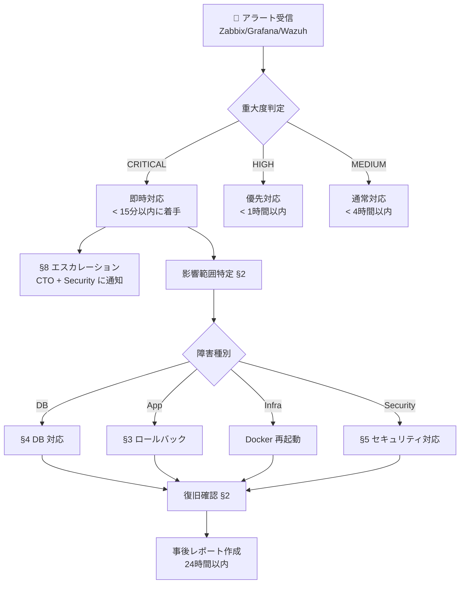

# 📖 CDX One Platform — 運用ランブック (Runbook)

> Construction DX One Platform 総合運用手順書  
> 適用規格: ISO 27001 A.12.1 (運用手順) / ISO 20000 8.1 (サービス提供)  
> 作成: Loop #36 (2026-06-01) | 対象フェーズ: production-release  
> 関連: `BCP_DRILL_PROTOCOL.md` / `DEPLOYMENT.md` / `ROLLBACK_RUNBOOK.md`

---

## 📌 インデックス

| カテゴリ                  | セクション                                                     | 概要                                    |
| :------------------------ | :------------------------------------------------------------- | :-------------------------------------- |
| 🚨 緊急対応               | [§1 インシデント対応フロー](#1-インシデント対応フロー)         | アラート受信から復旧まで                |
| 🏥 ヘルスチェック         | [§2 サービスヘルスチェック](#2-サービスヘルスチェック)         | 23サービスの死活確認                    |
| 🔄 デプロイ・ロールバック | [§3 デプロイ手順](#3-デプロイ手順)                             | Blue-Green / ロールバック               |
| 🗄️ DB                     | [§4 DB 運用](#4-db-運用)                                       | PostgreSQL フェイルオーバ・バックアップ |
| 🔐 セキュリティ           | [§5 セキュリティ対応](#5-セキュリティ対応)                     | 侵害検知・封鎖・調査                    |
| 📊 監視                   | [§6 監視・アラート管理](#6-監視アラート管理)                   | Zabbix / Grafana / Wazuh                |
| 🔧 メンテナンス           | [§7 定期メンテナンス](#7-定期メンテナンス)                     | 計画的作業・証明書更新                  |
| 📞 エスカレーション       | [§8 エスカレーションマトリクス](#8-エスカレーションマトリクス) | 連絡先・判断基準                        |

---

## 🗺 アーキテクチャ概要

```text
Internet
   │
   ▼
[API Gateway :8080]  ← JWT検証 / Rate Limit / X-Request-ID
   │
   ├── Frontend (:5180-5190) × 11部門
   └── Backend  (:8001-8011) × 11部門
         └── PostgreSQL (Primary :5432 / Replica :5433)
         └── Mocks Server :8090
```

| コンポーネント | Port      | 担当部門               |
| :------------- | :-------- | :--------------------- |
| API Gateway    | 8080      | インフラ全体           |
| Backend 01     | 8001      | 経営企画部             |
| Backend 02     | 8002      | 営業本部               |
| Backend 03     | 8003      | ソリューション営業本部 |
| Backend 04     | 8004      | 施工本部               |
| Backend 05     | 8005      | 技術本部               |
| Backend 06     | 8006      | 安全品質環境本部       |
| Backend 07     | 8007      | 管理本部               |
| Backend 08     | 8008      | 購買部                 |
| Backend 09     | 8009      | 船舶事業部             |
| Backend 10     | 8010      | IT-DX部門              |
| Backend 11     | 8011      | 統合データ基盤         |
| Mocks          | 8090      | 外部API mock           |
| Frontend 01-11 | 5180-5190 | 各部門 UI              |

---

## 1. インシデント対応フロー



### 1.1 重大度判定基準

| 重大度   | 基準                                | RTO      | 通知先                    |
| :------- | :---------------------------------- | :------- | :------------------------ |
| CRITICAL | 全体サービス停止 / セキュリティ侵害 | 即時     | CTO + Security + 全担当者 |
| HIGH     | 複数部門に影響 / DB障害             | 1時間    | CTO + 担当部門責任者      |
| MEDIUM   | 単一部門に影響                      | 4時間    | 担当部門責任者            |
| LOW      | 軽微なパフォーマンス低下            | 翌営業日 | DevOps チーム             |

---

## 2. サービスヘルスチェック

### 2.1 全サービス一括確認

```bash
# 全 23 ポートの疎通確認
python3 - <<'EOF'
import socket, sys
ports = list(range(5180, 5191)) + list(range(8001, 8012)) + [8080, 8090]
failed = []
for p in ports:
    s = socket.socket()
    s.settimeout(2)
    r = s.connect_ex(('localhost', p))
    s.close()
    status = "✅ OK" if r == 0 else "❌ FAIL"
    print(f"  Port {p}: {status}")
    if r != 0:
        failed.append(p)
print(f"\n結果: {len(ports)-len(failed)}/{len(ports)} 正常")
if failed:
    print(f"❌ 障害ポート: {failed}")
    sys.exit(1)
EOF
```

### 2.2 バックエンド /health エンドポイント確認

```bash
# 11部門バックエンド + API GW ヘルスチェック
for port in $(seq 8001 8011) 8080 8090; do
  status=$(curl -s -o /dev/null -w "%{http_code}" --max-time 5 http://localhost:$port/health 2>/dev/null || echo "000")
  icon="✅" && [ "$status" != "200" ] && icon="❌"
  echo "$icon Backend :$port → HTTP $status"
done
```

### 2.3 DB 接続確認

```bash
# PostgreSQL Primary
psql -h localhost -p 5432 -U postgres -c "SELECT 'primary OK' AS status;" 2>&1

# PostgreSQL Replica
psql -h localhost -p 5433 -U postgres -c "SELECT pg_is_in_recovery() AS is_replica;" 2>&1

# 全バックエンドの /health/db 確認
for port in $(seq 8001 8011); do
  status=$(curl -s -o /dev/null -w "%{http_code}" --max-time 5 http://localhost:$port/health/db 2>/dev/null || echo "000")
  icon="✅" && [ "$status" != "200" ] && icon="❌"
  echo "$icon Backend :$port /health/db → HTTP $status"
done
```

### 2.4 Docker コンテナ状態確認

```bash
# 停止中コンテナの検出
docker ps --format "table {{.Names}}\t{{.Status}}" | grep -v "Up"

# 全コンテナ一覧
docker ps -a --format "table {{.Names}}\t{{.Status}}\t{{.Ports}}"
```

---

## 3. デプロイ手順

> 詳細: `DEPLOYMENT.md` / `ROLLBACK_RUNBOOK.md` 参照

### 3.1 通常デプロイ (Blue → Green)

```bash
# ステップ 1: デプロイ前確認
git status
git log --oneline -5
docker-compose ps

# ステップ 2: Green 環境ビルド
docker-compose -f docker-compose.green.yml build --parallel

# ステップ 3: Green 環境起動
docker-compose -f docker-compose.green.yml up -d

# ステップ 4: Green ヘルスチェック
for port in $(seq 5280 5290) $(seq 8101 8111); do
  status=$(curl -s -o /dev/null -w "%{http_code}" http://localhost:$port/health 2>/dev/null || echo "000")
  echo "Green :$port → HTTP $status"
done

# ステップ 5: トラフィック切り替え (API Gateway)
./scripts/blue-green-switch.sh --target green

# ステップ 6: 切り替え後確認
for port in $(seq 5180 5190) $(seq 8001 8011); do
  curl -s -o /dev/null -w "Port $port: %{http_code}\n" http://localhost:$port/health
done
```

### 3.2 ロールバック手順

```bash
# 緊急ロールバック (Green → Blue)
./scripts/blue-green-switch.sh --target blue

# ロールバック後確認
for port in $(seq 5180 5190) $(seq 8001 8011) 8080; do
  status=$(curl -s -o /dev/null -w "%{http_code}" http://localhost:$port/health 2>/dev/null || echo "000")
  echo "Port $port: $status"
done
```

### 3.3 デプロイゲート確認項目

- [ ] CI (GitHub Actions) が全て green
- [ ] pytest 通過率 ≥ 99%
- [ ] ESLint エラー = 0
- [ ] Trivy CRITICAL = 0
- [ ] gitleaks 検出 = 0
- [ ] Blue-Green 切り替えテスト済み (ステージング)
- [ ] ロールバック手順確認済み

---

## 4. DB 運用

### 4.1 PostgreSQL フェイルオーバ

> 詳細: `BCP_DRILL_PROTOCOL.md` シナリオ 1 参照

```bash
# Primary 状態確認
systemctl status postgresql@14-main

# Replica 状態確認
psql -h localhost -p 5433 -U postgres -c "SELECT pg_is_in_recovery();"
# → t が返れば standby 正常

# フェイルオーバ実行 (Replica → Primary 昇格)
sudo -u postgres pg_ctl promote -D /var/lib/postgresql/14/replica/

# アプリ接続先変更
for port in $(seq 8001 8011); do
  curl -X POST http://localhost:$port/admin/db/failover \
    -H "Content-Type: application/json" \
    -d '{"host": "localhost", "port": 5433}'
done
```

### 4.2 バックアップ確認・リストア

```bash
# 最新バックアップ確認
ls -la /var/backups/postgresql/ | tail -5

# 手動バックアップ実行
sudo -u postgres pg_dump -Fc cdx_main > /var/backups/postgresql/manual-$(date +%Y%m%d-%H%M%S).dump

# リストア (緊急時)
sudo -u postgres pg_restore -d cdx_main /var/backups/postgresql/BACKUP_FILE.dump
```

### 4.3 接続数・パフォーマンス確認

```sql
-- 接続数確認
SELECT datname, count(*) FROM pg_stat_activity GROUP BY datname ORDER BY count DESC;

-- 長時間実行クエリ確認
SELECT pid, now() - pg_stat_activity.query_start AS duration, query
FROM pg_stat_activity
WHERE state = 'active' AND (now() - pg_stat_activity.query_start) > interval '5 minutes';

-- テーブル統計確認
SELECT schemaname, tablename, n_live_tup, n_dead_tup
FROM pg_stat_user_tables
ORDER BY n_live_tup DESC LIMIT 20;
```

---

## 5. セキュリティ対応

> 詳細: `BCP_DRILL_PROTOCOL.md` シナリオ 4 / `AUDIT_CHECKLIST.md` A.16.1 参照

### 5.1 不審アクセス検知

```bash
# Wazuh アラート確認
sudo /var/ossec/bin/ossec-logtest -f /var/ossec/logs/alerts/alerts.log | tail -30

# API Gateway ログから 401/403 の急増を確認
docker logs cdx-api-gateway 2>&1 | grep -E "401|403" | tail -50

# 不審な IP からのアクセス数集計
docker logs cdx-api-gateway 2>&1 | \
  grep -oP '"remote_addr":"[^"]*"' | sort | uniq -c | sort -rn | head -20
```

### 5.2 緊急封鎖

```bash
# 特定 IP のブロック
sudo ufw deny from SUSPICIOUS_IP to any
sudo ufw status

# Rate Limit の強化 (API Gateway)
curl -X POST http://localhost:8080/admin/rate-limit \
  -H "Content-Type: application/json" \
  -d '{"limit": 10, "window": 60}'
```

### 5.3 ログ保全 (証拠確保)

```bash
INCIDENT_DIR="/tmp/incident-$(date +%Y%m%d-%H%M%S)"
mkdir -p "$INCIDENT_DIR"

# Wazuh アラートログ
sudo cp /var/ossec/logs/alerts/alerts.log "$INCIDENT_DIR/"

# API Gateway ログ
docker logs cdx-api-gateway 2>&1 > "$INCIDENT_DIR/api-gateway.log"

# 全バックエンドログ
for i in $(seq 1 11); do
  docker logs cdx-backend-$(printf "%02d" $i) 2>&1 >> "$INCIDENT_DIR/backends.log"
done

# システムログ
sudo journalctl --since "1 hour ago" > "$INCIDENT_DIR/syslog.log"

echo "✅ ログ保全完了: $INCIDENT_DIR"
ls -la "$INCIDENT_DIR/"
```

### 5.4 JWT トークン無効化

```bash
# 全ユーザーのセッション強制終了 (JWT 秘密鍵ローテーション)
# ⚠️ 全ユーザーが再ログイン必須になる
curl -X POST http://localhost:8080/admin/auth/rotate-secret \
  -H "Authorization: Bearer $ADMIN_TOKEN"
```

---

## 6. 監視・アラート管理

### 6.1 Zabbix 確認

```text
URL: http://localhost:10051 (Zabbix Server)
テンプレート: monitoring/zabbix-templates/
  - cdx-universal.yaml  : 共通テンプレート
  - cdx-frontend.yaml   : Frontend 11部門
  - cdx-backend.yaml    : API GW + Backend 11 + Mocks
```

```bash
# Zabbix Agent 状態確認
systemctl status zabbix-agent

# トリガー発火状況の確認 (CLI)
sudo zabbix_get -s localhost -k system.uptime
```

### 6.2 Grafana ダッシュボード

```text
URL: http://localhost:3000
```

| ダッシュボード     | UID                | 用途                                     |
| :----------------- | :----------------- | :--------------------------------------- |
| サービスヘルス全体 | cdx-service-health | 23サービスの死活・エラー率               |
| API レイテンシ     | cdx-api-latency    | p50/p95/p99・ヒートマップ                |
| CI/CD メトリクス   | cdx-cicd-metrics   | ビルド時間・テスト・セキュリティスキャン |
| 認証・セキュリティ | cdx-auth-security  | JWT 認証・Wazuh アラート                 |

### 6.3 Wazuh アラート管理

```bash
# アラート確認
sudo tail -f /var/ossec/logs/alerts/alerts.log

# ルール確認
sudo /var/ossec/bin/ossec-logtest

# エージェント状態
sudo /var/ossec/bin/agent-control -l
```

### 6.4 アラート閾値一覧

| 項目             | WARNING | HIGH     | DISASTER     |
| :--------------- | :------ | :------- | :----------- |
| HTTP 応答時間    | 2s      | 5s       | タイムアウト |
| CPU 使用率       | 80%     | 95%      | -            |
| メモリ使用率     | 80%     | -        | -            |
| ディスク使用率   | 85%     | -        | -            |
| 5xx エラー率     | 1%      | 5%       | -            |
| JWT 401 連続失敗 | -       | 10回/min | -            |

---

## 7. 定期メンテナンス

### 7.1 日次作業

```bash
# バックアップ確認
ls -la /var/backups/postgresql/ | grep "$(date +%Y-%m-%d)"

# ログローテーション確認
du -sh /var/log/cdx-* 2>/dev/null

# Docker ヘルス確認
docker ps --format "{{.Names}}: {{.Status}}" | grep -v "Up"
```

### 7.2 週次作業

```bash
# Docker イメージ / コンテナ清掃
docker system prune -f

# 古いログアーカイブ削除 (90日超)
find /var/log/ -name "*.gz" -mtime +90 -delete

# セキュリティスキャン
cd /home/user/Construction-DX-OnePlatform
gitleaks detect --source . --report-format json --report-path /tmp/gitleaks-$(date +%Y%m%d).json
```

### 7.3 月次作業

- [ ] SSL/TLS 証明書の有効期限確認 (90日未満なら更新)
- [ ] Wazuh ルール更新 (`monitoring/wazuh-rules.xml`)
- [ ] npm audit / pip audit 実行・脆弱性修正
- [ ] 不要ユーザー・APIキーの棚卸し
- [ ] BCP 訓練記録の確認・次回計画

### 7.4 SSL 証明書確認

```bash
# 有効期限確認
openssl x509 -in /etc/ssl/certs/cdx.pem -noout -dates 2>/dev/null || \
  echo "証明書ファイルパスを確認してください"

# API Gateway の TLS 状態
curl -sv --max-time 5 https://localhost:8443/health 2>&1 | grep "SSL certificate"
```

---

## 8. エスカレーションマトリクス

| レベル | 条件                        | 第一報              | 第二報   | タイムアウト |
| :----- | :-------------------------- | :------------------ | :------- | :----------- |
| L1     | 軽微・単一サービス          | DevOps              | -        | 2時間        |
| L2     | 複数サービス / DB           | DevOps + 担当部門長 | CTO      | 1時間        |
| L3     | 全体停止 / セキュリティ侵害 | CTO + Security      | 全管理職 | 即時         |

### 8.1 連絡先テンプレート

```text
件名: [CDX INCIDENT L{N}] {障害概要} - {日時}

本文:
発生時刻: YYYY-MM-DD HH:MM
影響範囲: {部門 / サービス}
症状: {具体的な症状}
現在の対応状況: {対応中 / 調査中}
推定 RTO: {時間}
担当者: {氏名}
```

---

## 🔁 関連ドキュメント

| ドキュメント                     | 役割                               |
| :------------------------------- | :--------------------------------- |
| `BCP_DRILL_PROTOCOL.md`          | BCP 訓練手順 (4シナリオ)           |
| `ROLLBACK_RUNBOOK.md`            | ロールバック詳細手順               |
| `DEPLOYMENT.md`                  | Blue-Green デプロイ手順            |
| `UAT_SCENARIOS.md`               | ユーザー受入れテストシナリオ       |
| `AUDIT_CHECKLIST.md`             | ISO 27001 / 20000 / J-SOX 監査項目 |
| `monitoring/wazuh-rules.xml`     | Wazuh SIEM ルール定義              |
| `monitoring/zabbix-templates/`   | Zabbix 監視テンプレート            |
| `monitoring/grafana-dashboards/` | Grafana ダッシュボード定義         |

---

> 🤖 _Generated during ClaudeOS v9.0 Loop #36 / session_2026-06-01_  
> 📋 AUDIT_CHECKLIST.md A.12.1 (運用手順) 対応: `☐ → 🟡 初版作成`
