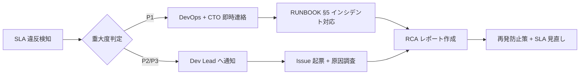

# 📊 SLA マトリクス (サービスレベル合意書)

> Construction DX One Platform  
> 適用規格: ISO 20000 6.1 (サービスレベル管理) / ISO 20000 6.2 (サービスレポート)  
> 作成: Loop #37 (2026-06-01)  
> レビュー周期: 四半期

---

## 📌 適用サービス一覧

| サービス ID | 部門                                | フロントエンド Port | バックエンド Port |    重要度    |
| :---------: | :---------------------------------- | :-----------------: | :---------------: | :----------: |
|   SVC-01    | 01 経営企画部 (Executive Dashboard) |        5180         |       8001        | **Critical** |
|   SVC-02    | 02 営業本部 (CRM/入札管理)          |        5181         |       8002        |     High     |
|   SVC-03    | 03 ソリューション営業               |        5182         |       8003        |     High     |
|   SVC-04    | 04 施工本部 (工事現場管理)          |        5183         |       8004        | **Critical** |
|   SVC-05    | 05 技術本部 (BIM/技術知識)          |        5184         |       8005        |    Medium    |
|   SVC-06    | 06 安全品質環境                     |        5185         |       8006        | **Critical** |
|   SVC-07    | 07 管理本部 (経費・人事)            |        5186         |       8007        |     High     |
|   SVC-08    | 08 購買部 (資材調達)                |        5187         |       8008        |     High     |
|   SVC-09    | 09 船舶事業部                       |        5188         |       8009        |    Medium    |
|   SVC-10    | 10 IT-DX 部門 (ITSM)                |        5189         |       8010        |     High     |
|   SVC-11    | 11 統合データ基盤 (DataLake/DX)     |        5190         |       8011        | **Critical** |
|     GW      | API ゲートウェイ                    |          —          |       8080        | **Critical** |
|    MOCK     | モックサーバー                      |          —          |       8090        |     Low      |

---

## 🎯 可用性 SLA

| 重要度       | 目標可用性 | 月間許容停止時間 |   RTO   |   RPO   |
| :----------- | :--------: | :--------------: | :-----: | :-----: |
| **Critical** | **99.9%**  |     43.8 分      | 1 時間  |  15 分  |
| High         |   99.5%    |     3.6 時間     | 4 時間  | 1 時間  |
| Medium       |   99.0%    |     7.3 時間     | 8 時間  | 4 時間  |
| Low          |   95.0%    |    36.5 時間     | 24 時間 | 24 時間 |

> ※ BCP 全体 RTO = 4 時間 / RPO = 1 時間 (`docs/BCP_DRILL_PROTOCOL.md` 参照)

---

## ⏱ パフォーマンス SLA

| 指標               | Critical サービス | High サービス | Medium サービス |
| :----------------- | :---------------: | :-----------: | :-------------: |
| API レスポンス p50 |      ≤ 200ms      |    ≤ 500ms    |    ≤ 1,000ms    |
| API レスポンス p95 |      ≤ 500ms      |   ≤ 1,000ms   |    ≤ 2,000ms    |
| API レスポンス p99 |     ≤ 1,000ms     |   ≤ 2,000ms   |    ≤ 5,000ms    |
| フロントエンド LCP |     ≤ 2.5 秒      |   ≤ 3.0 秒    |    ≤ 4.0 秒     |
| エラーレート       |      ≤ 0.1%       |    ≤ 0.5%     |     ≤ 1.0%      |

---

## 🔧 サポート SLA

| 重大度            | 初動応答 | 解決目標 | エスカレーション  |
| :---------------- | :------: | :------: | :---------------: |
| P1 (サービス停止) |  15 分   |  1 時間  | CTO / DevOps 即時 |
| P2 (機能障害)     |  1 時間  |  4 時間  |     Dev Lead      |
| P3 (性能劣化)     |  4 時間  | 24 時間  |      DevOps       |
| P4 (軽微な問題)   | 翌営業日 |  1 週間  |     Developer     |

---

## 📅 メンテナンスウィンドウ

| 種別                | スケジュール                    |       事前通知        | 最大停止時間 |
| :------------------ | :------------------------------ | :-------------------: | :----------: |
| 定期メンテナンス    | 毎月第 3 日曜日 02:00–06:00 JST |      5 営業日前       |    4 時間    |
| 緊急パッチ          | 随時 (セキュリティ Critical)    | 2 時間前 (可能な限り) |    1 時間    |
| Blue-Green デプロイ | 随時 (ダウンタイム 0)           |         不要          |     0 秒     |

---

## 📈 SLA 測定・報告

| 測定項目           | ツール                                        |  収集間隔  |      報告頻度       |
| :----------------- | :-------------------------------------------- | :--------: | :-----------------: |
| 可用性             | Zabbix (`monitoring/zabbix-templates/`)       |    1 分    |      月次 PDF       |
| API レイテンシ     | Grafana (`cdx-api-latency` ダッシュボード)    |   30 秒    | リアルタイム + 月次 |
| エラーレート       | Grafana (`cdx-service-health` ダッシュボード) |   30 秒    |    リアルタイム     |
| CI/CD パイプライン | Grafana (`cdx-cicd-metrics` ダッシュボード)   | コミット毎 |        週次         |

### 📊 月次 SLA レポート生成

```bash
# Grafana API で月次 PDF エクスポート (例)
curl -H "Authorization: Bearer $GRAFANA_TOKEN" \
  "http://localhost:3000/api/dashboards/uid/cdx-service-health/export" \
  -o reports/sla/$(date +%Y-%m)_service-health.pdf
```

---

## 🚨 SLA 違反時の対応



---

## 📤 エビデンス・成果物

| 成果物               | 保存場所                              |      頻度      |
| :------------------- | :------------------------------------ | :------------: |
| 月次可用性レポート   | `reports/sla/YYYY-MM_availability.md` |      月次      |
| 月次 Grafana PDF     | `reports/sla/YYYY-MM_grafana.pdf`     |      月次      |
| SLA 違反記録         | `reports/incidents/`                  | インシデント毎 |
| 四半期レビュー議事録 | `reports/sla/YYYY-QN_review.md`       |     四半期     |

---

> 🤖 _Generated during ClaudeOS v9.0 Loop #37 / session_2026-06-01_  
> 📋 ISO 20000 6.1 (サービスレベル管理) 対応: `☐ → 🟡 初版作成`  
> 📋 ISO 20000 6.2 (サービスレポート) 対応: `☐ → 🟡 測定・報告枠組み策定`
