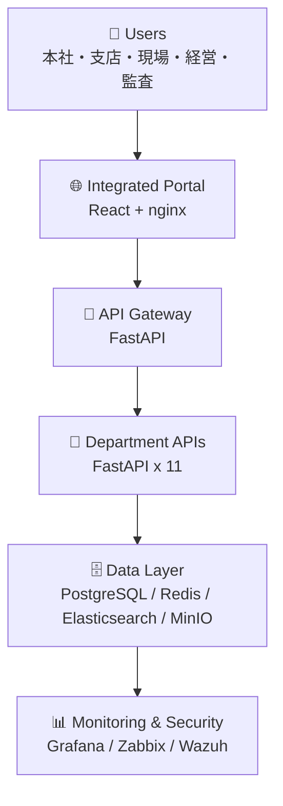
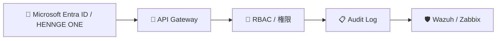
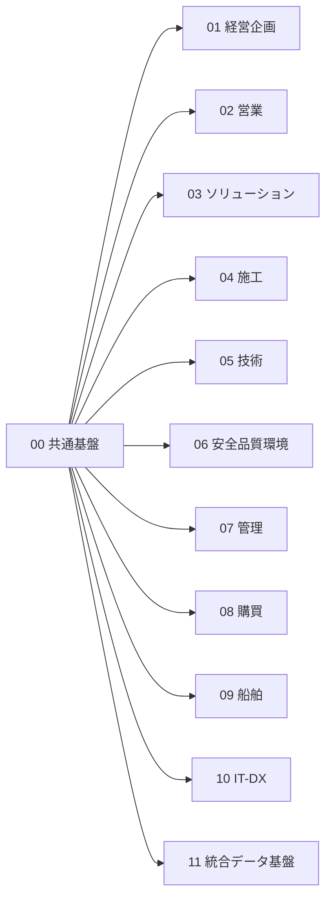

# ⚙️ 技術スタック

Construction DX One Platform の技術構成を、確認しやすいようにレイヤー別に整理した資料です。

非エンジニア向け概要: [README.md](../README.md)

IT部門向け運用資料: [README_ENGINEERS.md](./README_ENGINEERS.md)

---

## 🗺️ 全体構成

## 🌐 フロントエンド

| 技術 | 用途 |
| --- | --- |
|  | 統合ポータルと部門別WebUI |
|  | 部門別フロントエンドの開発・ビルド |
|  | 部門別WebUIの型安全 |
|  | 静的ファイル配信 |
| SVG / CSS Custom Properties | チャート、アイコン、ライト/ダークテーマ |

## 🐍 バックエンド

| 技術 | 用途 |
| --- | --- |
|  | バックエンド共通言語 |
|  | API Gateway、部門API |
|  | ORM |
|  | API入出力検証 |
| Alembic | DBマイグレーション |
| uvicorn | ASGIサーバー |

## 🗄️ データ層

| 技術 | 用途 |
| --- | --- |
|  | 業務データ |
| PostGIS | 位置情報、現場・設備データ |
| TimescaleDB | IoT・時系列データ |
|  | キャッシュ、セッション |
|  | 全文検索、ログ検索 |
|  | 写真、PDF、図面ファイル |

## 🛡️ 認証・セキュリティ

| 技術・仕組み | 用途 |
| --- | --- |
| Microsoft Entra ID | 社内ID連携 |
| HENNGE ONE | SSO / メール・ID統制 |
| RBAC | 部門・役割別アクセス制御 |
| Wazuh | セキュリティ監視 |
| Zabbix | インフラ監視 |
| 監査ログ | 操作証跡、権限変更、出力履歴 |

## 🐳 インフラ・運用

| 技術 | 用途 |
| --- | --- |
|  | ローカル/社内機器でのコンテナ起動 |
|  | 機器起動時の自動起動 |
|  | CI/CD |
| Grafana | メトリクス可視化 |
| nginx healthcheck | WebUI死活監視 |

## 🧪 品質・テスト

| ツール | 用途 |
| --- | --- |
| pytest | Pythonユニットテスト |
| ESLint | JavaScript/TypeScript静的解析 |
| Ruff | Python静的解析 |
| npm audit | Node.js依存関係チェック |
| pip-audit | Python依存関係チェック |
| Playwright | E2Eテスト |

## 🏗️ 部門別構成

## 🌐 標準・制度対応

| 標準・制度 | 関連領域 |
| --- | --- |
| i-Construction 2.0 | BIM/CIM、ICT施工、3次元データ |
| ISO 9001 | 品質管理 |
| ISO 14001 | 環境管理 |
| ISO 20000 | ITサービス管理 |
| ISO 27001 | 情報セキュリティ |
| J-SOX | 内部統制、監査証跡 |
| 電子帳簿保存法 | 電子データ保存 |
| インボイス制度 | 請求・購買管理 |

## 🔗 関連資料

- [IT部門向けガイド](./README_ENGINEERS.md)
- [ポート一覧](./PORTS.md)
- [自動起動ガイド](./AUTOSTART.md)
- [本番リリースロードマップ](./PRODUCTION_LAUNCH_ROADMAP.md)
