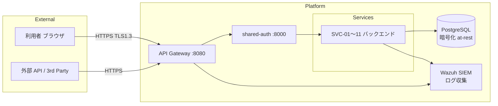
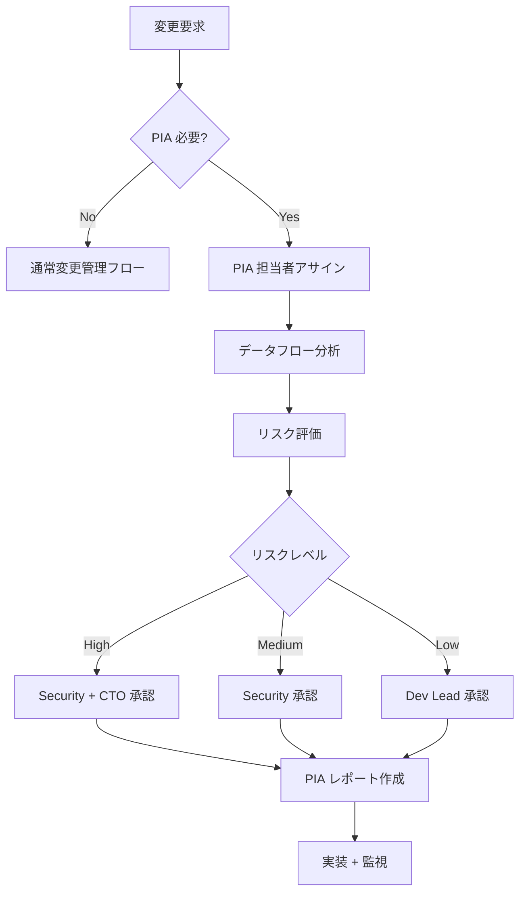

# 🔒 データ保護方針・プライバシー影響評価 (DPA/PIA)

> Construction DX One Platform  
> 適用規格: ISO 27001 A.18.1 (法令遵守・個人情報保護法) / GDPR 準拠参考  
> 作成: Loop #37 (2026-06-01)  
> レビュー周期: 年次 / 新機能追加時

---

## 📌 目的

本文書は、Construction DX One Platform が取り扱う個人情報の保護に関する方針および
プライバシー影響評価 (PIA: Privacy Impact Assessment) の枠組みを定める。
個人情報保護法 (令和 4 年改正対応)、GDPR (参考) への準拠を保証する。

---

## 📋 取り扱い個人情報の分類

| データカテゴリ | 具体例                          | 取り扱い部門 |      保存場所       |       保存期間       |
| :------------- | :------------------------------ | :----------- | :-----------------: | :------------------: |
| 従業員基本情報 | 氏名・社員番号・所属・役職      | 07 管理本部  | PostgreSQL (暗号化) |     退職後 7 年      |
| 認証情報       | ユーザー ID・パスワードハッシュ | 00 共通基盤  |   shared-auth DB    | アカウント削除後即時 |
| 顧客情報       | 会社名・担当者名・連絡先        | 02 営業本部  |       CRM DB        |   契約終了後 5 年    |
| 現場作業員情報 | 氏名・資格・健康診断結果        | 04 施工本部  |  施工 DB (暗号化)   |   工事完了後 10 年   |
| 安全衛生情報   | 事故記録・ヒヤリハット          | 06 安全品質  |  安全 DB (暗号化)   |        10 年         |
| アクセスログ   | IP アドレス・操作履歴           | 全部門       |     Wazuh SIEM      |         1 年         |
| 生体認証情報   | 指紋・顔認証 (将来実装)         | —            |          —          |          —           |

---

## 🗺 データフロー概要



---

## ⚖ 法的根拠と利用目的

| 利用目的             | 法的根拠                  | 個人情報の種類       |
| :------------------- | :------------------------ | :------------------- |
| 建設プロジェクト管理 | 契約履行                  | 従業員・顧客情報     |
| 安全衛生管理         | 法令義務 (労働安全衛生法) | 作業員・安全衛生情報 |
| アクセス認証・認可   | 正当な利益                | 認証情報             |
| セキュリティ監視     | 正当な利益                | アクセスログ         |
| 請求・経理処理       | 契約履行 / 法令義務       | 顧客・従業員情報     |

---

## 🔐 個人情報保護コントロール

| コントロール                |        実装状況         |   担当    |
| :-------------------------- | :---------------------: | :-------: |
| アクセス制御 (RBAC)         |       ✅ 実装済み       | Security  |
| 通信暗号化 (TLS 1.3)        |       ✅ 実装済み       |  DevOps   |
| DB 暗号化 (at-rest)         |       ✅ 実装済み       |    DBA    |
| 最小権限の原則              |       ✅ 実装済み       | Security  |
| ログ監査証跡                |   ✅ 実装済み (Wazuh)   |  DevOps   |
| データマスキング (開発環境) |       🟡 部分対応       | Developer |
| 個人情報削除機能            |       🟡 部分対応       | Developer |
| 越境移転管理                | ☐ 未実装 (国内のみ現状) | Security  |

---

## 📊 プライバシー影響評価 (PIA) 手順

### 🔒 PIA が必要な変更の条件

以下のいずれかに該当する変更は PIA を実施すること:

1. 新たな個人情報カテゴリの収集開始
2. 既存個人情報の新規利用目的への転用
3. 第三者への個人情報提供開始
4. 自動化意思決定システムの導入
5. 大規模な個人情報処理システムの変更

### 🔍 PIA 実施フロー



### 📝 PIA レポートテンプレート

PIA レポートは `reports/privacy/PIA_<機能名>_<YYYY-MM-DD>.md` に保存する。

```markdown
# PIA レポート: [機能名]

- 実施日: YYYY-MM-DD
- 担当者: [氏名]
- 承認者: [氏名]

## 1. 概要

## 2. 取り扱う個人情報

## 3. データフロー

## 4. リスク評価

## 5. 軽減策

## 6. 残存リスク

## 7. 承認
```

---

## 🚨 個人情報漏洩対応

| フェーズ    | アクション                        |      期限       |        担当         |
| :---------- | :-------------------------------- | :-------------: | :-----------------: |
| 検知        | Wazuh アラート → インシデント起票 |      即時       |       DevOps        |
| 初動        | 影響範囲特定・封鎖                |   1 時間以内    |  Security + DevOps  |
| 報告 (内部) | 経営陣への一次報告                |   2 時間以内    |      Security       |
| 報告 (行政) | 個人情報保護委員会への報告        | **72 時間以内** |     CTO + Legal     |
| 本人通知    | 影響を受けた個人への通知          |    速やかに     |  Security + Legal   |
| RCA         | 根本原因分析・再発防止策          |   2 週間以内    | Security + Dev Lead |

> ⚠️ 個人情報保護法 第 26 条: 漏洩等が生じた場合、個人情報保護委員会への報告義務あり

---

## 📅 定期レビュー

| レビュー項目                   | 頻度 |       担当       |
| :----------------------------- | :--: | :--------------: |
| プライバシーポリシー全体見直し | 年次 | Security + Legal |
| データ保持期間の棚卸し         | 年次 |  DBA + Security  |
| 第三者提供先の確認             | 年次 |     Security     |
| PIA 実施記録の確認             | 年次 |     Security     |
| 従業員プライバシー研修         | 年次 |  Security + HR   |

---

> 🤖 _Generated during ClaudeOS v9.0 Loop #37 / session_2026-06-01_  
> 📋 ISO 27001 A.18.1 (法令遵守・個人情報保護法) 対応: `☐ → 🟡 DPA + PIA 初版作成`
