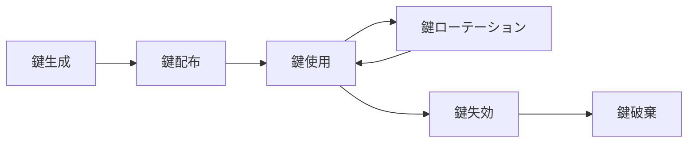

# 🔐 暗号化方針 (Encryption Policy)

> Construction DX One Platform  
> 適用規格: ISO 27001 A.10.1 (暗号化の使用方針)  
> 作成: Loop #37 (2026-06-01)  
> レビュー周期: 年次

---

## 📌 目的

本方針は、Construction DX One Platform が取り扱う情報資産の機密性・完全性を保護するため、
暗号化技術の使用に関する基準・手順・責任を定める。

---

## 🛡 暗号化基準

### 1. 通信の暗号化 (In-Transit)

| 通信経路                            |  プロトコル  | 最低バージョン |           証明書           |
| :---------------------------------- | :----------: | :------------: | :------------------------: |
| 外部クライアント ↔ API ゲートウェイ |    HTTPS     |    TLS 1.3     | Let's Encrypt / 企業証明書 |
| マイクロサービス間 (内部)           | HTTPS / mTLS |    TLS 1.3     |     自己署名 + 内部 CA     |
| DB クライアント ↔ PostgreSQL        |   SSL/TLS    |    TLS 1.3     |         DB 証明書          |
| Grafana / Zabbix モニタリング       |    HTTPS     |  TLS 1.2 以上  |         企業証明書         |
| GitHub Actions ↔ レジストリ         |    HTTPS     |    TLS 1.3     |       GitHub 証明書        |

**禁止事項:**

- TLS 1.0 / TLS 1.1 / SSL 3.0 の使用禁止
- 自己署名証明書の本番外部公開禁止
- 証明書検証スキップ (`verify=False`, `-k`, `--insecure`) の本番使用禁止

### 2. 保存データの暗号化 (At-Rest)

| データ種別                  |               暗号化方式               |           鍵管理           |
| :-------------------------- | :------------------------------------: | :------------------------: |
| PostgreSQL データベース     |       AES-256 (ストレージ暗号化)       |     OS / クラウド KMS      |
| バックアップファイル        |             PGP / AES-256              |   セキュリティチーム管理   |
| コンテナイメージ            | ベースイメージ署名 + レジストリ暗号化  |  GitHubContainerRegistry   |
| シークレット・認証情報      | GitHub Secrets / 環境変数 (暗号化保存) | DevOps + Security 共同管理 |
| ログファイル (個人情報含む) |                AES-256                 |        DevOps 管理         |

### 3. アプリケーション層の暗号化

| 用途               |                        方式                         |          実装場所          |
| :----------------- | :-------------------------------------------------: | :------------------------: |
| JWT 署名           | RS256 (RSA 2048bit 以上) または HS256 (256bit 以上) |       `shared-auth/`       |
| パスワードハッシュ |         bcrypt (cost ≥ 12) または Argon2id          | バックエンド認証モジュール |
| セッショントークン |                    CSPRNG 256bit                    |       `shared-auth/`       |
| API キー           |           SHA-256 ハッシュ保存 (平文禁止)           |      API ゲートウェイ      |

---

## 🔑 暗号鍵管理

### 鍵ライフサイクル

### ローテーションスケジュール

| 鍵種別            | ローテーション周期 |      責任者       | 緊急ローテーション条件 |
| :---------------- | :----------------: | :---------------: | :--------------------: |
| JWT シークレット  |       90 日        | Security / DevOps |      漏洩疑い即時      |
| GitHub Secrets    |       180 日       |      DevOps       |      退職者発生時      |
| DB 接続パスワード |       90 日        |        DBA        |      漏洩疑い即時      |
| TLS 証明書        |  有効期限 30 日前  |      DevOps       |     失効検知時即時     |
| API Admin Token   |       90 日        | DevOps / Security |      漏洩疑い即時      |

### 鍵保護要件

- 鍵をコードリポジトリに平文コミット禁止
- `gitleaks` による自動スキャン (CI + pre-commit hook)
- 鍵へのアクセスは最小権限 (Need-to-Know) 原則を適用
- 鍵のバックアップは暗号化された安全な保管場所に限定

---

## 🚫 禁止アルゴリズム

以下のアルゴリズムは脆弱性が知られており、使用を禁止する:

| 禁止対象                           | 理由                   |
| :--------------------------------- | :--------------------- |
| MD5 / SHA-1 (署名・整合性検証用途) | 衝突攻撃が実証済み     |
| DES / 3DES                         | 鍵長不足・SWEET32 攻撃 |
| RC4                                | 統計的脆弱性           |
| ECB モード (対称暗号)              | パターン漏洩           |
| RSA 1024bit 以下                   | 解読リスク             |
| TLS 1.0 / 1.1                      | POODLE / BEAST 攻撃    |

---

## ✅ 準拠確認・監査

| 確認項目                 | 確認方法                                  |    頻度    |       担当        |
| :----------------------- | :---------------------------------------- | :--------: | :---------------: |
| TLS バージョン確認       | `testssl.sh` / Qualys SSL Labs            |    月次    |      DevOps       |
| 証明書有効期限           | Zabbix 監視 (30 日前アラート)             |  日次自動  |      DevOps       |
| シークレットスキャン     | `gitleaks` (CI + pre-commit)              | コミット毎 |     Developer     |
| 鍵ローテーション実施記録 | `reports/audit/key_rotation_<YYYY-QN>.md` |   四半期   |     Security      |
| 脆弱アルゴリズム検出     | Trivy + SAST                              |   CI 毎    | DevOps / Security |

---

## 📋 例外プロセス

暗号化要件の例外が必要な場合は、以下の承認を得ること:

1. Security チームへ例外申請書を提出
2. リスク評価を実施 (代替コントロールを明示)
3. CTO の最終承認
4. 例外記録を `reports/audit/crypto_exceptions.md` に登録
5. 次回年次レビュー時に再評価

---

> 🤖 _Generated during ClaudeOS v9.0 Loop #37 / session_2026-06-01_  
> 📋 ISO 27001 A.10.1 (暗号化の使用方針) 対応: `☐ → 🟡 初版作成`
