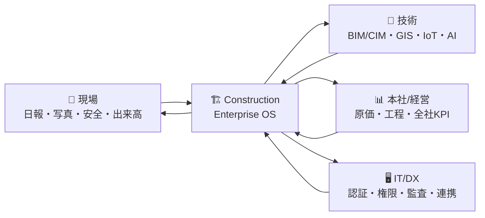
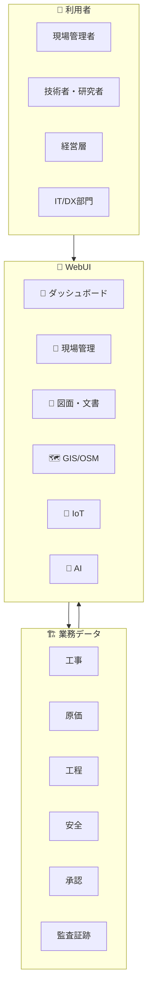
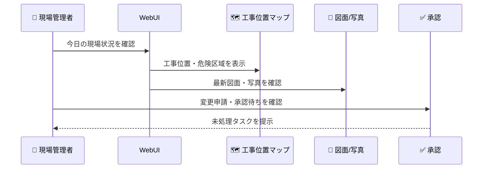
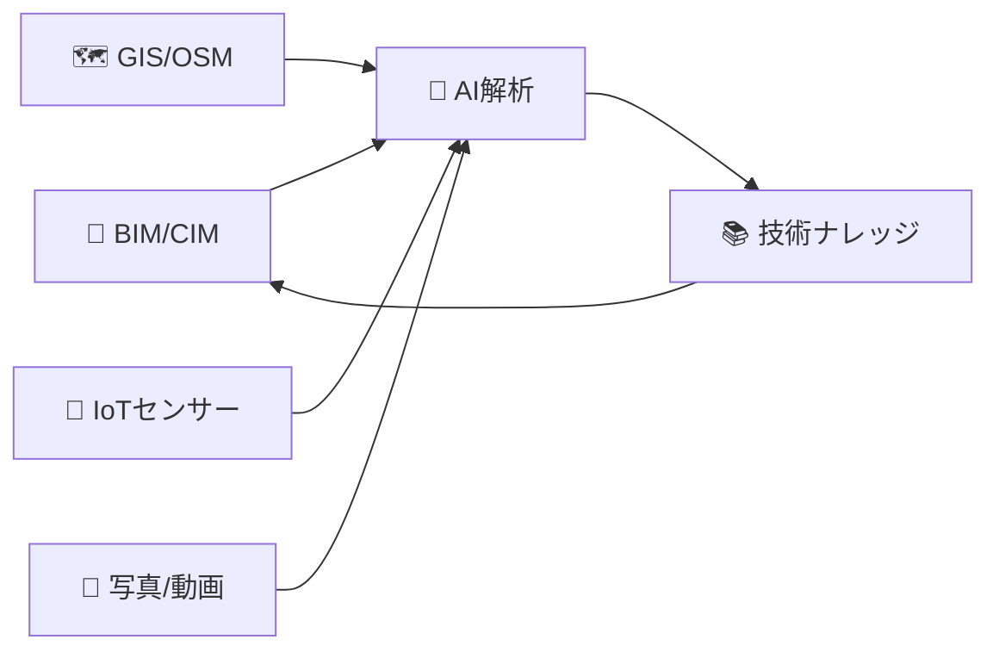
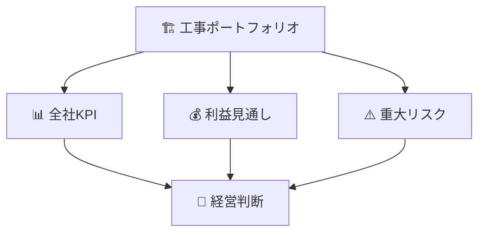
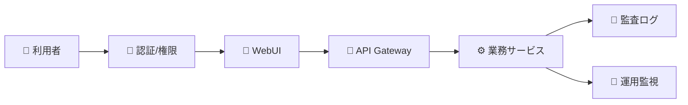
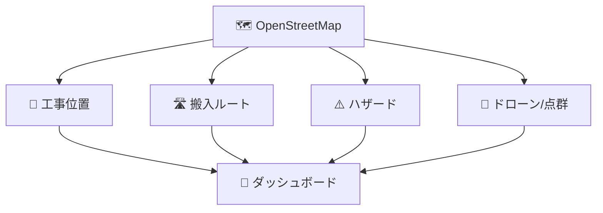
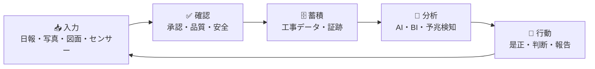
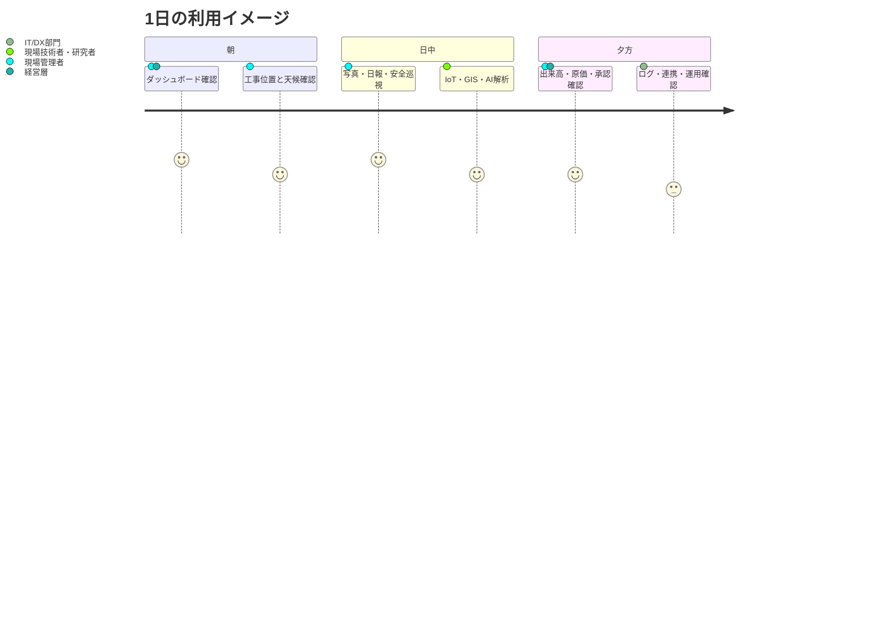

# Construction Enterprise OS

建設・土木プロジェクトの **現場、技術、経営、IT/DX** をつなぐ統合業務プラットフォームです。進捗、原価、安全、図面、写真、承認、GIS、IoT、AI、監査証跡をひとつの WebUI で見通せる状態を目指しています。

現在は実データ接続前の **モック環境** です。画面構成、情報量、利用者別の見え方、OpenStreetMap を使った工事位置マップの操作感を確認できるよう、ダミーデータを多めに入れています。

```text
http://192.168.0.185:3102/
```

## このREADMEの読み方

| 読む人 | まず見る場所 | 分かること |
| --- | --- | --- |
| 🦺 現場管理者 | [現場管理者向け](#現場管理者向け) | 今日の作業、安全、写真、日報、承認待ち |
| 🧪 現場技術者・研究者 | [現場技術者・研究者向け](#現場技術者研究者向け) | BIM/CIM、GIS、IoT、AI、施工データ活用 |
| 📊 経営層 | [経営層向け](#経営層向け) | 全社KPI、原価、リスク、投資判断 |
| 🖥️ 社内IT・DX部門 | [社内IT・DXシステム部門向け](#社内itdxシステム部門向け) | 権限、連携、監査、運用、拡張方針 |

## ひとことでいうと

Construction Enterprise OS は、建設会社の本社、支店、現場、協力会社、監査対応を同じ情報基盤でつなぐための **建設業務OS** です。



## 全体像

| アイコン | 領域 | できること |
| --- | --- | --- |
| 📍 | ダッシュボード | 工事全体の進捗、原価、安全、承認、リスクを一覧化 |
| 🦺 | 現場管理 | 日報、出来高、写真、作業予定、KY、安全巡視を管理 |
| 📄 | 図面・文書 | PDF、CAD、BIM/CIM、写真、動画、電子納品、版管理を確認 |
| ✅ | 承認・ワークフロー | 変更申請、承認待ち、電子署名、決裁滞留を追跡 |
| 💰 | 原価・ERP | 予算、契約、発注、請求、労務、在庫、収益見通しを把握 |
| 🗺️ | GIS・地図 | OpenStreetMap で工事位置、ルート、災害リスク、点群を確認 |
| 📡 | IoT | センサー、気象、波浪、水位、機械稼働、アラートを監視 |
| 🤖 | AI | チャット、OCR、画像判定、予測、異常検知、ナレッジ検索を活用 |
| 🔐 | セキュリティ | 監査ログ、SOC、VPN、端末防御、脆弱性、インシデントを管理 |
| 🚁 | ロボティクス | ドローン、自律施工、ROV、デジタルツインを扱う |



## 現場管理者向け

現場管理者は、朝礼前、巡視中、日報作成時、協力会社との調整時に使うことを想定しています。

| 場面 | 見る画面 | 判断できること |
| --- | --- | --- |
| 🌅 朝礼前 | ダッシュボード、現場管理、安全 | 今日の作業、危険作業、天候、未承認、注意喚起 |
| 📸 巡視中 | 写真、品質、安全巡視 | 是正箇所、撮影漏れ、品質確認、KY記録 |
| 📝 日報作成 | 日報、出来高、労務、機械 | 作業実績、出来高、稼働、残作業 |
| 🚧 変更発生時 | ワークフロー、図面、原価 | 変更申請、承認状況、予算影響 |
| ⚠️ アラート発生時 | IoT、安全、GIS | 水位、気象、機械異常、危険区域 |



## 現場技術者・研究者向け

現場技術者・研究者は、施工データを技術検証、改善、標準化に使うことを想定しています。

| 関心領域 | 確認できる情報 | 活用例 |
| --- | --- | --- |
| 🧱 BIM/CIM | モデル、図面、版管理、点群 | 設計変更影響、出来形比較、維持管理連携 |
| 🗺️ GIS | 工事位置、ルート、地形、災害リスク | 施工計画、資材搬入、周辺リスク評価 |
| 📡 IoT | 環境、機械、構造物、水位、気象 | 予兆検知、施工条件分析、安全基準検証 |
| 🤖 AI | OCR、画像解析、異常検知、予測 | 検査支援、品質判定、事故予兆、報告書作成 |
| 📊 データ分析 | 工程、原価、安全、品質の横断データ | 標準歩掛、遅延要因、改善施策の評価 |



## 経営層向け

経営層は、個別現場の詳細ではなく、全社の収益性、リスク、意思決定に必要な情報を短時間で把握することを想定しています。

| 経営テーマ | 見る指標 | 意思決定につながる問い |
| --- | --- | --- |
| 📈 業績 | 売上、粗利、利益見通し、請求状況 | 今期着地はどこまで確度があるか |
| 💰 原価 | 予算消化、変更契約、労務、資材、外注 | 赤字化しそうな工事はどこか |
| 🕒 工程 | 進捗率、遅延、クリティカル工程 | 納期リスクをどこで吸収するか |
| ⚠️ リスク | 安全、品質、災害、協力会社、監査 | 重大事故や損失につながる兆候はあるか |
| 🧭 投資 | DX効果、標準化、データ蓄積 | どの業務を次に自動化すべきか |



## 社内IT・DXシステム部門向け

社内IT・DXシステム部門は、利用者に安定して提供できるか、既存システムと連携できるか、監査やセキュリティ要件に耐えられるかを確認します。

| 観点 | 確認ポイント | 関連する機能 |
| --- | --- | --- |
| 🔐 認証・権限 | 利用者、組織、役割、MFA、SSO | 共通基盤、セキュリティ |
| 🔌 外部連携 | API、Webhook、既存ERP、文書管理、BI | 共通API、ERP、文書 |
| 🧾 監査 | 操作ログ、承認履歴、版管理、証跡 | 監査ログ、ワークフロー、文書 |
| 🧰 運用 | Docker、systemd、自動起動、ポート管理 | WebUI、インフラ設定 |
| 🧪 品質 | Lint、Type check、Test、Build、セキュリティスキャン | CI/CD、GitHub Actions |



## 工事位置マップとOpenStreetMap

工事位置、ルート、周辺リスク、災害情報、ドローン・点群の見え方は、OpenStreetMap を中心に確認できるようにしています。

| 地図利用 | 表示内容 | 期待する効果 |
| --- | --- | --- |
| 📍 工事位置 | 現場、拠点、施工範囲 | 現場の場所を全員が同じ前提で把握 |
| 🛣️ 搬入ルート | 資材ルート、迂回、規制 | 搬入計画と周辺影響を説明しやすくする |
| ⚠️ リスク | 河川、斜面、ハザード、気象 | 事前対策と緊急時判断を早める |
| 🚁 ドローン/点群 | 撮影位置、点群、進捗確認 | 出来形・出来高の確認を支援 |



## データの流れ

現場で発生した情報を、承認、原価、工程、安全、監査に分断せずつなげることを重視しています。



## 現在の状態

| 区分 | 状態 |
| --- | --- |
| 🧭 WebUI | モック環境。ダミーデータで画面と業務導線を確認可能 |
| 🗺️ 地図 | OpenStreetMap ベースの工事位置、ルート、GIS 表示を確認可能 |
| 🧪 データ | 実在の工事名、個人名、金額、センサー値ではありません |
| 🧰 起動 | Docker、systemd、自動ポート割当を想定 |
| 🔐 本番化 | 実データ連携、権限設計、監査要件、セキュリティ設定が必要 |

## 代表的な利用シーン



## 関連ドキュメント

| アイコン | 読む人 | ドキュメント |
| --- | --- | --- |
| 🖥️ | IT部門スタッフ | [IT部門スタッフ向け 運用ガイド](docs/it-operations.md) |
| 🧑‍💻 | 開発者・エンジニア | [エンジニア向け 開発・保守ガイド](docs/engineering-guide.md) |
| 🧱 | 技術選定・構成を確認する人 | [技術スタックとシステム構成](docs/technology-stack.md) |
| 🏛️ | 詳細アーキテクチャ | [アーキテクチャ概要](docs/architecture/00-overview.md) |

## 本番導入前に確認すること

| チェック | 内容 |
| --- | --- |
| ✅ 業務範囲 | どの現場、支店、本社業務から始めるか |
| ✅ 権限 | 現場、支店、本社、協力会社、監査担当の見える範囲 |
| ✅ データ移行 | 図面、写真、契約、原価、工程、過去日報の扱い |
| ✅ 既存連携 | ERP、文書管理、BI、認証基盤、メール、チャット |
| ✅ セキュリティ | MFA、SSO、監査ログ、端末制御、脆弱性対応 |
| ✅ 運用 | 障害対応、バックアップ、更新手順、問い合わせ窓口 |

## 注意事項

この README は、利用者が全体像を理解するための概要説明です。コマンド、Docker、systemd、API、データベースなどの詳細は `docs/` 配下の文書に分けています。

本プロジェクトは、現時点では **WebUI で業務イメージを確認する段階** です。本番導入判断では、対象業務、権限、監査範囲、データ移行、既存システム連携、保守体制を別途確認してください。
