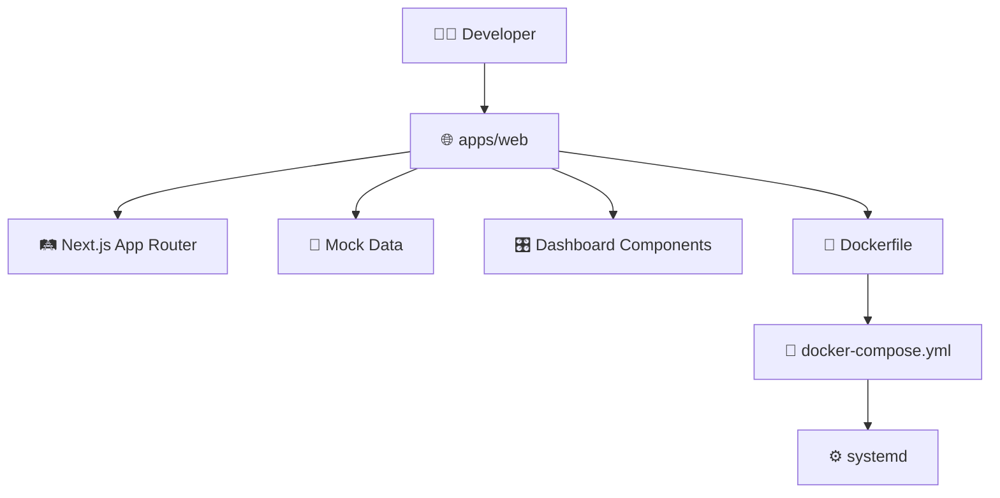
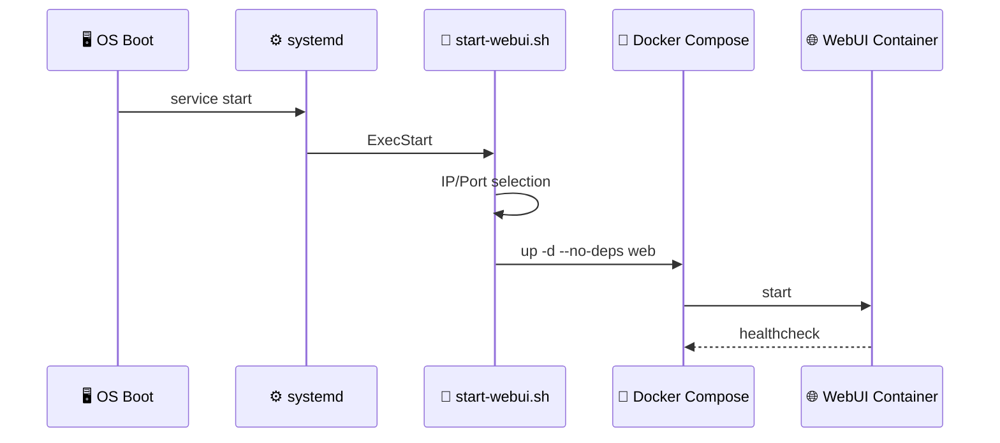
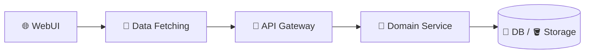

# エンジニア向け 開発・保守ガイド

この文書は、Construction Enterprise OS のWebUI、Docker、systemd、今後のAPI連携を保守するエンジニア向けの入口です。

## 🧭 開発対象の全体像



## 📁 主要ファイル

| 用途 | ファイル |
| --- | --- |
| ダッシュボードレイアウト | `apps/web/src/app/(dashboard)/layout.tsx` |
| デザイン反映画面 | `apps/web/src/app/(dashboard)/_components/DesignMockPage.tsx` |
| `/design/...` ルート | `apps/web/src/app/(dashboard)/design/[[...slug]]/page.tsx` |
| ダッシュボード用データ | `apps/web/src/lib/mock-dashboard-data.ts` |
| WebUI Dockerfile | `apps/web/Dockerfile` |
| Compose設定 | `docker-compose.yml` |
| systemdユニット | `infra/systemd/construction-enterprise-os-webui.service` |
| WebUI起動 | `scripts/webui/start-webui.sh` |
| WebUI停止 | `scripts/webui/stop-webui.sh` |

## 🧪 ローカル確認

```bash
cd apps/web
npm run typecheck
npm run build
```

Node.js は `20.x` 系でのビルドを確認しています。環境によっては新しすぎるNode.jsでビルド時にメモリ不足になる場合があります。

## 🌐 WebUI起動

リポジトリ直下で実行します。

```bash
scripts/webui/start-webui.sh
```

WebUI単体確認では、バックエンド依存を起動しないため、Composeは `--no-deps web` で実行します。

## 🔁 systemd

```bash
sudo scripts/webui/install-systemd.sh
systemctl status construction-enterprise-os-webui.service
```

systemdは `oneshot + RemainAfterExit=yes` です。実プロセスはDockerコンテナとして残ります。



## 🧩 モックデータ設計

現在のWebUIは、画面確認を優先したモックです。

- 実API接続前でも主要業務画面を確認できること
- 本社、支店、現場、経営、監査の視点を切り替えられること
- GIS、AI、IoT、ERP、Security、Roboticsの情報密度を確認できること

本番連携時は、`DesignMockPage.tsx` 内の表示データをAPI取得へ段階的に置き換えます。

## 🔌 API連携方針



推奨方針:

- 画面単位でモックからAPIへ置き換える。
- 表示用型定義とAPIレスポンス型を分ける。
- 権限、監査ログ、エラー表示は共通化する。
- 大きなUI改修とAPI接続を同時に行わない。

## ✅ 変更時の確認観点

| 観点 | 確認内容 |
| --- | --- |
| UI | サイドバー、タブ、カード、表が崩れていないか |
| ルーティング | `/design/...` の代表画面が200で返るか |
| ビルド | `npm run typecheck` と `npm run build` |
| Docker | `docker compose --env-file .env.webui ps web` |
| systemd | `systemctl status construction-enterprise-os-webui.service` |
| 監査 | 操作履歴、承認履歴、ログ設計への影響 |

## ⚠️ 注意

- `.env.webui` は起動時に生成されるためGit管理しません。
- WebUIモックの数値や名称は実データではありません。
- 本番公開前に、認証、TLS、ネットワーク制限、バックアップ、ログ保管を確定してください。
