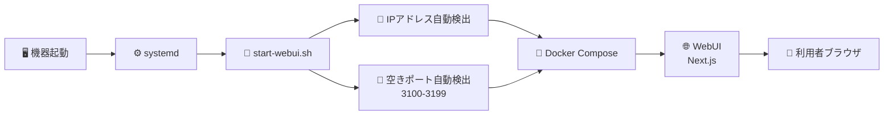
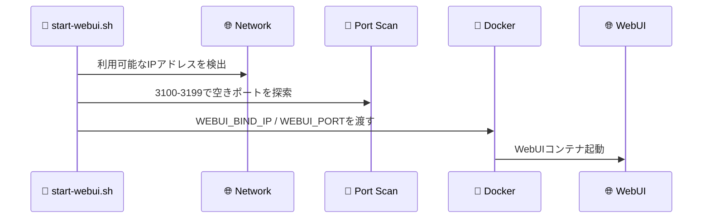
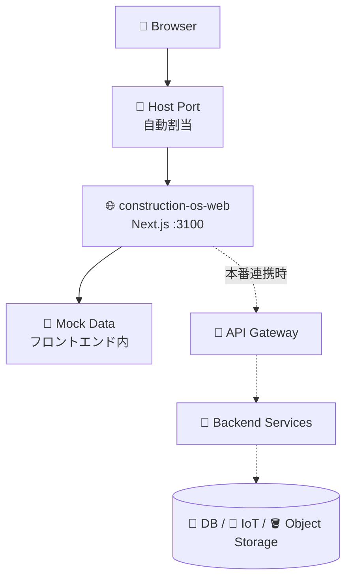

# IT部門スタッフ向け 運用ガイド

この文書は、Construction Enterprise OS のWebUIを、社内機器または検証サーバーで起動・停止・確認するための運用メモです。

## 🧭 運用の全体像



## ✅ 現在の確認済み状態

| 項目 | 状態 |
| --- | --- |
| WebUI URL | `http://192.168.0.185:3102/` |
| systemdサービス | `construction-enterprise-os-webui.service` |
| 自動起動 | 有効化済み |
| Dockerコンテナ | `construction-os-web` |
| ヘルスチェック | `/design/dashboard/all` を確認 |
| データ状態 | モックデータ |

## 🚀 手動起動

```bash
scripts/webui/start-webui.sh
```

起動時に、リポジトリ直下へ `.env.webui` が作成されます。

```env
WEBUI_BIND_IP=192.168.x.x
WEBUI_PORT=3100
```

表示されたURLをブラウザで開いてください。

## 🔁 systemd登録

```bash
sudo scripts/webui/install-systemd.sh
```

登録されるサービス名:

```text
construction-enterprise-os-webui.service
```

登録後は、機器起動時にWebUIが自動で立ち上がります。

## 🩺 状態確認

```bash
systemctl status construction-enterprise-os-webui.service
docker compose --env-file .env.webui ps web
docker logs construction-os-web --tail 100
```

WebUIの疎通確認:

```bash
curl -I http://192.168.0.185:3102/design/dashboard/all
```

期待する結果は `HTTP/1.1 200 OK` です。

## 🛑 停止

systemd経由で停止:

```bash
sudo systemctl stop construction-enterprise-os-webui.service
```

手動停止:

```bash
scripts/webui/stop-webui.sh
```

## 🔌 IPアドレスとポートの扱い

既定では、WebUIは次の流れでURLを決めます。



固定したい場合は、次のファイルを編集します。

```text
/etc/construction-enterprise-os/webui.env
```

例:

```env
CONSTRUCTION_OS_HOME=/home/kensan/Projects/Construction-Enterprise-OS
WEBUI_BIND_IP=0.0.0.0
WEBUI_PORT=3100
WEBUI_PORT_START=3100
WEBUI_PORT_END=3199
```

## 🧱 Docker構成

現在のWebUIモックは、バックエンドに依存せず単体で起動できます。



## 🧯 トラブル対応

| 事象 | 確認すること |
| --- | --- |
| URLが開かない | `.env.webui` のIPとポート、Docker状態、ファイアウォール |
| ポートが変わった | `scripts/webui/start-webui.sh` が空きポートを再選択しています |
| `unhealthy` 表示 | `docker logs construction-os-web --tail 100` を確認 |
| systemdが失敗 | `journalctl -u construction-enterprise-os-webui.service -n 160 --no-pager` を確認 |
| Redis/Postgresと競合 | WebUI単体起動は `--no-deps web` のため、通常は依存サービスを起動しません |

## 🔐 運用時の注意

- 現在のWebUIはモックデータです。個人情報や実工事データは投入しないでください。
- 社内ネットワーク外へ公開する場合は、認証、TLS、VPN、ファイアウォール設定を別途確認してください。
- 本番導入前に、監査ログ、権限、バックアップ、障害復旧手順を確定してください。
