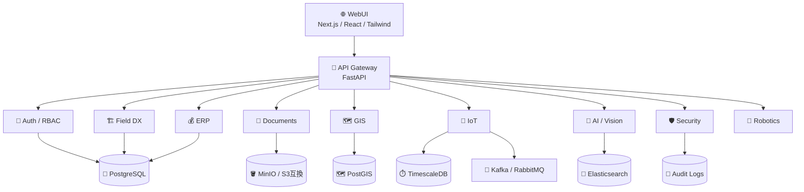
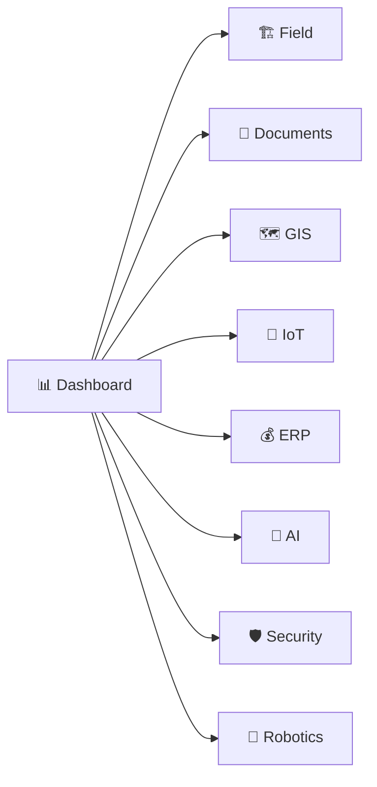
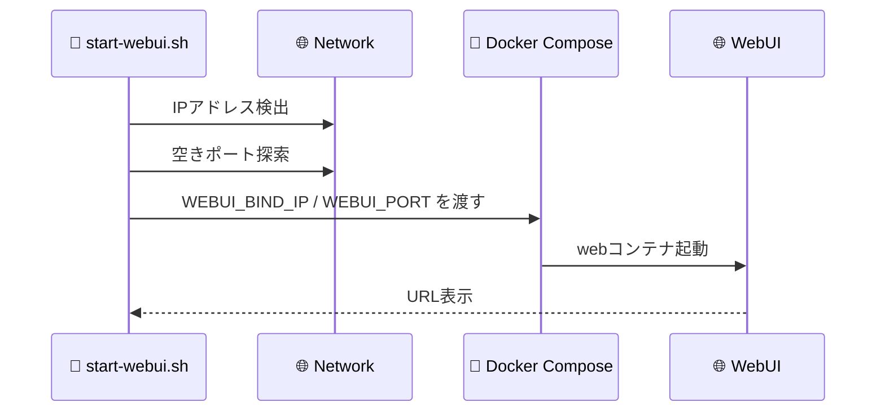
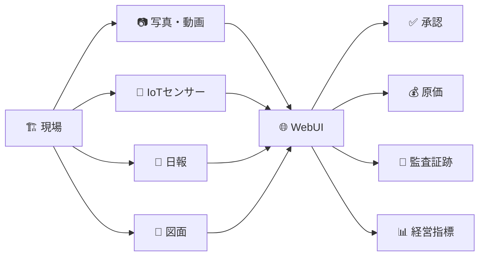

# 技術スタックとシステム構成

Construction Enterprise OS の技術構成を、役割ごとに整理した文書です。

## 🏗️ 全体アーキテクチャ

## 🧩 レイヤ別構成

| レイヤ | アイコン | 主な技術 | 役割 |
| --- | --- | --- | --- |
| WebUI | 🌐 | Next.js 14, React 18, Tailwind CSS, lucide-react | 利用者が操作する画面 |
| API入口 | 🚪 | FastAPI Gateway | 各業務サービスへの入口 |
| 認証・権限 | 🔐 | JWT, RBAC, Entra ID連携想定 | 利用者、権限、監査の管理 |
| 業務サービス | 🧩 | FastAPI microservices | 文書、現場、ERP、GIS、IoT、AIなど |
| データベース | 🐘 | PostgreSQL, PostGIS, TimescaleDB | 業務、地図、時系列データ |
| キャッシュ | ⚡ | Redis | セッション、短期キャッシュ |
| メッセージ | 📨 | Kafka, RabbitMQ | IoT、通知、非同期処理 |
| 文書保管 | 🪣 | MinIO S3互換 | 図面、写真、電子納品、動画 |
| 検索・分析 | 🔎 | Elasticsearch, Kibana | 全文検索、ログ分析、監査補助 |
| コンテナ | 🐳 | Docker Compose | 検証環境・機器内起動 |
| 自動起動 | ⚙️ | systemd | 機器起動時のWebUI起動 |

## 🌐 WebUI構成

現在のWebUIはモックモードです。

| 項目 | ファイル |
| --- | --- |
| WebUIレイアウト | `apps/web/src/app/(dashboard)/layout.tsx` |
| デザインモック共通画面 | `apps/web/src/app/(dashboard)/_components/DesignMockPage.tsx` |
| デザインモックルーティング | `apps/web/src/app/(dashboard)/design/[[...slug]]/page.tsx` |
| ダッシュボード用ダミーデータ | `apps/web/src/lib/mock-dashboard-data.ts` |
| WebUI Dockerfile | `apps/web/Dockerfile` |
| systemdユニット | `infra/systemd/construction-enterprise-os-webui.service` |
| 起動スクリプト | `scripts/webui/start-webui.sh` |

## 🚀 起動構成

WebUIコンテナ内では `3100` 番を使います。ホスト側は `scripts/webui/start-webui.sh` が `3100-3199` の空きポートを選び、Docker Composeへ渡します。

## 🛤️ 将来の本番連携イメージ

## 🔐 本番導入時に確定すべき技術項目

- 認証方式: Entra ID、AD、MFA、SSOの範囲
- 権限設計: 本社、支店、現場、協力会社、監査法人の閲覧・操作権限
- 監査ログ: 保管期間、改ざん防止、検索要件
- データ連携: 既存ERP、文書管理、CAD/BIM、IoT基盤との接続方式
- バックアップ: RPO/RTO、復旧訓練、保管先
- セキュリティ: TLS、VPN、EDR、脆弱性診断、ログ監視
