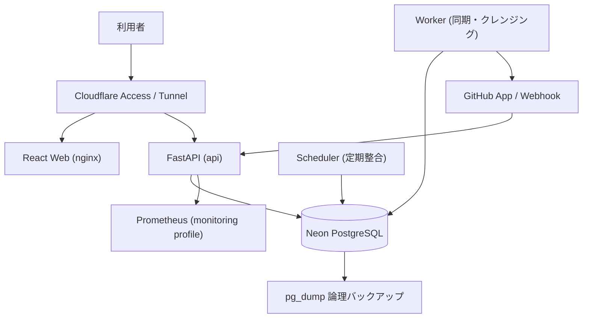
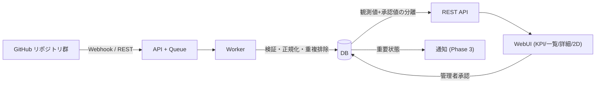

# DX Project Atlas 🗺

**DXプロジェクト・ポートフォリオ可視化基盤** — GitHub 上の多数の DX・IT プロジェクトを、
経営 / IT-DX / 開発 / 運用の各視点から把握できるポートフォリオとして一元管理するシステム。

| 項目 | 内容 |
| --- | --- |
| リポジトリ | [DX-Project-Portfolio-Atlas](https://github.com/Kensan196948G/DX-Project-Portfolio-Atlas) |
| フェーズ | v0.6.0（台帳・KPI・詳細・2D/3D・同期・RBAC・監査・AI・ユーザー管理） |
| バックエンド | Python 3.12 / FastAPI / SQLAlchemy 2 / Alembic |
| フロントエンド | React 18 / TypeScript / Vite / Cytoscape.js |
| DB | Neon PostgreSQL（本番）/ Docker PostgreSQL 17（開発） |
| 認証 | Cloudflare Access JWT + アプリ内 RBAC |
| 実行基盤 | Ubuntu Server LTS + Docker Compose + systemd + Cloudflare Tunnel |

> **v0.1.2（DR 復旧性・リリース衛生）**: バックアップの復元不能（Neon 固有ロール依存）と
> 空バックアップの黙殺を解消、復元試験を自動化、稼働バージョンの一元管理を実施
> （2026-08-07）。詳細は
> [Release Notes v0.1.2](docs/release-notes/Release-Notes-v0.1.2.md)。
>
> **v0.6.0（本番運用性・RBAC運用・セキュリティ強化）**: ユーザー・ロール管理、
> セッション失効（token_version）、監査ログCSV出力、リクエスト上限、
> GitHub Actions SHAピン化・Dependabot、バックアップ鮮度チェックを実装（2026-08-12）。
> 詳細は
> [Release Notes v0.6.0](docs/release-notes/Release-Notes-v0.6.0.md)。
>
> **v0.1.5（同期データ列長超過の解消）**: GitHub Actions Run の長いタイトル等で
> `github_items` 同期が失敗する問題を保存境界での切り詰めで解消
> （2026-08-07・本番反映済み）。詳細は
> [Release Notes v0.1.5](docs/release-notes/Release-Notes-v0.1.5.md)。
>
> **v0.1.4（管理設定の永続化・UI/UX 強化）**: 設定の保存・関係性管理 UI・監査
> before/after・認証付き CSV 出力・モバイル検索・全件ページング・reduced-motion 対応
> を実装（2026-08-07・本番反映済み）。詳細は
> [Release Notes v0.1.4](docs/release-notes/Release-Notes-v0.1.4.md)。
>
> **v0.1.3（役割別設定検証・同期堅牢性）**: worker/scheduler の本番起動不能（P0-O）の
> 恒久修正、SyncRun/ジョブの永久滞留の自己回復、可視性漏えい・webhook PAT 未設定を
> 修正（2026-08-07・本番反映済み）。詳細は
> [Release Notes v0.1.3](docs/release-notes/Release-Notes-v0.1.3.md)。
>
> **v0.1.1（本番堅牢化）**: 依存脆弱性（cryptography）解消、本番設定の
> 起動時検証、ロール変更の即時反映、If-Match 必須化、監査・レート制限・
> 監視メトリクスの補強を実施（2026-08-06）。詳細は
> [Release Notes v0.1.1](docs/release-notes/Release-Notes-v0.1.1.md)。

> ✅ **本番サブドメイン決定**: `dx-atlas.mirai-dx-platform.com`
> （2026-08-01・ユーザー指示。Cloudflare DNS + Tunnel + Access 設定済み）
> GitHub App 導入範囲 (OI-001) と Private 閲覧ポリシー (OI-002) の承認は
> 本番運用開始前に必要。

## 🖥 現在の稼働状態（ADR-002 → サブドメイン/Tunnel/Access/Neon 適用済み）

- WebUI（公開）: **https://dx-atlas.mirai-dx-platform.com**（Cloudflare Access で制限:
  `mirai-const.co.jp` ドメイン / 管理者メール。未認証は Access ログインへリダイレクト）
- WebUI（LAN フォールバック）: **http://192.168.0.185:8081**（本機 IP + ポート）
- 経路: Cloudflare Tunnel（`dx-project-atlas`）→ 本機 `localhost:8081`（nginx）
- 認証: **Cloudflare Access JWT（SSO）＋アプリ内 RBAC**。Access 未経由時はローカルユーザー
  （メール + パスワード）／`APP_ACCESS_TOKEN`（Bearer）がフォールバックとして利用可能
- 起動管理: systemd `dx-project-atlas.service`（`sudo systemctl status dx-project-atlas`、boot 時自動起動）
- DB: **Neon PostgreSQL**（Neon プロジェクト `DX-Project-Portfolio-Atlas`、既定 DB `neondb` / 本番データ20プロジェクト投入済み）
- ドメイン: `mirai-dx-platform.com`（サブドメイン `dx-atlas` 登録・Tunnel 設定済み）
- 詳細: [ADR-002](docs/adr/ADR-002-interim-local-deployment.md)

ローカルユーザーのパスワード設定/変更（コンテナ内）:
```bash
cd /home/kensan/Projects/Mirai-DX-Project/DX-Project-Portfolio-Atlas
docker compose run --rm --no-deps api python -m app.manage_users set-password admin@example.com <新しいパスワード>
```

## 🏗 構成図



## 🔄 データフロー



## ✨ 主要機能（Phase 1）

| ID | 機能 | 状態 |
| --- | --- | --- |
| FR-001〜004 | GitHub App 連携・同期・Webhook・クレンジング | ✅ 実装（GitHub App 導入は承認待ち、開発時 mock） |
| FR-005 | プロジェクト台帳（検索・フィルター・ページング） | ✅ |
| FR-006 | 詳細表示（概要/観測/CI/関係/履歴/品質） | ✅ |
| FR-007 | KPI ダッシュボード | ✅ |
| FR-008 | 手動分類・承認（履歴付き・楽観ロック） | ✅ |
| FR-009/010 | 関係性管理・2D 関係図 | ✅ |
| FR-013 | CSV 出力（認可・注入対策・監査） | ✅ |
| FR-014 | 監査ログ | ✅ |
| FR-015 | データ品質表示 | ✅ |
| FR-011 | 3D Atlas（WebGL・遅延ロード） | ✅ Phase 2（v0.2.0）。WebGL 非対応/動作低減時は 2D 誘導 |
| FR-012 | 通知（メール/Webhook/Teams・キュー・画面・抑制/集約） | ✅ Phase 3（v0.3.0）。抑制・Teams 対応済み |
| FR-016 | 週次レポート | ✅ Phase 3（v0.3.0・7日ごと自動＋手動生成） |
| FR-017 | AI（要約・類似・リスク） | ✅ 要約・類似・リスク実装（v0.5.0・オフライン/OpenAI・ベクトル類似・監査/費用記録）。RAG は次段階 |
| UI-011 | ユーザー・ロール管理（一覧・ロール・無効化・パスワードリセット・監査） | ✅ v0.6.0（administrator 専用・セッション失効連動） |
| OPS-04 | 保持期間の自動削除ジョブ | ✅ Phase 2（v0.2.0・日次実行・監査/通知記録） |

## 🚀 開発環境での起動

### Docker Compose（推奨）

```bash
cp .env.example .env   # 値を設定
docker compose up -d db migrate api worker scheduler web
docker compose run --rm api python -m app.seed   # デモデータ投入
```

- WebUI: http://localhost:8080
- API ドキュメント: http://localhost:8080/api/v1/docs
- 開発用 DB: localhost:5432 (atlas/atlas)

### MVP / Prototype デモ環境（ローカル・本番とは完全分離）

関係者レビュー・操作確認用の MVP 環境です。本番スタック（compose.yaml + Neon +
Cloudflare Tunnel）とはポート・DB・コンテナ名・デモバナー・環境変数が完全に分離されており、
本番 `.env` や Neon へ接続しません。

```bash
bash scripts/mvp-up.sh    # 起動 + migration + デモデータ投入（冪等）
bash scripts/mvp-down.sh  # 停止
```

- WebUI: **http://127.0.0.1:8083**（画面上部に「デモ用環境」バナーを表示）
- API ドキュメント: http://127.0.0.1:8003/api/v1/docs
- DB: 127.0.0.1:55434 (atlas/atlas、Docker Volume `pgdata-mvp` に保存)
- 公開 URL（関係者レビュー用）: **https://dx-atlas-mvp.mirai-dx-platform.com/**
  （named tunnel `dx-atlas-mvp` + DNS CNAME + systemd `dx-atlas-mvp-cloudflared.service`
  で公開。Cloudflare Access は未適用のため、アクセス制御はアプリ内ログイン＋RBAC に依存）

デモユーザー（パスワードはすべて `DemoPass123!`）:

| メール | ロール |
| --- | --- |
| admin@demo.dxatlas.jp | administrator（全機能・ユーザー管理） |
| manager@demo.dxatlas.jp | portfolio_manager（承認・レビューキュー） |
| operator@demo.dxatlas.jp | operator（運用操作） |
| viewer@demo.dxatlas.jp | viewer（閲覧のみ） |

投入されるデータはすべて架空のダミーデータです（`app.seed` 15 プロジェクト +
`app.seed_mvp` の【デモ】プロジェクト／リポジトリ／関係／通知／レビュー／同期履歴／監査）。
検証後も削除せず、そのまま操作・評価できる状態を維持します。

> **セキュリティ注記**: 上記公開 URL は MVP レビュー用にアプリ内ログインだけで保護しています。
> 社外公開を続ける場合や Access ポリシーを掛けたい場合は別途ご相談ください。

### ローカル（Vite + uvicorn）

```bash
# バックエンド
cd apps/api && cp .env.example .env
uv sync && uv run alembic upgrade head && uv run python -m app.seed
uv run uvicorn app.main:app --port 8001

# フロントエンド（別ターミナル）
cd apps/web && cp .env.example .env
pnpm install && pnpm dev
```

> 開発時は Vite プロキシが `X-Dev-User` を付与し、`APP_ENV=local` 限定で認証バイパスが有効。
> 本番イメージではバイパスは無効（詳細設計 11.1）。

## 🧪 検証

| 項目 | コマンド | 結果 |
| --- | --- | --- |
| Backend lint / type / test | `cd apps/api && uv run ruff check . && uv run mypy app && uv run pytest -q` | ✅ PASS |
| Frontend lint / build / test | `cd apps/web && pnpm lint && pnpm build && pnpm test` | ✅ PASS |
| E2E（Playwright） | `cd apps/web && pnpm e2e`（CI: chromium） | ✅ 5 フロー PASS |
| Compose 検証 | `docker compose config --quiet` | ✅ PASS |
| CI | GitHub Actions (`ci.yml` / `deploy.yml` / `preview.yml`) | 構成済み |
| DX Idea（統合アプリ） | `cd apps/dx-idea && TMPDIR=/tmp/cdx-verify npm run verify` | ✅ PASS（CI ジョブ `dx-idea` で検証） |

> 注: 本検証環境のサンドボックスでは Chromium バイナリが起動不能（SIGTRAP）のため、
> ローカル E2E は `pnpm exec playwright test --project=webkit` で実施。
> CI（GitHub Actions）では chromium を実行する。

## 📁 リポジトリ構成

```text
DX-Project-Portfolio-Atlas/
├─ apps/
│  ├─ api/          # FastAPI / SQLAlchemy / Alembic / Worker / Scheduler
│  ├─ web/          # React + Vite SPA
│  └─ dx-idea/      # Construction DX Idea（AI 活用 DX アイデア管理・Worker/Neon・2026-08-07 統合）
├─ packages/
│  └─ design-tokens/ # CSS variables
├─ migrations/      # Alembic マイグレーション
├─ ops/
│  ├─ systemd/      # 本番 systemd unit
│  ├─ monitoring/   # Prometheus 設定 + SLO アラート
│  └─ runbooks/     # 運用・障害・監視・バックアップ・シークレット・リリース手順
├─ scripts/         # bootstrap / backup / restore / healthcheck
├─ docs/            # 設計書・ADR・契約・アーキテクチャ・リリースノート
├─ .github/workflows/ # CI / Deploy / Preview
├─ compose.yaml
└─ .env.example
```

## 🧩 統合アプリ: Construction DX Idea

2026-08-07 に `Kensan196948G/Construction-DX-Idea` の全機能を本モノレポへ統合した
（[統合記録](docs/integration/construction-dx-idea-migration.md)）。

- 本番 URL: **https://dxidea.mirai-dx-platform.com**（Cloudflare Access 認証・AI 有効）
- 機能: 困りごと入力 → AI 質問 → 構造化 → 人確認 → 登録 → ステージ管理 → Slack 通知
- 構成: React SPA（`apps/dx-idea/src`）＋ Cloudflare Worker API（`apps/dx-idea/worker`）＋
  Neon PostgreSQL（`apps/dx-idea/migrations`）
- デプロイ: GitHub Actions `Deploy` → `deploy-dx-idea`（workflow_dispatch）
- 旧リポジトリは全機能移行確認後に Y/N 判断で削除予定

## 🔐 セキュリティ方針

- 秘密情報（DB URL、Webhook Secret、GitHub App 鍵）は `.env` / Secret 管理のみ。`git` 管理しない。
- GitHub Token は保存時に Fernet 暗号化（`GITHUB_TOKEN_ENCRYPTION_KEY` 未設定時は `SECRET_KEY` から導出）。
- GitHub App 権限は Metadata/Contents/Issues/PR/Actions の **Read のみ**（Write なし）。
- Webhook は HMAC-SHA256 署名検証 + Delivery ID 冪等化 + 2MiB 上限。
- Private リポジトリは administrator のみ（MVP ルール・OI-002 保留）。
- プロジェクト台帳・関係図・CSV・KPI は同じ可視性ルールを適用（viewer は public + 明示許可のみ）。
- コンテナは非 root・read-only・cap_drop ALL・no-new-privileges。
- CSV 出力は formula injection 対策済み。変更系 API は監査ログ必須。

## 📚 運用ドキュメント

| ドキュメント | 内容 |
| --- | --- |
| [運用手順書](ops/runbooks/operations-runbook.md) | 日次/週次/月次/四半期点検 |
| [障害対応手順書](ops/runbooks/incident-runbook.md) | 検知→対応→復旧→再発防止、ロールバック判定 |
| [監視手順書](ops/runbooks/monitoring-runbook.md) | Prometheus / アラート解説 |
| [バックアップ・リストア手順書](ops/runbooks/backup-restore-runbook.md) | RPO 24h / RTO 8h・復元試験（`scripts/restore-verify.sh`） |
| [シークレットローテーション手順書](ops/runbooks/secret-rotation-runbook.md) | 鍵・シークレットの更新手順 |
| [リリース手順書](ops/runbooks/release-runbook.md) | リリースチェックリスト・migration・rollback |
| [リリースノート](docs/release-notes/Release-Notes-v0.1.0.md) | v0.1.0 変更内容・既知の問題 |
| [ADR-001（CTO 決定事項）](docs/adr/ADR-001-cto-decisions-phase1.md) | サブドメイン候補・RBAC ルール等 |
| [API 契約](docs/contracts/api-v1.md) | frontend/backend 共通契約 |

## 🚧 既知の問題・未決事項

| ID | 内容 | 影響 | 対応方針 |
| --- | --- | --- | --- |
| OI-001 | GitHub App の対象 Organization / リポジトリ範囲 | 実データ同期不可 | 本番前のユーザー承認 |
| OI-002 | Private 閲覧ポリシー | MVP は admin のみ | 承認後に repository_access_rules 実装 |
| OI-003 | ✅ 解消済み: 本番 URL / Access ポリシー | なし | `dx-atlas.mirai-dx-platform.com` に確定・Tunnel/Access 適用済み（2026-08-01） |
| OI-004 | 通知先（メール/Slack/Teams） | ✅ 基盤＋Teams 実装（v0.3.0）。本番資格情報は未設定 | 資格情報決定後に runbook のチェックリストで有効化 |
| OI-005 | 保持期間・RPO/RTO 確定 | 初期案運用中 | 復元試験を自動化し RTO を実測（2026-08-07）。Neon PITR 契約の確認と業務影響評価は PoC 後 |
| OI-006 | 活動閾値の確定 | 初期値運用中 | PoC 評価時に調整 |
| OI-007 | README 保存範囲・AI 利用 | ✅ 承認・要約/類似/リスク実装（v0.5.0・オフライン動作可・ベクトル類似対応） | RAG は次段階 |
| SEC-001 | ✅ 解消済み: react-router 8.3.0 + React 19 へ移行 | なし | 済み（2026-07-31） |
| SEC-002 | ✅ 解消済み: brace-expansion（dev 依存）・js-yaml（CVE-2026-59870）を更新 | なし | CI の依存監査は high 以上で失敗（2026-08-07） |
| BK-06 | 本番で APP_ACCESS_TOKEN が有効（暫定共有トークン） | 管理者権限 | Cloudflare Access 全面適用後に無効化（ADR-002 L-003 の既知バックログ） |

## 📄 ライセンス

本リポジトリは社内利用を前提とした管理ツールです。[LICENSE](LICENSE)（社内利用・
All Rights Reserved）を適用します。OSS 化や別ライセンスへの変更はプロジェクトオーナーの
承認に従います。
