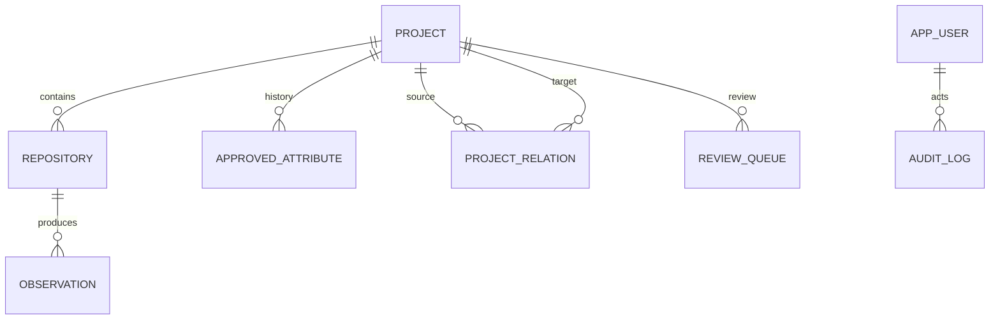
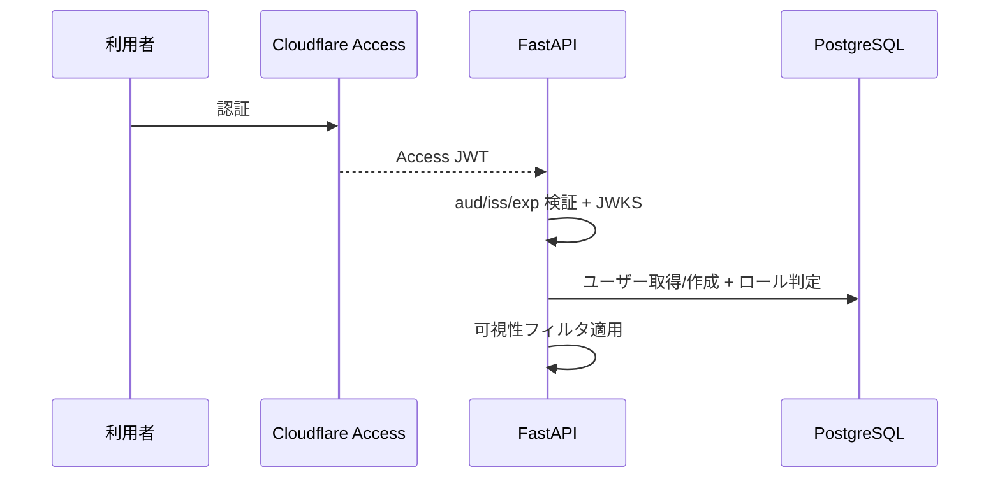

# アーキテクチャ概要

詳細は `docs/adr/ADR-001-cto-decisions-phase1.md` と設計仕様書を参照。

## コンポーネント

| コンポーネント | 技術 | 役割 |
| --- | --- | --- |
| web | React + Vite + nginx | SPA 配信、KPI/一覧/詳細/2D |
| api | FastAPI + SQLAlchemy | REST API、認可、Webhook、監査 |
| worker | Python | 同期・クレンジング・ジョブ実行 |
| scheduler | Python | 定期整合（reconcile/metrics） |
| db | Neon PostgreSQL 17 | 正本データ、ジョブキュー |
| monitoring | Prometheus | メトリクス・SLO アラート |

## データモデル（要約）

## 認証・認可フロー

