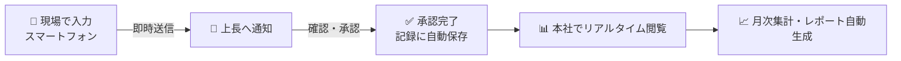
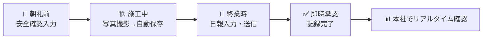
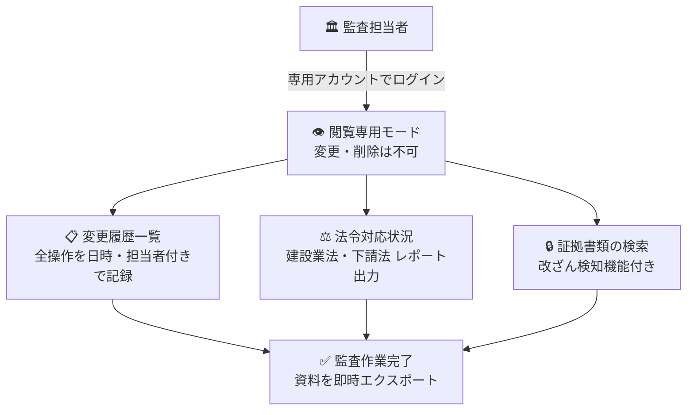
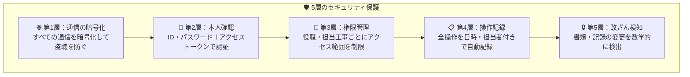
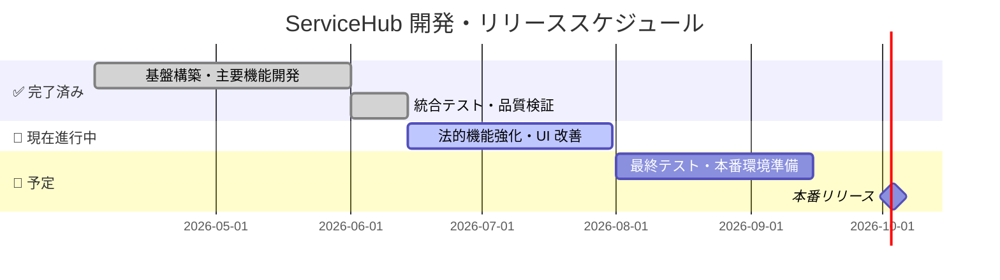

# 🏗️ ServiceHub 工事管理プラットフォーム

<div align="center">

### 建設現場・施工管理・経営管理・監査 — すべてをひとつの画面で

> 紙・Excel・メール・電話による情報の分断をなくし、  
> 現場から経営層まで「いま何が起きているか」をリアルタイムでつなぐ  
> **建設業専用クラウド統合管理システム**

[](https://github.com/Kensan196948G/ServiceHub-Construction-Platform/actions)
[](https://github.com/Kensan196948G/ServiceHub-Construction-Platform/actions)
[](LICENSE)

</div>

---

## 📋 このドキュメントについて

| 📖 このページ（README）                    | 対象：現場施工管理者・技術者・経営役員・監査法人          |
| ------------------------------------------ | --------------------------------------------------------- |
| [📘 IT 導入・運用ガイド](docs/it-guide.md) | 対象：IT 部門スタッフ（サーバー構築・ユーザー管理・監視） |
| [⚙️ 技術スタック詳細](docs/tech-stack.md)  | 対象：エンジニア・技術評価者（アーキテクチャ・API 設計）  |

---

## 💡 導入前後の変化

| 🔴 これまでの課題                    | 🟢 ServiceHub 導入後                         |
| ------------------------------------ | -------------------------------------------- |
| 日報を紙で記入 → 本社に郵送 → 転記   | スマートフォンで入力 → 即時送信 → 電子承認   |
| 現場写真を USB で持ち帰って整理      | 撮影と同時にクラウドへ自動保存・整理         |
| 「あの写真どこ？」が毎回発生         | 工事名・日付で3秒以内に検索・表示            |
| 契約書リスクの確認に数日かかる       | AI が数分で法的リスクを自動検出              |
| 監査対応で書類探しに丸一日           | 全記録をすぐに呼び出せる・閲覧専用権限       |
| 複数の Excel・紙が混在して最新版不明 | 全員が同じ最新情報をリアルタイムで確認       |
| 工事の原価超過に気づくのが遅い       | 予算 vs 実績をグラフで自動比較・早期アラート |

---

## 👥 利用対象者

```
┌──────────────────────────────────────────────────────────┐
│                   ServiceHub 利用者                        │
├────────────────┬──────────────────┬──────────────────────┤
│  🦺 現場の方   │  📊 本社・管理職  │  🏛️ 監査・法務の方   │
├────────────────┼──────────────────┼──────────────────────┤
│ 現場施工管理者 │ 経営役員          │ 監査法人・会計士      │
│ 土木建設技術者 │ 工事部長・支店長  │ 法務・コンプライアンス│
│ 現場作業員     │ 積算・原価管理    │ 内部監査室            │
│ 土木建設研究者 │ 管理本部長        │ 外部審査機関          │
└────────────────┴──────────────────┴──────────────────────┘
```

---

## ✨ 主な機能

### 1️⃣ 工事案件管理

進行中のすべての工事を一元管理します。

| 機能                    | 現場・管理職が得られる効果                         |
| ----------------------- | -------------------------------------------------- |
| 📋 工事一覧・進捗確認   | 「今どこまで進んでいるか」を全社でリアルタイム共有 |
| 📅 工期・予算管理       | 遅延・予算超過を早期発見して手を打てる             |
| 🤖 契約書 AI リスク解析 | 建設業法・下請法のリスクを契約締結前に自動検出     |
| 📁 関連書類の一元管理   | 図面・仕様書・許可書類を工事案件ごとに整理         |

---

### 2️⃣ 日報・報告管理

現場でスマートフォンから日報を送信。紙を本社へ持ち帰る手間がなくなります。



| 機能                      | 効果                               |
| ------------------------- | ---------------------------------- |
| 📝 現場からの直接入力     | 紙・転記・Excel 集計が不要         |
| ✅ 電子承認ワークフロー   | 上長の承認・差し戻しがその場で完結 |
| 🔍 過去の日報を即検索     | 引継ぎ・証拠提出に瞬時に対応       |
| 📊 自動集計・月次レポート | 手作業集計が不要になる             |

---

### 3️⃣ 写真・資料管理

現場写真を撮ってそのままクラウドへ保存。工事の進捗記録が自動的に整理されます。

| 機能                        | 効果                               |
| --------------------------- | ---------------------------------- |
| 📸 写真の即時アップロード   | 「後で整理する」作業が不要         |
| 🗓️ 日付・工事別の自動整理   | 時系列で施工進捗を確認できる       |
| 🔐 安全なクラウド保管       | 端末紛失・故障による写真消失を防ぐ |
| 👁️ 本社からリアルタイム閲覧 | 現場に行かなくても施工状況を確認   |

---

### 4️⃣ 安全・品質管理

法令で定められた安全確認や品質検査を電子記録。書類提出・監査対応が大幅に楽になります。

| 機能                      | 効果                                 |
| ------------------------- | ------------------------------------ |
| ✅ 安全確認チェックリスト | 確認漏れをシステムが防ぐ             |
| 📊 品質検査記録の集計     | 現場別・期間別の品質傾向を一目で把握 |
| 📋 監査用記録の自動作成   | 「書類を作り直す」手間がなくなる     |
| 🚨 危険箇所の自動アラート | 安全確認が未完了な場合に即通知       |

---

### 5️⃣ 原価・工数管理

工事ごとの予算と実績をグラフで比較。コスト超過を早期発見して収益を守ります。

| 機能                        | 効果                               |
| --------------------------- | ---------------------------------- |
| 💰 予算 vs 実績のグラフ表示 | 「気づいたら赤字」を防ぐ早期警告   |
| 📈 工事別・月別コスト集計   | 原価管理の手作業・Excel 集計が不要 |
| 📉 予実差異の自動計算       | 経営判断に使えるデータをすぐに取得 |

---

### 6️⃣ AI ナレッジ管理

「あの工事のとき、どう対応したっけ？」という疑問に、社内の蓄積知識を AI が答えます。

| 機能                  | 効果                                             |
| --------------------- | ------------------------------------------------ |
| 🤖 自然な言葉で検索   | 「橋梁工事の施工注意点は？」など普通の言葉で検索 |
| 📚 施工ノウハウの蓄積 | 熟練技術者の知識を会社の財産として保存           |
| 💡 関連情報の自動提案 | 調べたい内容の関連記事も一緒に表示               |

---

### 7️⃣ ⚖️ 法的コンプライアンス（Legal Tech）

建設業法・下請法に特化した AI が契約書を自動審査。見落としなくリスクを検出します。

| 機能                         | 効果                                         |
| ---------------------------- | -------------------------------------------- |
| 🤖 契約書の AI 自動審査      | 弁護士確認前に危険な条項を自動発見           |
| 🔴 CRITICAL リスクの即時通知 | 法令違反リスクがある場合は担当者へ即アラート |
| 📜 法的証跡タイムライン      | いつ・誰が・何を確認したかを記録             |
| 🔒 電子証拠の完全性保証      | 書類の改ざんを検知する仕組みを内蔵           |

> 📌 対応法令：建設業法 / 下請法 / 公共工事の入札及び契約の適正化に関する法律

---

### 8️⃣ 障害・変更管理（ITSM）

IT システムのトラブルや変更作業を管理。問題を見える化して迅速に解決します。

| 機能                          | 効果                                   |
| ----------------------------- | -------------------------------------- |
| 🚨 障害の記録と追跡           | 「誰が・いつ・どう対応したか」を明確化 |
| 📝 変更申請・承認ワークフロー | 無断変更によるシステム障害を防ぐ       |
| 📊 障害傾向の分析             | 繰り返す問題の根本原因を把握           |

---

## 💼 役割別の活用シーン

### 🦺 現場施工管理者・土木建設技術者の方



**毎日の業務がこう変わります**

| 従来                                       | ServiceHub 後                     |
| ------------------------------------------ | --------------------------------- |
| 紙の日報を記入（15〜30分）                 | スマートフォンから5分で入力・送信 |
| 写真を USB で持ち帰って整理（1〜2時間/週） | 撮影ボタン1つでクラウドへ即保存   |
| 「あの書類どこ？」で時間ロス               | 案件名・日付で3秒以内に検索       |
| 技術的な疑問は先輩に聞くしかない           | AI ナレッジ検索で社内事例を即参照 |

---

### 📊 経営役員・管理本部長の方

**朝イチでダッシュボードを開くと…**

```
┌─────────────────────────────────────────────────────────────┐
│ 📊 経営ダッシュボード                    2026年6月14日 08:30 │
├───────────────┬───────────────┬───────────────┬─────────────┤
│ 🏗️ 進行中案件 │  📋 本日の日報 │ ⚠️ 要対応事項  │  💰 収益率  │
│    8 件       │    12 件      │    2 件       │   94.2%    │
├───────────────┴───────────────┴───────────────┴─────────────┤
│ 🔴 要対応: 〇〇橋梁工事 ── 予算超過率が 15% を超えました     │
│ 🟡 確認中: △△道路工事 ── 本日分の安全確認が未完了です        │
│ 🟢 完了: ◇◇河川工事 ── 月次報告書が提出されました           │
└─────────────────────────────────────────────────────────────┘
```

**ServiceHub があれば…**

- 📈 全工事の進捗・リスクを**一画面で把握**できる
- ⚠️ 問題が発生したときに**自動でアラート**が届く
- 💰 原価・予実差異を**リアルタイムで確認**できる
- 📋 月次報告・経営会議の資料が**自動集計**される

---

### 🏛️ 監査法人・コンプライアンス担当の方



**ServiceHub が提供する監査対応機能**

| 必要な記録              | ServiceHub での確認方法                          |
| ----------------------- | ------------------------------------------------ |
| 📋 操作・変更履歴       | 全操作の日時・担当者・内容を自動記録（削除不可） |
| ⚖️ 法令コンプライアンス | 建設業法・下請法の対応状況を一覧・レポート出力   |
| 🔒 証拠書類の完全性確認 | 書類の改ざんを検知する仕組みを内蔵               |
| 📜 契約書審査記録       | AI 審査結果・承認フローの全履歴を表示            |
| 👤 アクセス管理記録     | 誰がいつ何を閲覧・変更したかの完全ログ           |

> 🔐 **監査専用の「閲覧のみ」アカウント**を発行できます。実務担当者のデータを変更することなく、安全に監査作業を行えます。

---

## 🔐 安心・安全への取り組み

建設業で扱う情報（契約内容・原価・個人情報）を守るための対策を多層で実施しています。



### アクセス権限の設定例

| 役割                | できること                               | できないこと           |
| ------------------- | ---------------------------------------- | ---------------------- |
| 👑 システム管理者   | 全機能・全ユーザー管理                   | —                      |
| 👔 工事部長・支店長 | 担当エリア全案件の閲覧・承認             | 他エリアの機密情報     |
| 🦺 現場担当者       | 担当工事の日報・写真・チェックリスト登録 | 他工事の原価・契約情報 |
| 👁️ 閲覧専用（監査） | データの閲覧・出力のみ                   | データの変更・削除     |

### 品質・信頼性の実績

| 項目                  | 内容                                                        |
| --------------------- | ----------------------------------------------------------- |
| 🧪 自動品質検査       | 開発のたびに **880 件以上のテスト**を自動実行               |
| 🔒 セキュリティ検査   | コード変更のたびに脆弱性スキャンを自動実施                  |
| 🌐 動作確認           | 実際のブラウザ操作を模した **221 件のシナリオ**で動作を保証 |
| 💾 データバックアップ | 毎日自動バックアップ（30 日間保存）                         |

---

## 📅 リリーススケジュール



| 🗂️ マイルストーン    | 📅 時期           | 内容                                   |
| -------------------- | ----------------- | -------------------------------------- |
| ✅ 主要機能開発完了  | 2026年6月         | 日報・写真・安全・原価・ITSM 等 8 機能 |
| 🔄 機能強化・UI 改善 | 2026年6〜7月      | Legal Tech 強化・画面使いやすさ向上    |
| 📋 最終検証          | 2026年8〜9月      | 全機能の最終テスト・セキュリティ審査   |
| 🚀 本番リリース      | **2026年10月3日** | 全社展開開始                           |

---

## 🔗 詳細資料

### 対象者別ドキュメント案内

| 対象者                        | ドキュメント                                               | 主な内容                                   |
| ----------------------------- | ---------------------------------------------------------- | ------------------------------------------ |
| 💻 **IT 部門スタッフ**        | [📘 IT 導入・運用ガイド](docs/it-guide.md)                 | 環境構築・ユーザー管理・監視・トラブル対応 |
| 🔧 **エンジニア・技術評価者** | [⚙️ 技術スタック詳細](docs/tech-stack.md)                  | 使用技術・アーキテクチャ・API 設計         |
| 🏛️ **監査・セキュリティ担当** | [🔒 セキュリティ設計書](docs/06_セキュリティ（Security）/) | セキュリティ設計・脅威分析・対策詳細       |
| 📊 **品質保証・検収担当**     | [📊 テスト仕様書](docs/07_テスト（Testing）/)              | テスト方針・品質基準・検証結果             |
| 🚀 **インフラ・構築担当**     | [📦 構築・運用手順書](docs/INSTALLATION.md)                | サーバー構築・デプロイ・バックアップ手順   |

---

## 📞 お問い合わせ

| 種別                        | 連絡先                                                                                                    |
| --------------------------- | --------------------------------------------------------------------------------------------------------- |
| 🔧 システムの不具合         | [不具合報告（GitHub Issues）](https://github.com/Kensan196948G/ServiceHub-Construction-Platform/issues)   |
| 💡 機能改善・ご要望         | [要望フォーム（GitHub Issues）](https://github.com/Kensan196948G/ServiceHub-Construction-Platform/issues) |
| 🔒 セキュリティに関する問題 | プロジェクト管理者へ直接ご連絡ください                                                                    |

---

<div align="center">

## 🏗️ ServiceHub Construction Platform

**建設業のデジタルトランスフォーメーションを、現場から経営まで一貫してサポート**

開発期間：2026年4月〜10月 ｜ 本番リリース目標：**2026年10月3日** ｜ ライセンス：MIT

---

_エンジニア・IT 部門の方は [技術スタック詳細](docs/tech-stack.md) および [IT 運用ガイド](docs/it-guide.md) をご参照ください_

</div>
