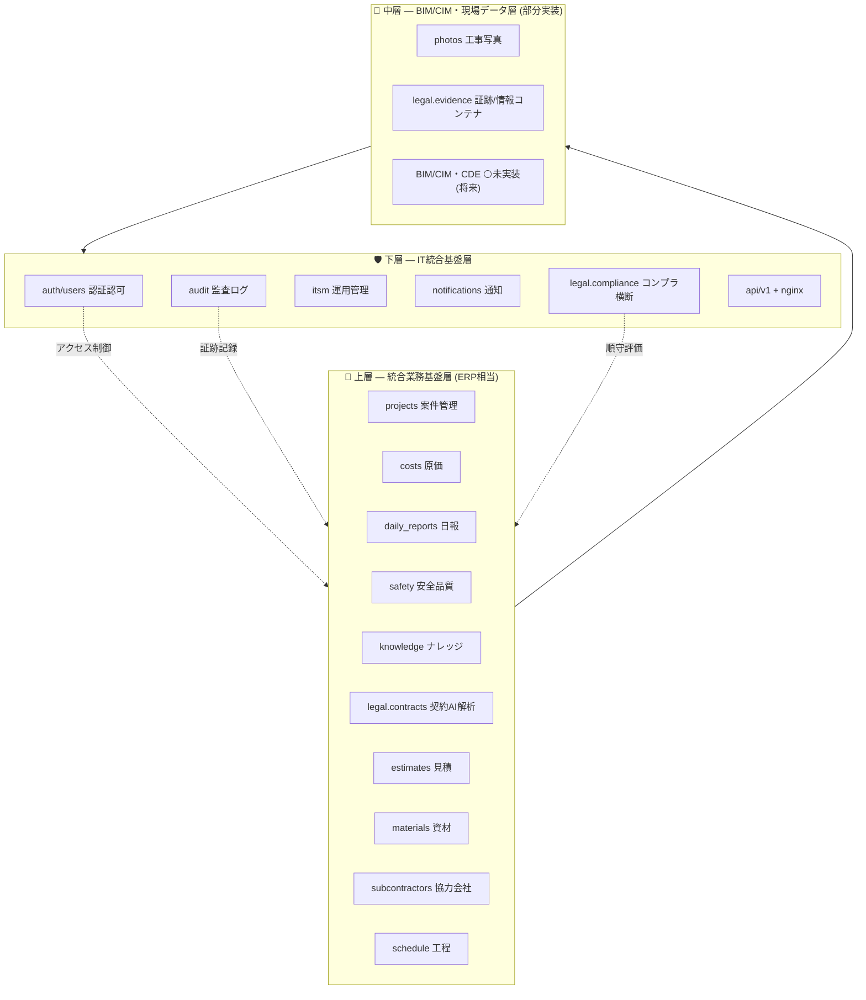

# 三層モデル × モジュール × ISO 要求マッピング

> 📌 本書は ServiceHub Construction Platform の各モジュールが「三層アーキテクチャモデル」のどの層に属し、どの ISO マネジメントシステム要求に対応しうるかを整理した設計ドキュメントである。
>
> | 項目           | 値                              |
> | -------------- | ------------------------------- |
> | ステータス     | Draft（実装と連動して継続更新） |
> | 最終更新       | 2026-05-31                      |
> | 関連 Issue     | #237                            |
> | 対象バージョン | v1.1.0 系                       |

---

## 📌 1. 本書の位置づけと前提

建設・土木業界向けの統合基盤は、業務アプリケーション・現場データ・IT 基盤という性質の異なるレイヤーが混在する。本書はそれを「三層モデル」として整理し、各層・各モジュールが満たしうる ISO 要求を可視化することで、**ISO 適合性の説明責任（外向けの真実）** を担保する。

重要な原則として、本書は **「理想（設計目標）」と「実装（コードの現実）」を明確に区別** する。対応状況は `status` 列で示し、未実装を「対応済み」と偽らない。

- 🟢 実装済み: 該当機能がコードベースに存在し、ISO 要求の主要部分を満たす
- 🟡 部分実装: 機能の一部が存在するが、ISO 要求を完全には満たさない
- ⚪ 未実装（将来）: 設計目標として掲げるが現状はコードに存在しない

---

## 📌 2. 三層モデル（設計目標）

| 層   | layer キー            | 役割                                                                                             | 代表モジュール                                                          |
| ---- | --------------------- | ------------------------------------------------------------------------------------------------ | ----------------------------------------------------------------------- |
| 上層 | `upper_business`      | 統合業務基盤層（ERP 相当）。工事・原価・日報・安全・品質・ナレッジ・契約など業務アプリケーション | projects / costs / daily_reports / safety / knowledge / legal.contracts |
| 中層 | `middle_bim_data`     | BIM/CIM・i-Construction・現場データ層。3D モデル・成果物台帳・CDE 連携・現場一次情報             | photos / legal.evidence（※ BIM/CIM 本体は未実装）                       |
| 下層 | `lower_it_foundation` | IT 統合基盤層。ID・認証・認可・監視・セキュリティ・共通データモデル・API                         | auth/users / audit / itsm / notifications / legal.compliance            |

---

## 📌 3. 対応 ISO 規格（精査済み一覧）

ServiceHub は **建設業ドメインの ISO** と **IT・内部統制の ISO** の双方を対象とする。後者はグローバル運用エージェント（`audit-agent`）の責務定義（ISO20000 / ISO27001 / J-SOX）とも整合する。

| 規格          | 名称                            | 領域           | 主担当層   |
| ------------- | ------------------------------- | -------------- | ---------- |
| ISO 9001      | 品質マネジメント（QMS）         | 建設業務全般   | 上層       |
| ISO 14001     | 環境マネジメント（EMS）         | 環境側面       | 上層・中層 |
| ISO 45001     | 労働安全衛生（OHSMS）           | 安全・現場     | 上層・中層 |
| ISO 55001     | アセットマネジメント            | 資産・LCC      | 上層       |
| ISO 19650     | BIM による情報マネジメント      | 成果物・CDE    | 中層       |
| ISO/IEC 20000 | IT サービスマネジメント（ITSM） | 運用           | 下層       |
| ISO/IEC 27001 | 情報セキュリティ（ISMS）        | セキュリティ   | 下層       |
| J-SOX         | 内部統制報告制度（金商法）      | 内部統制・証跡 | 下層・中層 |

---

## 📌 4. モジュール × 三層 × ISO マッピング表（実装ベース）

`module_key` はコードベース上の実名（`backend/app/api/v1/routers/` の router 名、または `frontend/src/pages/` のページ名）に対応する。

| module_key         | display_name_ja                  | layer                            | status | iso_core                                         | iso_requirements_hint                                                                                                                                              | notes                                                                                       |
| ------------------ | -------------------------------- | -------------------------------- | ------ | ------------------------------------------------ | ------------------------------------------------------------------------------------------------------------------------------------------------------------------ | ------------------------------------------------------------------------------------------- |
| `auth` / `users`   | 認証・認可・ユーザー管理         | lower_it_foundation              | 🟢     | 27001, J-SOX, 9001/14001/45001/55001 共通, 19650 | アクセス制御・最小権限（27001 A.5/A.8）、職務分掌（J-SOX）、役割・責任・権限（共通 5.3）、責任主体の明確化（19650 Appointing/Appointed Party）                     | IDOR 防止 `core/access_control.py` 強化中（PR#236）。RBAC: ADMIN/MANAGER/VIEWER             |
| `projects`         | 工事案件管理                     | upper_business                   | 🟢     | 9001, 14001, 45001, 55001, 19650                 | 品質計画・工程管理（9001 8.1）、プロジェクト別環境側面（14001 6.1.2）、工事別リスク評価（45001 6.1）、資産トラッキング（55001）、プロジェクト情報要求 PIR（19650） | 全モジュールの親エンティティ。`manager_id` で所有権スコープ                                 |
| `daily_reports`    | 日報・作業記録                   | upper_business / middle_bim_data | 🟢     | 9001, 14001, 45001, 19650                        | 実績記録・トレーサビリティ（9001 8.5.2）、環境影響記録（14001 9.1）、ヒヤリハット・安全活動記録（45001）、現場実績の情報コンテナ紐付け（19650）                    | 現場一次情報の発生源。中層データの入口                                                      |
| `photos`           | 工事写真・資料管理               | middle_bim_data                  | 🟢     | 9001, 45001, 19650                               | 検査記録の客観的証拠（9001 8.6）、危険箇所・是正前後写真（45001）、現場一次データ=情報コンテナ候補（19650）                                                        | MinIO 保管。EXIF/位置情報の構造化は将来拡張                                                 |
| `safety`           | 安全・品質管理                   | upper_business                   | 🟢     | 9001, 14001, 45001                               | 不適合・是正処置（9001 10.2）、リスクアセスメント・是正処置（45001 6.1/10.2）、環境不適合事象（14001 10.2）                                                        | 是正ワークフロー（依頼→対応→検証→完了）。itsm と連携                                        |
| `costs`            | 原価・工数管理                   | upper_business                   | 🟢     | 9001, 55001                                      | 品質目的のモニタリング（9001 9.1）、ライフサイクルコスト LCC の一部（55001）                                                                                       | 予算/実績差異分析                                                                           |
| `knowledge`        | ナレッジ・文書管理（AI 支援）    | upper_business                   | 🟢     | 全 ISO 共通, 19650                               | 文書化した情報の管理（共通 7.5）、記録管理、情報コンテナ管理の補助（19650）                                                                                        | AI 検索・推薦。CDE の文書管理 UI 側面                                                       |
| `legal/contracts`  | 契約 AI 解析                     | upper_business                   | 🟢     | 9001, J-SOX                                      | 契約・受注前レビュー（9001 8.2）、契約統制・適正性評価（J-SOX）、建設業法/下請法リスク評価                                                                         | Claude による CRITICAL リスク検出（Phase 1）                                                |
| `legal/evidence`   | 法的証跡タイムライン             | middle_bim_data                  | 🟢     | 19650, 9001, 14001, 45001, 27001, J-SOX          | 情報コンテナ（Status/Revision 概念）（19650）、記録の完全性保護（9001 7.5.3）、改ざん防止＝完全性（27001）、証跡の保全（J-SOX）                                    | SHA-256 Fail-Closed 整合性検証（Phase 2）。ISO19650 の Information Container に最も近い実装 |
| `legal/compliance` | コンプライアンスチェックエンジン | lower_it_foundation（横断）      | 🟢     | 全 ISO 横断                                      | 順守評価（9001 9.x / 14001 9.1.2 / 45001 9.1.2）、コンプライアンス義務の特定と評価                                                                                 | 法令・規格順守を横断的に評価するガバナンス機能                                              |
| `itsm`             | ITSM 運用管理                    | lower_it_foundation              | 🟢     | 20000, 27001                                     | インシデント/問題/変更/リリース管理（20000）、情報セキュリティインシデント管理（27001 A.5.24-A.5.28）                                                              | incidents/problems/changes エンティティ                                                     |
| `audit`            | 監査ログ管理                     | lower_it_foundation              | 🟢     | 27001, J-SOX, 全 ISO                             | イベントログ取得・保護（27001 A.8.15）、内部統制証跡（J-SOX）、内部監査の証跡基盤（共通 9.2）                                                                      | 全操作の改ざん耐性ログ                                                                      |
| `notifications`    | 通知管理                         | lower_it_foundation              | 🟢     | 20000, 27001                                     | サービス通知・エスカレーション（20000）、セキュリティ事象通知                                                                                                      | 複数チャネル配信                                                                            |
| `estimates`        | 見積管理                         | upper_business                   | 🟡     | 9001                                             | 引合・見積（9001 8.2.1 受注前プロセス）                                                                                                                            | フロントエンド中心。backend API は将来拡張                                                  |
| `materials`        | 資材管理                         | upper_business                   | 🟡     | 9001, 14001, 55001                               | 購買・受入検査（9001 8.4）、資材の環境配慮（14001）、資産管理（55001）                                                                                             | フロントエンド中心                                                                          |
| `subcontractors`   | 協力会社管理                     | upper_business                   | 🟡     | 9001, 45001, 19650                               | 外部提供者の管理（9001 8.4）、協力会社の安全管理（45001）、Appointed Party の識別（19650）                                                                         | フロントエンド中心                                                                          |
| `schedule`         | 工程管理                         | upper_business                   | 🟡     | 9001, 45001                                      | 工程・運用の計画と管理（9001 8.1）、工程に伴う安全計画（45001）                                                                                                    | フロントエンド中心                                                                          |
| BIM/CIM・CDE       | BIM 情報管理基盤                 | middle_bim_data                  | ⚪     | 19650                                            | CDE（Common Data Environment）、Information Container の Status コード（S0-S7/A1-An）ワークフロー、3D モデル連携、点群・ドローン測量（i-Construction）             | **未実装（将来拡張）**。現状は evidence/photos が現場データを部分的に担う                   |
| `共通マスター`     | 工事/現場/協力会社コード等       | lower_it_foundation              | 🟡     | 全 ISO 共通, 19650                               | 組織・利害関係者・設備の識別、情報コンテナ命名規則・識別子設計の基礎（19650）                                                                                      | 独立モジュール非実在。各モジュール内に分散。将来は共通データモデルへ集約検討                |
| `API ゲートウェイ` | API/連携基盤                     | lower_it_foundation              | 🟢     | 全 ISO 共通, 19650                               | 他システムとの情報整合性、CDE/BIM ツール連携インタフェース（19650）                                                                                                | 独立モジュール非実在。`api/v1` + nginx edge に吸収                                          |

---

## 📌 5. 実装ギャップと将来拡張

精査の結果、三層モデルに対する実装の充足度は層によって大きく異なる。

### 🟢 厚い層: 上層（業務）・下層（IT 基盤）

業務モジュール（projects/costs/daily_reports/safety/knowledge）と IT 基盤（auth/audit/itsm/notifications）は実装が充実しており、ISO 9001/45001/20000/27001/J-SOX の主要要求を技術的に満たす素地がある。特に **Legal Tech 三兄弟（evidence/compliance/contracts）** は、証跡の完全性検証・順守評価・契約リスク解析という ISO 適合の中核機能を実コードで具現化しており、ServiceHub 固有の強みである。

### ⚪ 最大のギャップ: 中層（BIM/CIM）

ServiceHub は **3D モデル / CDE / i-Construction を未実装**である。`photos`（工事写真）と `legal/evidence`（証跡）が現場一次データを担うが、ISO19650 が要求する完全な CDE（命名規則・Status コードワークフロー・Information Container の版管理）には到達していない。

将来拡張候補（中層）:

1. CDE（Common Data Environment）の本格実装 — Information Container の Status（S0-S7）/ Approval（A1-An）ワークフロー
2. BIM/CIM 3D モデルビューア連携
3. i-Construction（点群・ドローン測量・出来形管理）データ取り込み
4. `legal/evidence` を ISO19650 準拠の完全な Information Container へ拡張（分類体系・命名規則の付与）

### 🟡 環境（14001）・アセット（55001）の深掘り余地

環境側面の専用入力（騒音・廃棄物・燃料）や、資産台帳・LCC 管理の専用モジュールは未整備。現状は daily_reports/costs/materials に断片的に存在する。

---

## 📌 6. ISO 別 充足度サマリ（自己評価）

| ISO                    | 充足度     | 主担当モジュール                                                  | 補足                                     |
| ---------------------- | ---------- | ----------------------------------------------------------------- | ---------------------------------------- |
| ISO 9001 品質          | 高         | projects / safety / daily_reports / costs / knowledge / contracts | 是正処置・記録管理・受注前レビューが揃う |
| ISO 14001 環境         | 中         | daily_reports / safety / materials                                | 環境側面の専用入力は将来拡張             |
| ISO 45001 安全衛生     | 高         | safety / daily_reports / subcontractors                           | リスクアセスメント・是正ワークフロー     |
| ISO 55001 アセット     | 低〜中     | costs / projects / materials                                      | LCC・資産台帳は将来拡張                  |
| ISO 19650 BIM 情報管理 | 低（部分） | evidence / photos / knowledge                                     | CDE・3D・Status コードは未実装           |
| ISO/IEC 20000 ITSM     | 高         | itsm / notifications                                              | インシデント/問題/変更/リリース          |
| ISO/IEC 27001 ISMS     | 中〜高     | audit / auth / itsm / evidence                                    | アクセス制御・ログ・完全性検証           |
| J-SOX 内部統制         | 中〜高     | audit / evidence / auth / contracts                               | 証跡保全・職務分掌・契約統制             |

> ⚠️ 本サマリは設計観点の自己評価であり、第三者認証の取得状況を示すものではない。正式な ISO 認証取得には、マネジメントシステム文書・運用記録・内部監査・是正処置の継続的運用が別途必要となる。

---

## 📌 7. 関連ドキュメント

| ドキュメント                                                                                                      | 関連                                        |
| ----------------------------------------------------------------------------------------------------------------- | ------------------------------------------- |
| [01\_システムアーキテクチャ](./01_システムアーキテクチャ（System%20Architecture）.md)                             | 三層モデルの技術アーキテクチャ              |
| [06\_モジュール設計](./06_モジュール設計（Module%20Design）.md)                                                   | モジュール一覧と責務・依存関係              |
| [05\_セキュリティ設計](./05_セキュリティ設計（Security%20Design）.md)                                             | 下層（27001/J-SOX）の詳細                   |
| [docs/06*セキュリティ/03*監査ログ設計](../06_セキュリティ（Security）/03_監査ログ設計（Audit%20Log%20Design）.md) | audit モジュール（27001 A.8.15）            |
| [docs/design/legal-integration.md](../design/legal-integration.md)                                                | Legal Tech（evidence/compliance/contracts） |
