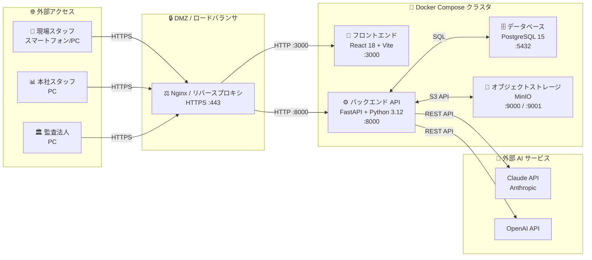
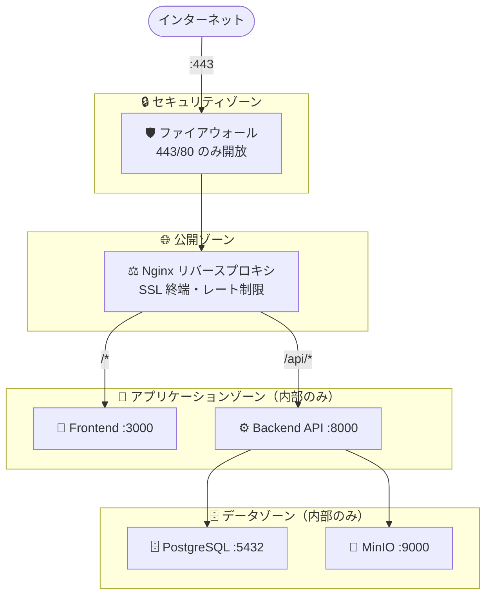
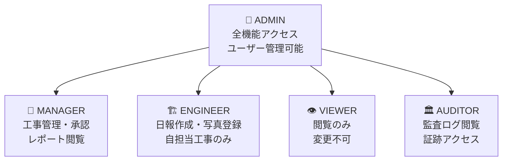
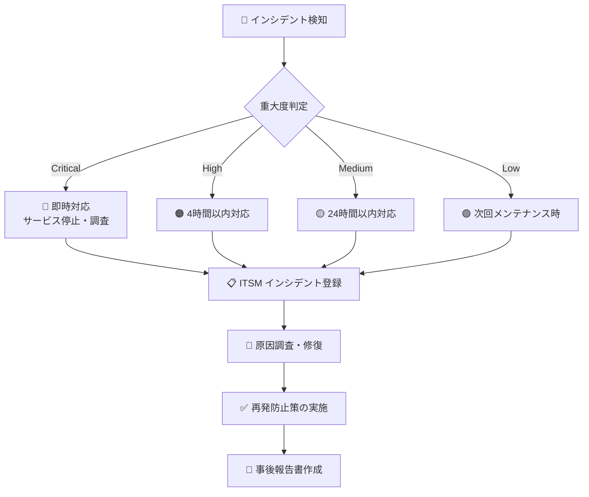
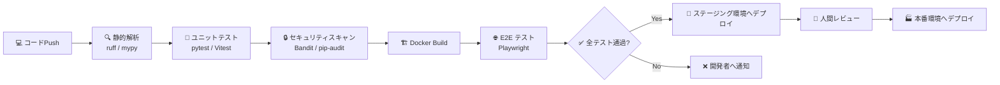

# 📘 IT 導入・運用ガイド

> **対象読者**: IT 部門スタッフ、インフラ担当者、システム管理者  
> ServiceHub 工事管理プラットフォームの導入から日常運用まで、IT 視点で解説します。

---

## 📌 目次

1. [システム構成概要](#-システム構成概要)
2. [動作要件](#-動作要件)
3. [導入手順](#-導入手順)
4. [環境変数一覧](#-環境変数一覧)
5. [ネットワーク構成](#-ネットワーク構成)
6. [データバックアップ](#-データバックアップ)
7. [監視・アラート](#-監視アラート)
8. [ユーザー管理](#-ユーザー管理)
9. [トラブルシューティング](#-トラブルシューティング)
10. [セキュリティ運用](#-セキュリティ運用)

---

## 🏗️ システム構成概要



### 📦 コンポーネント一覧

| コンポーネント | 技術 | バージョン | ポート |
|---|---|---|---|
| 🖥️ フロントエンド | React 18 + TypeScript + Vite | Node.js 20 LTS | 3000 |
| ⚙️ バックエンド API | FastAPI + Python | 3.12 | 8000 |
| 🗄️ データベース | PostgreSQL | 15 | 5432 |
| 📁 ファイルストレージ | MinIO | RELEASE.2024 | 9000/9001 |
| 🔁 マイグレーション | Alembic | 最新 | — |
| 🐳 コンテナ管理 | Docker Compose | v2+ | — |

---

## 💻 動作要件

### サーバー（本番環境推奨スペック）

| 項目 | 最小 | 推奨 |
|---|---|---|
| CPU | 2 コア | 4 コア以上 |
| メモリ | 4 GB | 8 GB 以上 |
| ストレージ | 50 GB SSD | 200 GB SSD 以上 |
| OS | Ubuntu 22.04 LTS | Ubuntu 24.04 LTS |
| Docker | 24.0 以上 | 最新安定版 |
| Docker Compose | 2.20 以上 | 最新安定版 |

### クライアント（利用者側）

| 環境 | 対応ブラウザ |
|---|---|
| 🖥️ PC | Chrome 100+、Edge 100+、Firefox 100+、Safari 16+ |
| 📱 スマートフォン | Chrome for Android、Safari (iOS 16+) |

---

## 🚀 導入手順

### ステップ 1: リポジトリの取得

```bash
git clone https://github.com/Kensan196948G/ServiceHub-Construction-Platform.git
cd ServiceHub-Construction-Platform
```

### ステップ 2: 環境変数の設定

```bash
# バックエンド設定
cp backend/.env.example backend/.env

# フロントエンド設定（本番環境ではモックを無効化）
cp frontend/.env.example frontend/.env.production
```

> ⚠️ `.env` ファイルには秘密鍵・API キーが含まれます。**Git にコミットしないでください。**

### ステップ 3: Docker コンテナの起動

```bash
# 本番環境での起動
docker compose -f docker-compose.yml up -d

# 状態確認
docker compose ps
docker compose logs -f
```

### ステップ 4: データベース初期化

```bash
# マイグレーション実行
docker compose exec backend alembic upgrade head

# 初期データの投入（任意）
docker compose exec backend python scripts/seed_data.py
```

### ステップ 5: 動作確認

```bash
# ヘルスチェック
curl http://localhost:8000/health
curl http://localhost:3000/

# API ドキュメント確認
open http://localhost:8000/docs
```

---

## 🔧 環境変数一覧

### バックエンド（`backend/.env`）

| 変数名 | 説明 | 例 |
|---|---|---|
| `DATABASE_URL` | PostgreSQL 接続 URL | `postgresql://user:pass@db:5432/servicehub` |
| `SECRET_KEY` | JWT 署名用秘密鍵（32文字以上） | ランダム生成必須 |
| `ALGORITHM` | JWT アルゴリズム | `HS256` |
| `ACCESS_TOKEN_EXPIRE_MINUTES` | アクセストークン有効期限（分） | `30` |
| `REFRESH_TOKEN_EXPIRE_DAYS` | リフレッシュトークン有効期限（日） | `7` |
| `MINIO_ENDPOINT` | MinIO エンドポイント | `minio:9000` |
| `MINIO_ACCESS_KEY` | MinIO アクセスキー | — |
| `MINIO_SECRET_KEY` | MinIO シークレットキー | — |
| `ANTHROPIC_API_KEY` | Claude API キー | `sk-ant-...` |
| `OPENAI_API_KEY` | OpenAI API キー | `sk-...` |
| `CORS_ORIGINS` | 許可するオリジン | `["https://your-domain.com"]` |

### フロントエンド（`frontend/.env.production`）

| 変数名 | 説明 | 本番環境での値 |
|---|---|---|
| `VITE_MOCK_MODE` | モックモード（本番は false） | `false` |
| `VITE_API_BASE_URL` | バックエンド API URL | `https://api.your-domain.com` |

---

## 🌐 ネットワーク構成



### 開放ポート（外部向け）

| ポート | プロトコル | 用途 | 備考 |
|---|---|---|---|
| 443 | HTTPS | Web アクセス | SSL 証明書必須 |
| 80 | HTTP | HTTPS リダイレクト | 443 へ転送 |

### 内部通信ポート（外部からアクセス不可）

| ポート | 用途 |
|---|---|
| 3000 | フロントエンド開発サーバー |
| 8000 | バックエンド API |
| 5432 | PostgreSQL |
| 9000 | MinIO API |
| 9001 | MinIO 管理コンソール |

---

## 💾 データバックアップ

### データベースバックアップ

```bash
# 日次バックアップスクリプト（cron に登録推奨）
docker compose exec -T db pg_dump -U postgres servicehub \
  | gzip > /backup/servicehub_$(date +%Y%m%d).sql.gz

# バックアップから復元
gunzip -c /backup/servicehub_20260614.sql.gz \
  | docker compose exec -T db psql -U postgres servicehub
```

### ファイルストレージバックアップ

```bash
# MinIO データのバックアップ
docker compose exec minio mc mirror /data /backup/minio/
```

### 推奨バックアップスケジュール

| 種別 | 頻度 | 保持期間 |
|---|---|---|
| 🗄️ DB フルバックアップ | 毎日 深夜 2:00 | 30 日間 |
| 🗄️ DB 差分バックアップ | 4 時間ごと | 7 日間 |
| 📁 ファイルストレージ | 毎週日曜日 | 90 日間 |

---

## 📊 監視・アラート

### ヘルスチェックエンドポイント

```bash
# バックエンド API
GET http://your-domain.com/health
# 正常時: {"status": "ok", "version": "x.x.x"}

# データベース接続確認
GET http://your-domain.com/api/v1/health/db
```

### 推奨監視項目

| 監視項目 | 閾値（警告） | 閾値（重大） | 推奨ツール |
|---|---|---|---|
| CPU 使用率 | 70% | 90% | Prometheus + Grafana |
| メモリ使用率 | 75% | 90% | Prometheus + Grafana |
| ディスク使用率 | 70% | 85% | Prometheus + Grafana |
| API レスポンス時間 | 1000ms | 3000ms | Uptime Kuma |
| エラー率 | 1% | 5% | Sentry |

### ログ確認

```bash
# バックエンドログ
docker compose logs -f backend

# データベースログ
docker compose logs -f db

# 全サービスのログ（最新 100 行）
docker compose logs --tail=100
```

---

## 👤 ユーザー管理

### ロール体系



### ユーザー作成（API 経由）

```bash
# 管理者ユーザーでログインしてトークン取得
TOKEN=$(curl -s -X POST http://localhost:8000/api/v1/auth/login \
  -H "Content-Type: application/json" \
  -d '{"email":"admin@example.com","password":"your-password"}' \
  | jq -r '.access_token')

# 新規ユーザー作成
curl -X POST http://localhost:8000/api/v1/users \
  -H "Authorization: Bearer $TOKEN" \
  -H "Content-Type: application/json" \
  -d '{
    "email": "tanaka@example.com",
    "full_name": "田中 一郎",
    "role": "ENGINEER",
    "password": "secure-password"
  }'
```

---

## 🔧 トラブルシューティング

### よくある問題と対処法

#### ❌ コンテナが起動しない

```bash
# 詳細ログを確認
docker compose logs backend

# よくある原因
# 1. 環境変数が設定されていない → .env ファイルを確認
# 2. ポートが競合している → 使用ポートを変更
# 3. データベースが準備できていない → db コンテナの起動を待つ
```

#### ❌ データベース接続エラー

```bash
# DB の状態確認
docker compose exec db pg_isready -U postgres

# 接続テスト
docker compose exec backend python -c "
from app.db.base import engine
with engine.connect() as conn:
    print('DB接続OK')
"
```

#### ❌ ファイルアップロードが失敗する

```bash
# MinIO の状態確認
docker compose exec minio mc ls local/

# バケット作成（初回のみ）
docker compose exec minio mc mb local/servicehub-files
```

#### ❌ API が 401 を返す

```bash
# JWT シークレットキーの確認
grep SECRET_KEY backend/.env

# トークンの有効期限を確認（デコード）
echo "<your-token>" | cut -d'.' -f2 | base64 -d | python -m json.tool
```

---

## 🔒 セキュリティ運用

### 定期作業チェックリスト

| 頻度 | 作業 |
|---|---|
| 毎日 | ログイン失敗ログの確認 |
| 毎週 | セキュリティスキャン結果の確認 |
| 毎月 | ユーザーアクセス権限レビュー |
| 毎月 | SSL 証明書有効期限確認 |
| 四半期 | パスワードポリシーの見直し |
| 年次 | 脆弱性診断の実施 |

### セキュリティインシデント対応フロー



### アクセスログの確認

```bash
# 最近の API アクセスログ
docker compose logs --tail=100 backend | grep "ERROR\|WARN\|401\|403\|500"

# 特定ユーザーのアクセス履歴（監査向け）
curl -H "Authorization: Bearer $ADMIN_TOKEN" \
  "http://localhost:8000/api/v1/audit/logs?user_email=tanaka@example.com"
```

---

## 📋 CI/CD パイプライン



### GitHub Actions ワークフロー一覧

| ワークフロー | トリガー | 内容 |
|---|---|---|
| `backend-ci.yml` | Push / PR | Python lint・テスト・セキュリティスキャン |
| `frontend-ci.yml` | Push / PR | TypeScript lint・Vitest テスト・ビルド |
| `e2e.yml` | Push to main | Playwright E2E テスト全件実行 |
| `security.yml` | 毎日 0:00 | 依存関係の脆弱性スキャン |

---

## 📞 IT サポート連絡先

| 問い合わせ種別 | 連絡先 |
|---|---|
| 🔧 システム障害 | [GitHub Issues（P1ラベル）](https://github.com/Kensan196948G/ServiceHub-Construction-Platform/issues) |
| 🔒 セキュリティ問題 | プロジェクト管理者へ直接連絡 |
| 💡 機能要望 | [GitHub Issues（enhancementラベル）](https://github.com/Kensan196948G/ServiceHub-Construction-Platform/issues) |
| 📋 ドキュメント修正 | GitHub PR にて提出 |

---

*📘 最終更新: 2026-06-14 | ServiceHub Construction Platform IT 導入・運用ガイド v1.0*
