# ⚙️ 技術スタック詳細

> **対象読者**: ソフトウェアエンジニア、アーキテクト、技術評価担当者  
> ServiceHub 工事管理プラットフォームの技術選定・アーキテクチャ・設計方針を詳述します。

---

## 📌 目次

1. [技術スタック全体図](#-技術スタック全体図)
2. [フロントエンド](#-フロントエンド)
3. [バックエンド](#-バックエンド)
4. [データベース・ストレージ](#-データベースストレージ)
5. [AI・機械学習](#-ai機械学習)
6. [インフラ・DevOps](#-インフラdevops)
7. [セキュリティ](#-セキュリティ)
8. [テスト](#-テスト)
9. [アーキテクチャ設計方針](#-アーキテクチャ設計方針)
10. [API 設計](#-api-設計)

---

## 🗺️ 技術スタック全体図

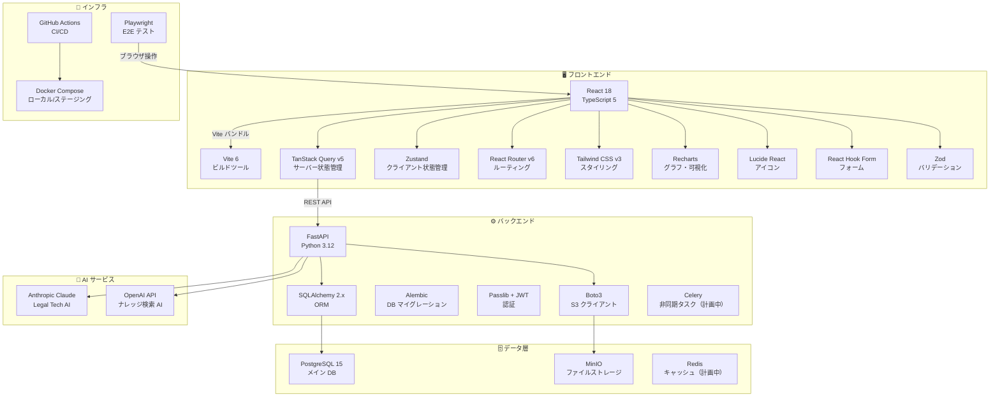

---

## 🖥️ フロントエンド

### コア技術

| ライブラリ | バージョン | 役割 | 採用理由 |
|---|---|---|---|
|  | 18.x | UI フレームワーク | Concurrent Mode・Server Components 対応 |
|  | 5.x | 型安全な JavaScript | 開発時エラー検出・IDE 補完 |
|  | 6.x | ビルドツール | 高速 HMR・ES Module ネイティブ |

### 状態管理

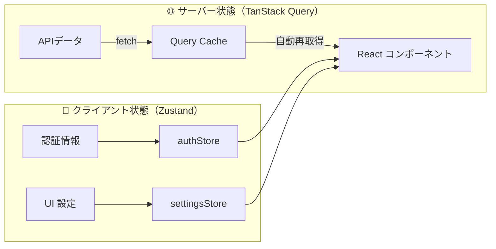

| ライブラリ | バージョン | 役割 | 採用理由 |
|---|---|---|---|
| TanStack Query | v5 | サーバー状態管理 | キャッシュ・再取得・エラー処理の自動化 |
| Zustand | v4 | クライアント状態管理 | 軽量・型安全・DevTools 対応 |

### UI・スタイリング

| ライブラリ | 役割 |
|---|---|
| Tailwind CSS v3 | ユーティリティファーストな CSS フレームワーク |
| shadcn/ui | Radix UI ベースのアクセシブルコンポーネント |
| Lucide React | 統一されたアイコンセット（MIT ライセンス） |
| Recharts | SVG ベースのグラフ・データ可視化 |

### フォーム・バリデーション

| ライブラリ | 役割 |
|---|---|
| React Hook Form v7 | 高性能フォーム（不要な再レンダリング排除） |
| Zod v3 | スキーマベースの型安全バリデーション |
| @hookform/resolvers | Zod を React Hook Form に統合 |

### フロントエンドアーキテクチャ

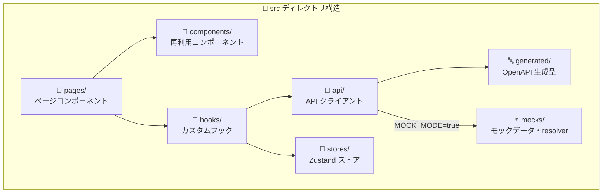

### モックアーキテクチャ（開発環境）

`VITE_MOCK_MODE=true` 設定時、API リクエストを実際のバックエンドに送らずモックデータで応答します。

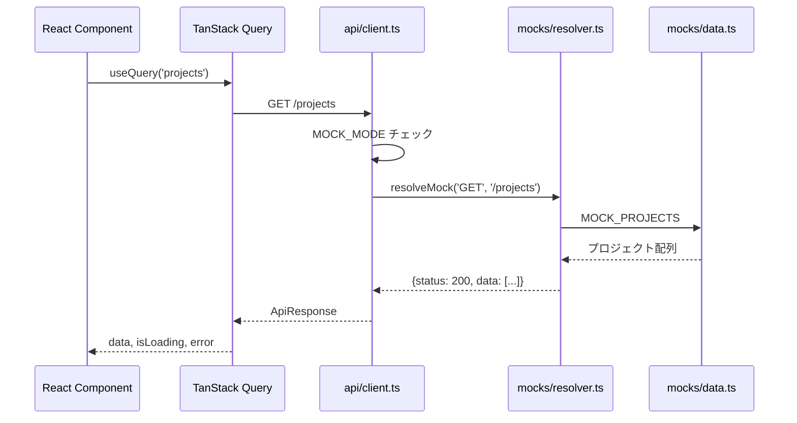

---

## ⚙️ バックエンド

### コア技術

| ライブラリ | バージョン | 役割 | 採用理由 |
|---|---|---|---|
|  | 0.136 | Web フレームワーク | 自動 OpenAPI 生成・型安全・高速 |
|  | 3.12 | 言語 | 型ヒント強化・パフォーマンス改善 |
| SQLAlchemy | 2.x | ORM | 非同期対応・型安全クエリ |
| Alembic | 最新 | DB マイグレーション | SQLAlchemy との統合・バージョン管理 |
| Pydantic v2 | 2.x | データバリデーション | 高速・型安全・JSON スキーマ生成 |

### バックエンドアーキテクチャ（レイヤー構造）

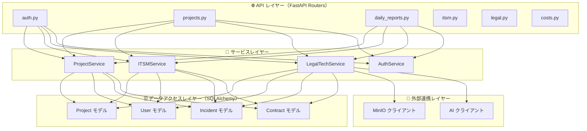

### 認証・認可フロー

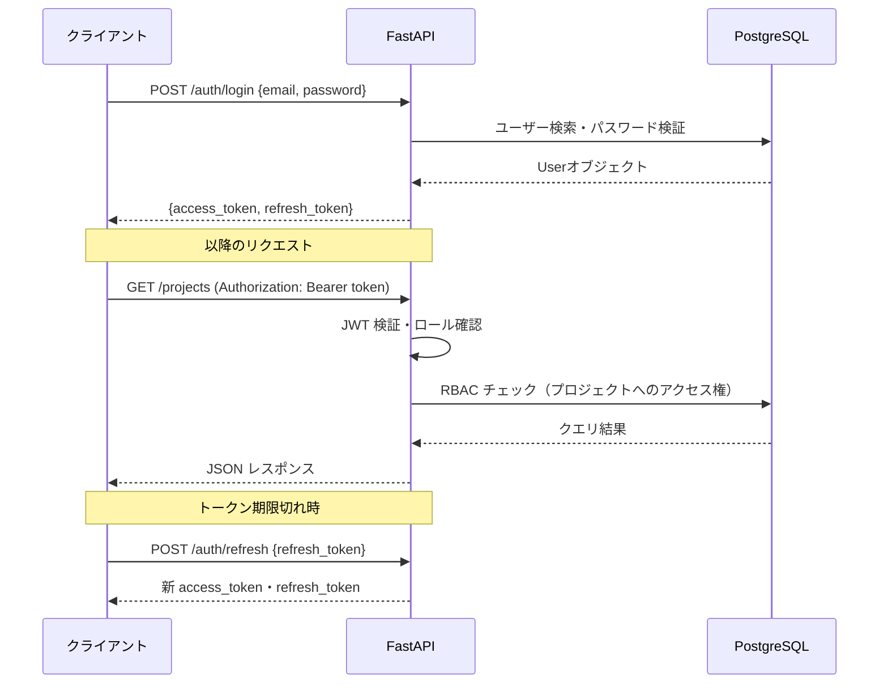

### セキュリティ実装

| 機能 | 実装方法 |
|---|---|
| 🔐 パスワードハッシュ | bcrypt（Passlib）|
| 🔑 JWT 発行 | python-jose（HS256） |
| 🛡️ IDOR 防止 | 全 API でオーナーシップ確認 |
| 🔒 CORS 制御 | 許可オリジンのホワイトリスト |
| 🚦 レート制限 | Nginx レベルでの制御 |

---

## 🗄️ データベース・ストレージ

### データベース設計

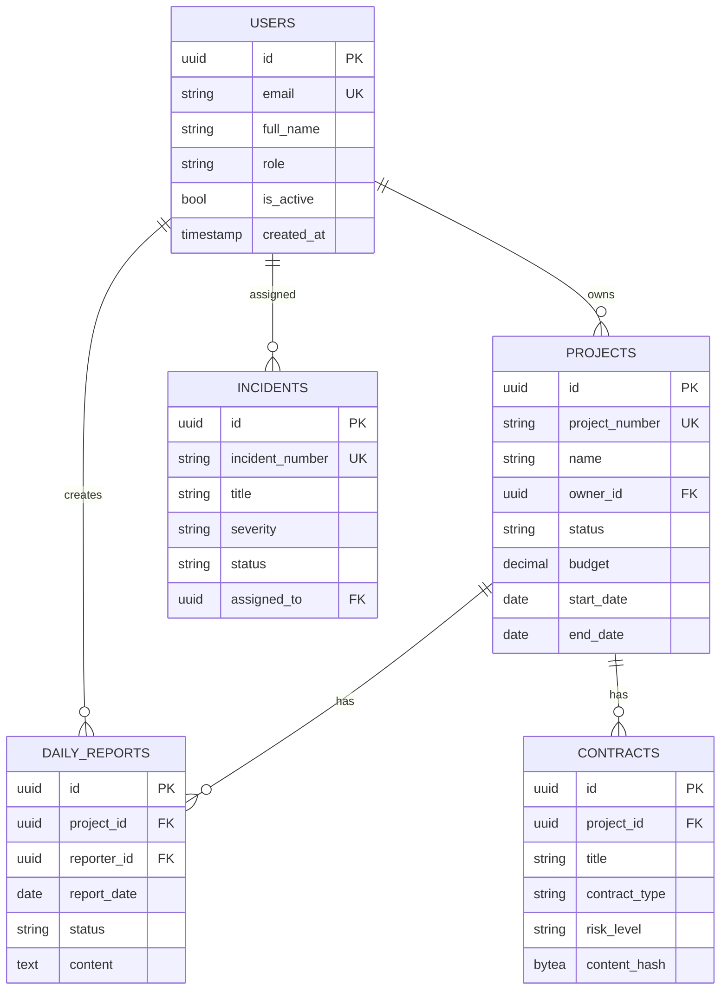

### ストレージ選定

| ストレージ | 用途 | 採用理由 |
|---|---|---|
| PostgreSQL 15 | メインデータ | ACID・JSON 対応・UUID・全文検索 |
| MinIO | ファイル（写真・書類） | S3 互換・オンプレ対応・プリサインド URL |
| Redis（計画中） | セッションキャッシュ | 高速・TTL 管理 |

---

## 🤖 AI・機械学習

### AI エンジン構成

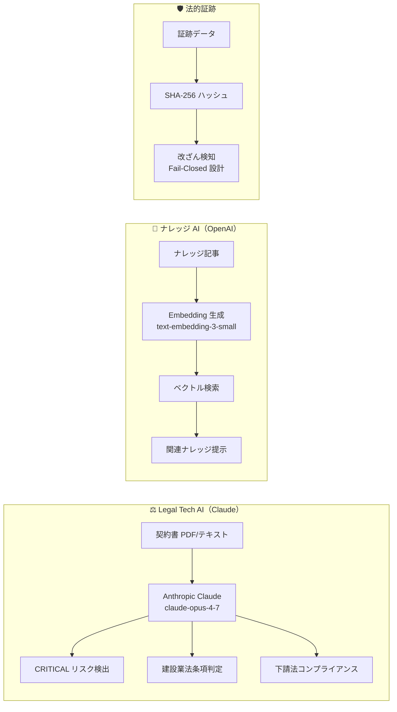

| AI サービス | モデル | 用途 |
|---|---|---|
| Anthropic Claude | claude-opus-4-7 | 法的リスク分析・建設業法判定 |
| OpenAI | text-embedding-3-small | ナレッジ記事のベクトル埋め込み |
| OpenAI | gpt-4o（計画中） | ナレッジ Q&A 生成 |

### Legal Tech 実装詳細

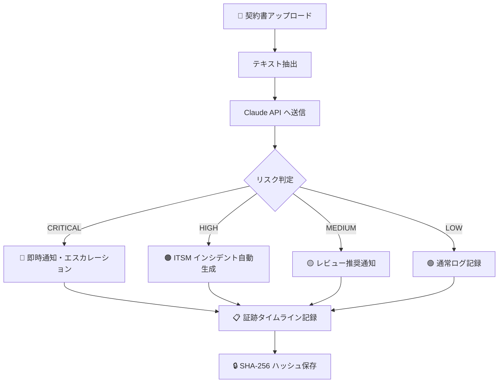

---

## 🐳 インフラ・DevOps

### Docker 構成

```yaml
# docker-compose.yml 概要
services:
  frontend:   # React アプリ (Node.js 20 LTS)
  backend:    # FastAPI (Python 3.12-slim)
  db:         # PostgreSQL 15-alpine
  minio:      # MinIO RELEASE.2024
  nginx:      # Nginx リバースプロキシ（本番のみ）
```

### CI/CD パイプライン詳細

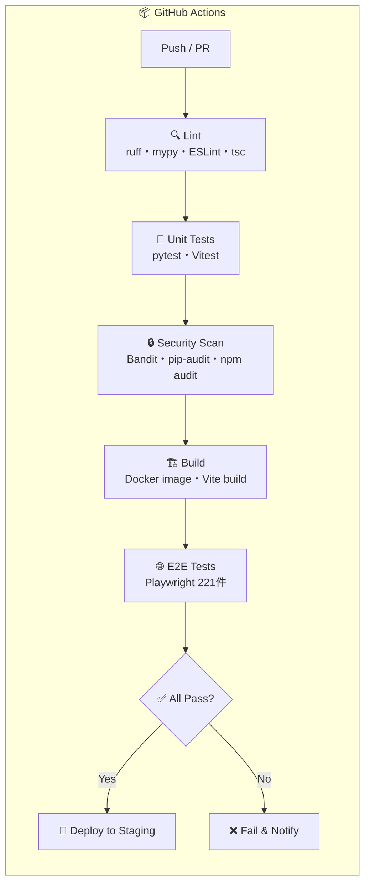

### 使用 GitHub Actions

| ワークフロー | 実行タイミング | 主な処理 |
|---|---|---|
| `backend-ci.yml` | PR・Push | ruff / mypy / pytest / Bandit / pip-audit |
| `frontend-ci.yml` | PR・Push | ESLint / tsc / Vitest / Vite build |
| `e2e.yml` | Push to main | Playwright E2E（Chromium・Firefox・Safari） |
| `security.yml` | 毎日 0:00 | 依存関係脆弱性スキャン |

---

## 🔒 セキュリティ

### セキュリティ多層防御

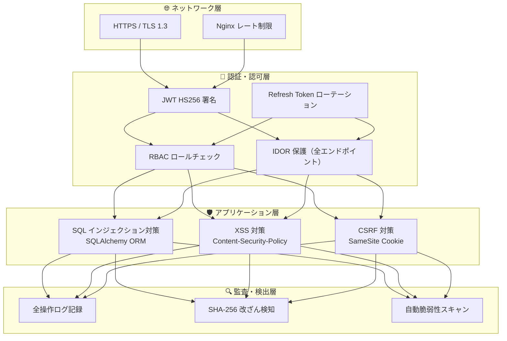

### IDOR（不正直接オブジェクト参照）防止設計

すべての READ / WRITE エンドポイントで以下のチェックを実施:

```python
# 例: プロジェクト取得時のオーナーシップ確認
@router.get("/projects/{project_id}")
async def get_project(
    project_id: UUID,
    current_user: User = Depends(get_current_user),
    db: Session = Depends(get_db)
):
    project = db.get(Project, project_id)
    if not project:
        raise HTTPException(404)
    # IDOR 防止: 自分のプロジェクトまたは ADMIN のみアクセス可
    if project.owner_id != current_user.id and current_user.role != "ADMIN":
        raise HTTPException(403)
    return project
```

---

## 🧪 テスト

### テスト戦略

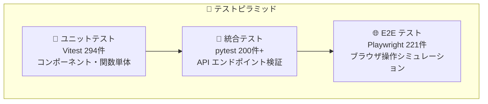

### バックエンドテスト（pytest）

| テスト種別 | 件数 | ファイル |
|---|---|---|
| 単体テスト | 150件+ | `tests/unit/` |
| 統合テスト | 215件+ | `tests/integration/` |
| セキュリティテスト | IDOR 全ルート | `tests/integration/test_*_security.py` |

### フロントエンドテスト（Vitest）

| テスト種別 | 件数 | ファイル |
|---|---|---|
| コンポーネントテスト | 200件+ | `src/**/*.test.tsx` |
| フックテスト | 94件+ | `src/hooks/**/*.test.ts` |

### E2E テスト（Playwright）

| テスト対象ページ | 件数 |
|---|---|
| 認証フロー | 12件 |
| ダッシュボード | 15件 |
| 工事案件管理 | 28件 |
| 日報管理 | 20件 |
| ITSM | 35件 |
| Legal Tech | 18件 |
| その他 | 93件 |

---

## 🏛️ アーキテクチャ設計方針

### 設計原則

| 原則 | 実践方法 |
|---|---|
| **型安全ファースト** | OpenAPI → TypeScript 型自動生成（`openapi-typescript`）|
| **単方向データフロー** | TanStack Query → コンポーネント（Props ドリル禁止）|
| **ゼロトラストセキュリティ** | 全 API でトークン検証・ロールチェック・IDOR 防止 |
| **テスト容易性** | モック注入可能・依存性逆転原則 |
| **オブザーバビリティ** | 構造化ログ・ヘルスチェックエンドポイント |

### OpenAPI 型生成フロー

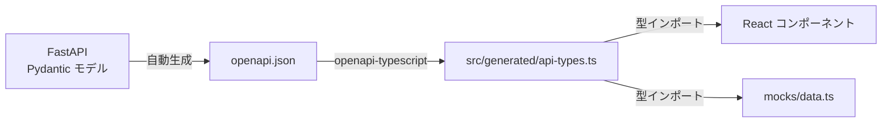

> フロントエンドとバックエンドの型が自動同期されるため、API 変更時の型不整合を開発時に検出できます。

---

## 📡 API 設計

### REST API 命名規則

| パターン | エンドポイント例 |
|---|---|
| コレクション取得 | `GET /api/v1/projects` |
| 単一リソース取得 | `GET /api/v1/projects/{id}` |
| 作成 | `POST /api/v1/projects` |
| 更新 | `PATCH /api/v1/projects/{id}` |
| 削除 | `DELETE /api/v1/projects/{id}` |
| サブリソース | `GET /api/v1/projects/{id}/daily-reports` |

### ページネーション

```json
// GET /api/v1/projects?page=2&per_page=20
{
  "items": [...],
  "total": 85,
  "page": 2,
  "per_page": 20,
  "pages": 5
}
```

### エラーレスポンス形式

```json
{
  "detail": "エラーメッセージ（日本語対応）",
  "error_code": "PROJECT_NOT_FOUND",
  "status": 404
}
```

---

## 🔗 関連ドキュメント

| ドキュメント | 内容 |
|---|---|
| [📘 IT 導入・運用ガイド](it-guide.md) | 環境構築・運用手順 |
| [📋 API 仕様書（Swagger）](http://localhost:8000/docs) | エンドポイント詳細（サーバー起動時） |
| [🔒 セキュリティ設計](06_セキュリティ（Security）/) | 脅威分析・対策詳細 |
| [📊 テスト仕様](07_テスト（Testing）/) | テスト方針・カバレッジ |

---

*⚙️ 最終更新: 2026-06-14 | ServiceHub Construction Platform 技術スタック詳細 v1.0*
