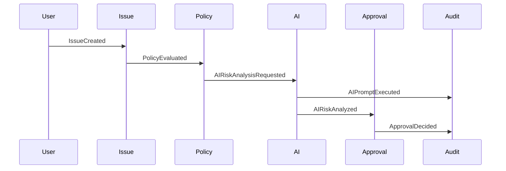

# EVENT_MODEL

## 目的

Event Model は、Enterprise Objectの状態変化をEventとして表現する。Enterprise OSでは、企業活動はEventの連鎖として進行し、Audit、Workflow、AI、Knowledge Graphに伝播する。

## Core Events

| Event | 発生条件 | 主な購読先 |
|---|---|---|
| IssueCreated | Issue起票 | Workflow、Audit、AI Risk |
| ApprovalRequested | 承認要求 | Approval、Notification、Audit |
| ApprovalDecided | 承認または却下 | Workflow、Audit |
| AIPromptExecuted | AI Gateway実行 | AI Audit、DLP、Cost Audit |
| AIRiskAnalyzed | AIリスク判定 | Approval、Dashboard |
| DocumentClassified | 文書分類 | DLP、Retention、Knowledge |
| DLPViolationDetected | DLP違反 | Security、Audit、Workflow |
| FederationAccessRequested | Cross Tenant要求 | Trust、Policy、Audit |
| FederationShared | Cross Tenant共有完了 | Audit、Knowledge Graph |
| AuditRecorded | 証跡保存 | Dashboard、Compliance |

## Event共通属性

| 属性 | 内容 |
|---|---|
| event_id | 一意ID |
| event_type | Event種別 |
| occurred_at | 発生日時 |
| actor_id | 実行主体 |
| actor_type | Human / AI Agent / Workflow / System |
| tenant_id | 起点Tenant |
| object_id | 対象Object |
| correlation_id | 関連Eventの追跡ID |
| policy_result | Policy判定 |
| audit_event_id | 対応監査ID |

## Event Flow例

## 原則

- Eventは業務処理と監査の両方の根拠になる
- AI起動EventもAI Gatewayを通過する
- Cross Tenant EventはFederation Eventとして扱う
- Eventは後から説明可能な粒度で設計する

