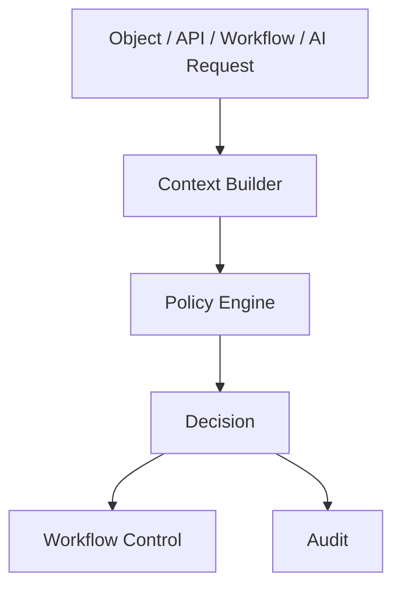

# POLICY_ENGINE_MODEL

## 目的

Policy Engine Model は、Governance Firstを実行可能な判断体系にする。承認、AI利用、DLP、Federation、変更管理、Retentionを統一的に評価する。

## Policy Engineの位置づけ

## Policy分類

| Policy | 判定対象 |
|---|---|
| AUTHORITY_POLICY | 誰が何をできるか |
| APPROVAL_POLICY | どの条件で承認が必要か |
| AI_EXECUTION_POLICY | AI利用可否、Model Routing |
| DLP_POLICY | 機密情報、外部送信、Mask |
| FEDERATION_POLICY | Cross Tenant共有 |
| RETENTION_POLICY | 保持、削除、Legal Hold |
| CHANGE_POLICY | 本番変更、CAB、Rollback |
| AUDIT_POLICY | 監査必須項目 |

## Decision種別

| Decision | 意味 |
|---|---|
| allow | 実行可能 |
| deny | 禁止 |
| approval_required | 人間承認が必要 |
| mask_required | Mask後に実行可能 |
| local_llm_required | Local LLMのみ許可 |
| federation_review_required | Cross Tenant審査が必要 |
| quarantine | 隔離が必要 |

## 評価Context

- actor
- tenant
- object_type
- classification
- action
- data_destination
- model_provider
- trust_level
- risk_score
- approval_state
- time
- device_posture

## 原則

- PolicyはUI表示ではなく実行制御である
- Policy結果は必ずAuditに保存する
- 例外承認は期限、責任者、理由、Auditを持つ
- Policy変更自体もApprovalとAuditの対象にする

