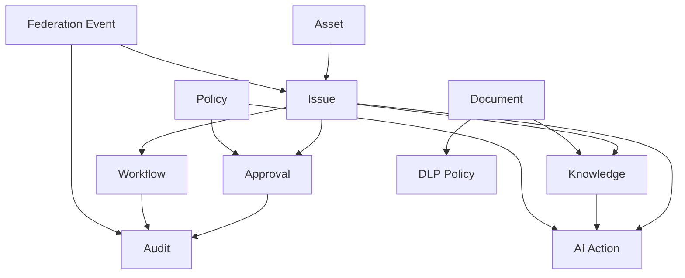

# RELATIONSHIP_MODEL

## 目的

Relationship Model は、Enterprise Object同士の関係を定義する。AIはこの関係を根拠に影響分析、承認支援、DLP判定、Explainability生成を行う。

## 基本関係

## Relationship種別

| Relation | 意味 |
|---|---|
| requires | 承認、Policy、DLPなどを必要とする |
| references | 文書、Knowledge、Assetを参照する |
| generated_by | AI、Workflow、人間によって生成された |
| approves | Approvalが対象Objectを承認する |
| audits | Auditが対象Objectの証跡になる |
| shares_with | Federation先Tenantへ共有する |
| blocks | PolicyやDLPが操作を止める |
| supersedes | 版、判断、文書を置換する |

## 重要な設計判断

| 判断 | 理由 |
|---|---|
| Issueを起点にする | 日本企業の依頼、稟議、障害、変更を一元化しやすい |
| Approvalを独立Objectにする | 承認はコメントではなく監査対象の企業判断であるため |
| AI Actionを独立Objectにする | AIの判断と操作を説明責任の対象にするため |
| Federation Eventを独立Objectにする | 組織境界を越えた操作を曖昧にしないため |

## 禁止する関係

- Documentから外部AIへ直接接続する
- Federation共有をAuditなしで実行する
- AI ActionがPolicyを自己承認する
- Approvalなしで高リスクWorkflowを完了させる

