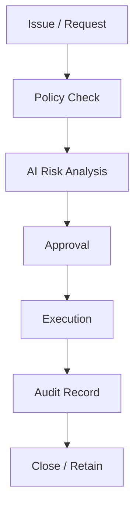

# WORKFLOW_MODEL

## 目的

Workflow Model は、Enterprise Objectをどの順番で進め、どこでPolicy、Approval、AI、Auditを挿入するかを定義する。

## Workflow基本形

## Workflow状態

| State | 意味 |
|---|---|
| draft | 下書き |
| submitted | 提出済み |
| policy_checking | Policy判定中 |
| ai_reviewing | AI分析中 |
| approval_required | 承認待ち |
| approved | 承認済み |
| rejected | 却下 |
| executing | 実行中 |
| audited | 監査保存済み |
| closed | 完了 |

## Workflow種別

| Workflow | 中心Object | MVP対象 |
|---|---|---|
| Issue Approval Workflow | Issue + Approval | Yes |
| AI Usage Workflow | AI Action | Yes |
| Document Governance Workflow | Document + DLP | Yes |
| Cross Org Workflow | Federation Event | Yes |
| Change / CAB Workflow | Issue + Asset | Later |
| Incident Workflow | Issue + Asset + Knowledge | Later |

## 原則

- Workflowは効率化だけでなく統制と監査の実行基盤である
- AIは承認者ではなく、原則として分析者または提案者である
- 高リスク操作はHuman Oversightを必須にする
- Workflow完了条件にはAudit保存を含める

