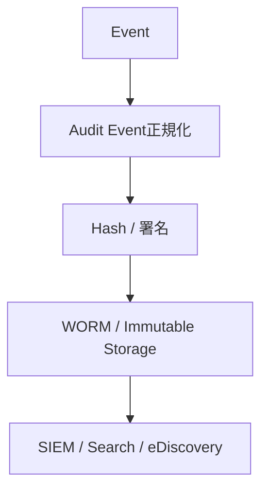

# AUDIT_MODEL

## 目的

Audit Model は、Enterprise OSにおける人間、AI、Workflow、Federation、Knowledgeのすべての重要操作を追跡可能にする。

## 監査対象

| 領域 | 監査内容 |
|---|---|
| System Audit | API、設定変更、管理操作 |
| Workflow Audit | 承認、差戻し、SLA、Escalation |
| AI Audit | Prompt、Context、Model、推論、出力 |
| Security Audit | Access、DLP、MFA、Policy違反 |
| Document Audit | 閲覧、分類、出力、共有、削除 |
| Federation Audit | Cross Tenant操作、Trust判定 |

## Audit Event

監査イベントは最低限、以下を保持する。

| 項目 | 内容 |
|---|---|
| event_id | 一意ID |
| actor | Human / AI Agent / Workflow |
| tenant | 所属Tenant |
| object | 対象Enterprise Object |
| action | 実行操作 |
| policy_result | allow / deny / approval_required |
| explanation | AIまたはPolicy判断根拠 |
| hash | 改ざん検知用Hash |

## AI監査の追加項目

- Prompt
- System instruction分類
- Context Source
- Knowledge Source
- Model Provider
- Model Version
- Reasoning Summary
- Confidence
- Risk Score
- DLP Result

## Immutable Logging

## 原則

- 「誰が実行したか」だけでなく「なぜ許可されたか」を保存する
- AI判断は説明責任の単位として保存する
- Federation越境は必ず双方Tenantの監査境界に記録する

