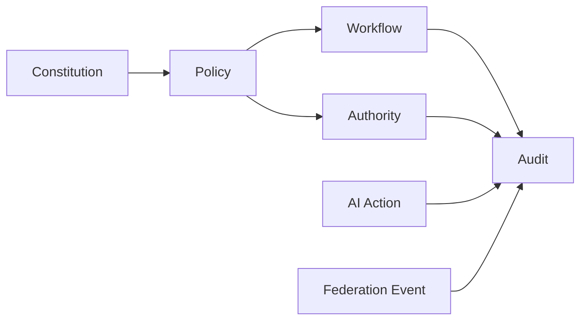

# ENTERPRISE_CONSTITUTION

## 目的

Enterprise Constitution は、AI Native Enterprise OS の最高規程である。すべてのWorkflow、Policy、Authority、Audit、Federation、AI Gatewayは、この憲法に従う。

## 構成

| 章 | 内容 |
|---:|---|
| 1 | Enterprise Identity |
| 2 | Governance First |
| 3 | Authority and Delegation |
| 4 | Auditability |
| 5 | AI Governance |
| 6 | Federation |
| 7 | Knowledge Governance |
| 8 | Zero Trust Security |
| 9 | Compliance |
| 10 | Change Management |

## 憲法条項

### Article 1: Governance First

すべての機能は統制可能でなければならない。統制できない機能はEnterprise OSに組み込まない。

### Article 2: Federation Native

A社/B社/C社は中央集権的に統合しない。各Tenantの独立権限、データ境界、監査境界を維持したまま協調する。

### Article 3: AI Gateway Mandatory

ChatGPT、Claude、Perplexity、Local LLM、AI Agent へのアクセスは必ず AI Gateway を経由する。直接AI接続は禁止する。

### Article 4: Explainability Required

AI判断は、入力、参照Knowledge、Policy判定、推論要約、Risk Score、Confidence、出力を追跡可能にする。

### Article 5: Immutable Audit

承認、Workflow、AI操作、Federation越境、DLP判定、権限変更は改ざん防止ログとして保存する。

### Article 6: Human Oversight

本番変更、外部共有、高機密文書処理、重大AI判断には人間承認を要求する。

## Enterprise Objectとの関係

## 禁止事項

- AIに未監査の企業データを直接送信する
- Tenant境界を越えて暗黙共有する
- 監査ログを任意削除可能にする
- Release期に統制外の新機能を追加する
- Policyを迂回する特権経路を作る

