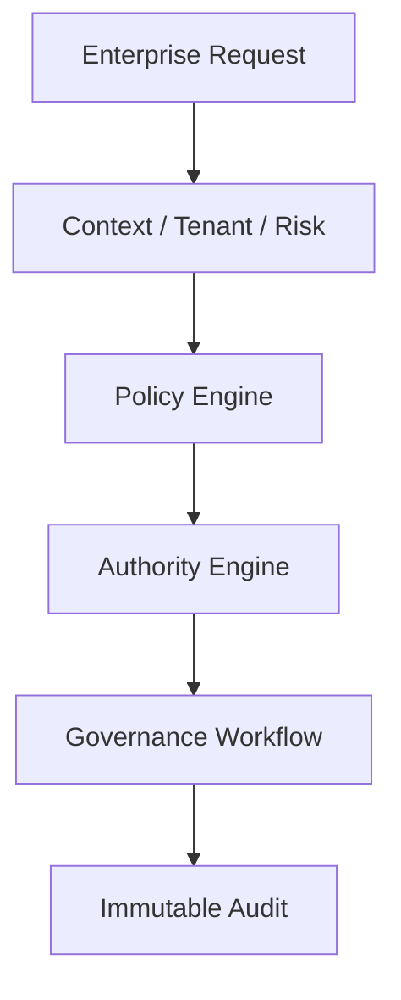

# GOVERNANCE_MODEL

## 目的

Governance Model は、Enterprise OS 全体の統制構造を定義する。対象は人間、AI Agent、Workflow、API、Federation組織、外部Partnerを含む。

## 統制領域

| 領域 | 統制対象 |
|---|---|
| IT Governance | Change、Incident、Asset、DevSecOps |
| AI Governance | Prompt、Model、Agent、AI Action |
| Information Governance | Document、Knowledge、DLP、Retention |
| Workflow Governance | Approval、BPM、CAB |
| Federation Governance | Cross Org Workflow、Trust、Tenant境界 |
| Security Governance | Zero Trust、MFA、Policy Enforcement |

## Governance Engine

## Governance Decision

| Decision | 意味 |
|---|---|
| allow | 条件を満たすため実行可能 |
| approve_required | 人間承認が必要 |
| restricted | Tenant、DLP、Policyにより制限 |
| deny | 実行禁止 |
| quarantine | AIまたはSecurity隔離が必要 |

## KPI

| KPI | 意味 |
|---|---|
| policy_violation_count | Policy違反数 |
| approval_sla_breach | 承認SLA超過 |
| ai_unexplained_rate | 説明不能AI判断率 |
| audit_gap_count | 監査欠落数 |
| federation_boundary_violation | Tenant境界違反 |

## 原則

- 統制は後付け機能ではなくPlatform Kernelである
- PolicyはWorkflow、AI Gateway、API Gateway、UIに一貫適用する
- 例外承認もAudit対象にする

