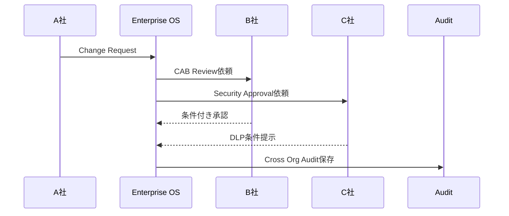

# CROSS_ORG_WORKFLOW

## 目的

Cross Org Workflow は、A社/B社/C社をまたぐ承認、変更、Incident、Knowledge共有を、Tenant境界を壊さずに実行するためのWorkflow設計である。

## 対象Workflow

| Workflow | 内容 |
|---|---|
| Cross Org Approval | 跨社承認 |
| Joint Change / CAB | 共同変更審査 |
| Incident Sharing | 障害共有 |
| Document Release | 文書公開・共有 |
| AI Assisted Review | AI支援レビュー |
| Partner Task | SI/委託先タスク |

## 代表フロー

## 必須制約

- 各社のAuthorityを維持する
- Cross Tenant Dataは最小化する
- Approvalは各Tenant Policyに従う
- AI分析はAI Gateway経由で実行する
- Federation Eventを必ずAuditする

## Workflow State

| State | 意味 |
|---|---|
| proposed | 起票 |
| policy_checked | Policy判定済み |
| awaiting_external_approval | 他社承認待ち |
| restricted | 制限付き |
| approved | 承認 |
| rejected | 却下 |
| audited | 監査保存済み |

