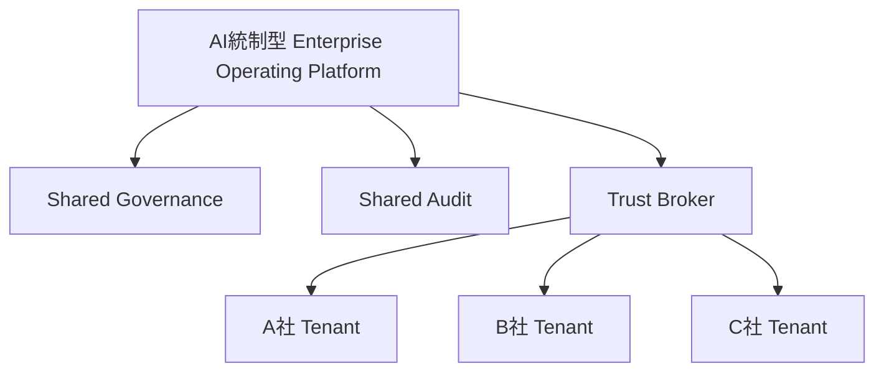

# FEDERATION_MODEL

## 目的

Federation Model は、A社/B社/C社を中央集権的に統合せず、独立性を維持したまま協調させる設計である。

## 基本原則

| 原則 | 内容 |
|---|---|
| Tenant Isolation | データ、権限、監査境界を分離 |
| Shared Governance | 共通統制のみ共有 |
| Independent Authority | 各社の最終権限を尊重 |
| Shared Audit | 必要な監査証跡を相互参照 |
| Zero Trust | 組織間も常時検証 |
| Policy Federation | 規程を連携し、強制適用する |

## 構造

## Federation対象

| 領域 | 内容 |
|---|---|
| Identity Federation | AD / Entra ID / LDAP / OIDC |
| Workflow Federation | 跨社承認、CAB、Incident共有 |
| Knowledge Federation | DLP付きKnowledge共有 |
| Audit Federation | Cross Tenant監査 |
| AI Federation | AI利用境界、Model Routing、Prompt監査 |

## Federation Event

Federation Eventは、跨社操作の最小単位である。

| 項目 | 内容 |
|---|---|
| source_tenant | 起点組織 |
| target_tenant | 対象組織 |
| shared_object | 共有対象 |
| trust_level | 信頼レベル |
| policy_binding | 適用Policy |
| audit_boundary | 監査保存先 |

