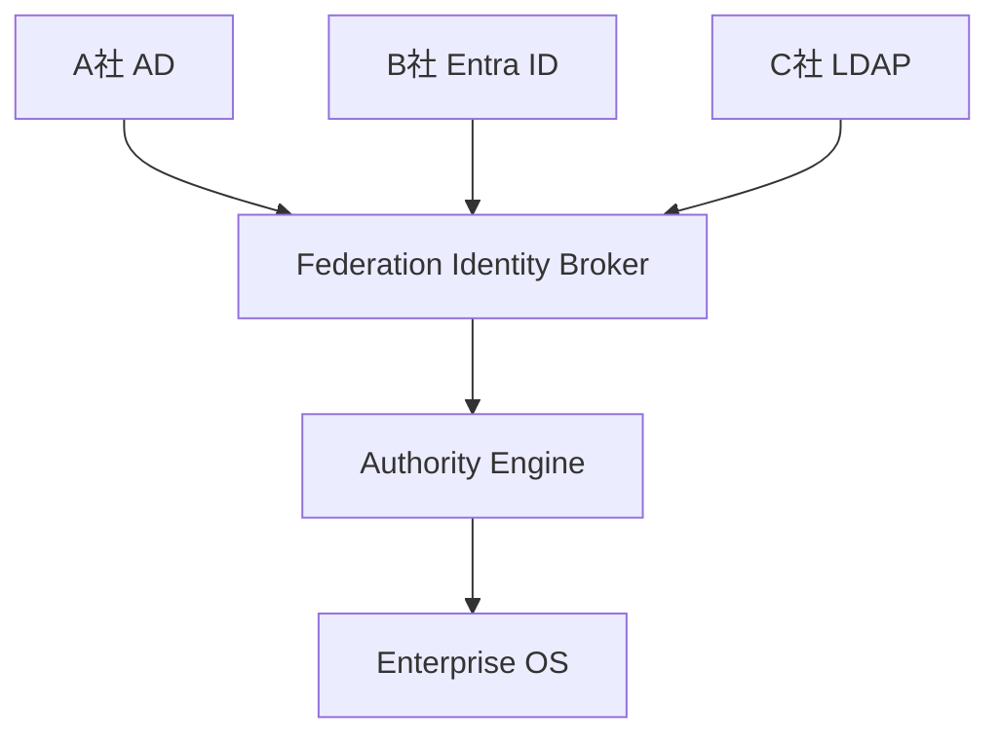

# IDENTITY_FEDERATION_MODEL

## 目的

Identity Federation Model は、A社/B社/C社のID基盤を統合せず、連携させるための認証・認可モデルである。

## 対象

| ID基盤 | 用途 |
|---|---|
| Active Directory | Windows企業環境 |
| Entra ID | Microsoft 365 / Conditional Access |
| LDAP | Legacy認証 |
| SAML | Federation SSO |
| OAuth / OIDC | API / SaaS連携 |
| AI Agent Identity | AI実行主体 |

## 構造

## AI Agent Identity

AI Agentは匿名の自動処理ではなく、企業内主体としてIDを持つ。

| 属性 | 内容 |
|---|---|
| agent_id | Agent識別子 |
| owner | 所有部門または責任者 |
| allowed_actions | 許可Action |
| model_scope | 利用可能Model |
| data_scope | 参照可能Data |
| approval_policy | 人間承認条件 |

## 原則

- ID統合ではなくID連携を行う
- Tenant側の認証強度をTrust判定に反映する
- AI AgentにもMFA相当の実行制約とAuditを適用する

