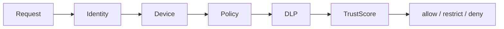

# TRUST_MODEL

## 目的

Trust Model は、Federation参加組織間の信頼を固定的なものではなく、継続検証される条件付き信頼として定義する。

## Zero Trust Federation

```text
信頼するのではなく、常に検証する。
```

## Trust Level

| Level | 対象 | 許可例 |
|---|---|---|
| L1 | 同一Tenant内部 | 通常Workflow |
| L2 | グループ会社 | Policy付きKnowledge共有 |
| L3 | JV / 共同事業 | Project限定Workflow |
| L4 | SI / Partner | 最小権限アクセス |
| L5 | 外部公開 | 匿名化・公開済み情報のみ |

## Trust評価要素

| 要素 | 内容 |
|---|---|
| identity_assurance | 認証強度 |
| device_posture | 端末状態 |
| tenant_policy | Tenant側Policy |
| data_classification | 機密分類 |
| ai_risk | AI利用リスク |
| audit_history | 過去の違反履歴 |
| approval_state | 承認状態 |

## Trust Decision



## 原則

- Trustは組織単位だけでなく、Object単位、Workflow単位、AI Action単位で評価する
- Trust Levelが高くてもDLPとAuditは省略しない
- 外部AI利用はTrust Levelに応じてModel Routingを制限する

