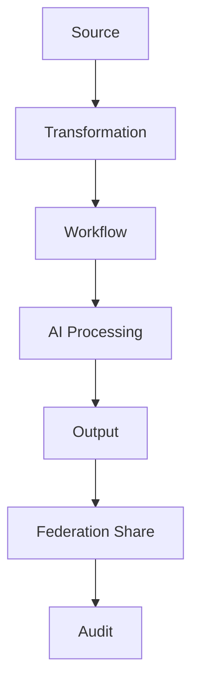

# DATA_LINEAGE_MODEL

## 目的

Data Lineage Model は、Knowledgeがどこから来て、誰が変更し、どのWorkflowやAI処理を経て、どこへ共有されたかを追跡する。

## Lineage対象

| 領域 | 追跡内容 |
|---|---|
| Document | 作成、編集、版、出力 |
| AI Generated Content | Prompt、Model、出力、再編集 |
| Workflow | 承認、差戻し、実行 |
| Git / DevSecOps | Commit、Issue、Change |
| Federation | Cross Tenant移動 |
| DLP | 分類、Mask、Block |

## Lineage Flow

## 必須属性

- source_id
- source_tenant
- transformation_type
- actor
- ai_action_id
- workflow_id
- policy_result
- audit_event_id

## 原則

- AI生成物は出典不明な文書として扱わない
- Knowledge GraphはLineageを根拠として信頼度を計算する
- Federation共有されたKnowledgeは共有前後のLineageを分離記録する

