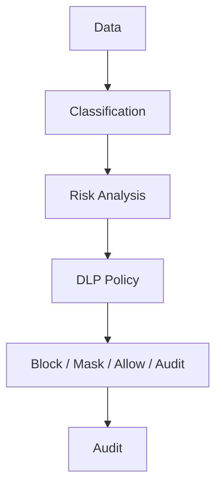

# DLP_MODEL

## 目的

DLP Model は、Enterprise KnowledgeとAI Gatewayにおける情報漏洩を防ぐための統制モデルである。

## 対象

| 対象 | 例 |
|---|---|
| Document | PDF、Excel、契約、議事録 |
| Prompt | AI入力、Context |
| Mail / Teams | 会話、添付、会議メモ |
| Git | Commit、Issue、PR |
| Federation | Cross Tenant共有 |
| Export | PDF出力、CSV出力 |

## DLP Flow

## 機密分類

| Level | 意味 | AI利用 |
|---|---|---|
| Public | 公開可能 | 外部AI可 |
| Internal | 社内限定 | Gateway経由 |
| Confidential | 機密 | MaskまたはLocal LLM |
| Restricted | 高機密 | 外部AI禁止 |

## 原則

- AIへの入力もDLP対象とする
- Cross Org共有はDLP判定後にのみ許可する
- Mask、Redaction、Watermark、Auditを標準機能にする

