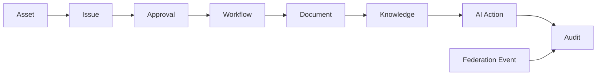

# KNOWLEDGE_GRAPH_MODEL

## 目的

Knowledge Graph Model は、文書、Workflow、Issue、Asset、Audit、AI Action、Federation Eventの関係をEnterprise Memoryとして構造化する。

## Graph対象

| Graph | 内容 |
|---|---|
| User Graph | 組織、役職、責任範囲 |
| Workflow Graph | 承認、BPM、CAB |
| Asset Graph | CMDB、依存関係 |
| Document Graph | 文書、版、分類 |
| AI Graph | Prompt、出力、根拠 |
| Audit Graph | 証跡、Policy判定 |
| Federation Graph | A社/B社/C社の関係 |

## 関係モデル

## AI活用目的

- 変更影響分析
- Risk分析
- 文書相関分析
- Incident原因推定
- Approval支援
- Federation共有範囲判定
- Explainability生成

## 原則

- Graphは検索補助ではなく、AI判断の根拠基盤である
- Knowledge Sourceは必ずLineageとAuditに接続する
- 高機密KnowledgeはDLPとPolicyによりAI参照を制限する

