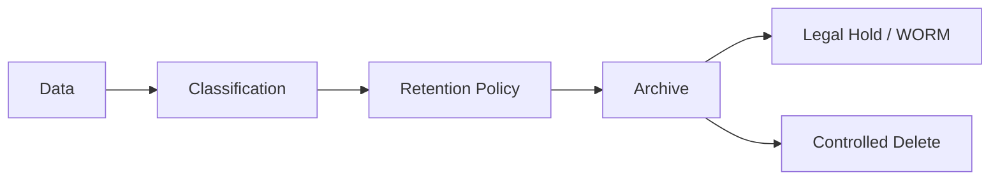

# RETENTION_MODEL

## 目的

Retention Model は、Enterprise OSが扱う文書、監査、AI履歴、Workflow、Federation Logの保持・削除・保全ルールを定義する。

## 保持対象

| データ | 保持方針 |
|---|---|
| Audit Log | 長期保持、改ざん防止 |
| AI Prompt / Output | Policyと機密分類に応じて保持 |
| Workflow History | 法令・内部統制に応じて保持 |
| Document | Retention Labelに従う |
| Incident / Change | ITSM規程に従う |
| Federation Log | 双方Tenantで保持 |

## Retention Flow

## 原則

- AI履歴は業務記録として扱う
- 削除可能性と監査保全のバランスをPolicy化する
- Legal Hold中のデータは削除できない
- Federation Logは片側削除で証跡を消せない

