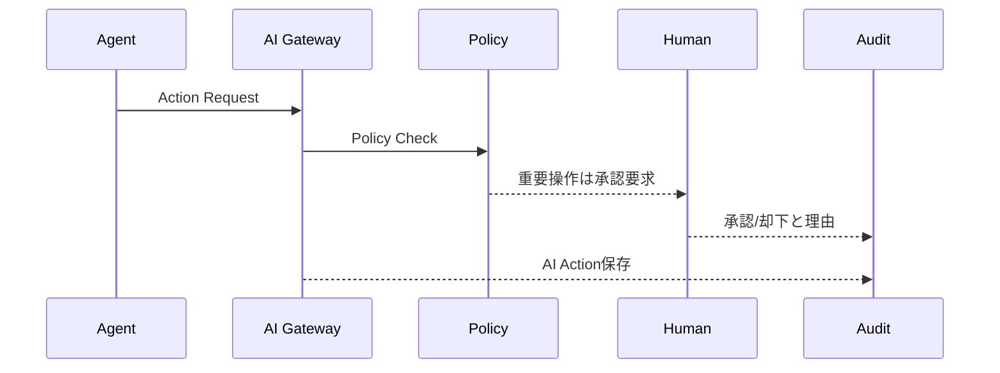

# AI_AGENT_MODEL

## 目的

AI Agent Model は、AI Agentを企業内の実行主体として定義し、権限、責任、監査、制約を明確にする。

## Agent種別

| Agent | 役割 |
|---|---|
| AI CAB | Change影響分析、承認支援 |
| AI Reviewer | 文書、設計、Security観点レビュー |
| AI DLP | 機密検出、Mask提案 |
| AI Knowledge Curator | Knowledge分類、関連付け |
| AI Incident Assistant | 障害要約、Runbook提案 |
| AI Federation Broker | Cross Org共有条件の確認 |

## Agent Identity

AI Agentは以下を持つ。

- agent_id
- owner
- allowed_objects
- allowed_actions
- model_scope
- data_scope
- approval_policy
- audit_policy

## 禁止事項

- 自分のPolicy例外を自己承認する
- Tenant境界を越えて無承認参照する
- 高機密データを外部AIへ送信する
- 本番変更を単独実行する

## Agent Action Flow

