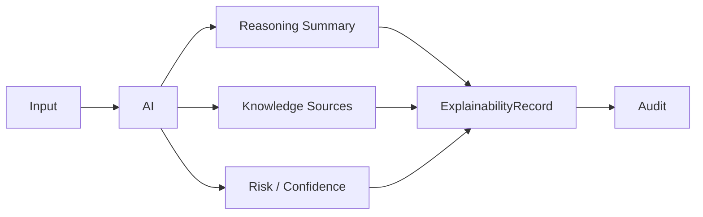

# AI_EXPLAINABILITY_MODEL

## 目的

AI Explainability Model は、AI判断を人間が追跡・説明・監査できる状態にする。

## 対象

| 対象 | 例 |
|---|---|
| AI CAB | 変更承認支援 |
| AI Review | 設計・文書・コードレビュー |
| AI Risk | DLP、Security、Compliance |
| AI Workflow | 承認分岐、優先度付け |
| AI Search | Enterprise Memory検索 |
| AI Agent | 自律実行判断 |

## 保存する説明情報

| 項目 | 内容 |
|---|---|
| input_summary | 入力要約 |
| prompt_ref | Prompt監査ID |
| context_sources | 参照Knowledge |
| policy_checks | 適用Policy |
| reasoning_summary | 推論要約 |
| confidence | 信頼度 |
| risk_score | リスク |
| human_override | 人間介入 |

## Flow

## 原則

- 説明できないAI判断は重要業務に使わない
- ExplainabilityはUI、Audit、Approvalで参照可能にする
- AIの提案と人間の最終判断を分離記録する

