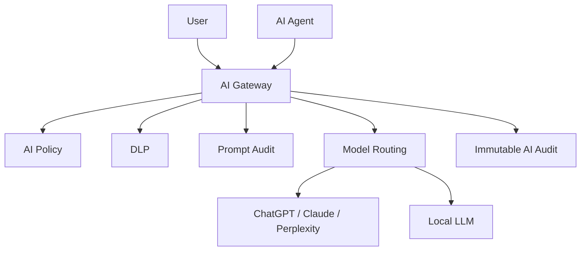

# AI_GATEWAY_MODEL

## 目的

AI Gateway Model は、ChatGPT、Claude、Perplexity、Local LLM、AI Agentへのアクセスを統制するEnterprise OSの必須レイヤである。

## 基本原則

```text
Direct AI Accessは禁止。
すべてのAI利用はAI Gatewayを通過する。
```

## 構造



## 機能

| 機能 | 内容 |
|---|---|
| Prompt Audit | PromptとContextを記録 |
| DLP Integration | 機密情報送信を制御 |
| Model Routing | 用途と機密分類でModelを選択 |
| Explainability | AI判断根拠を保存 |
| Policy Enforcement | AI利用規程を強制 |
| Cost / Token Audit | 利用量監査 |
| Sandbox | 危険操作の隔離 |

## Model Routing例

| 用途 | 推奨 |
|---|---|
| 高機密 | Local LLM |
| 一般文書生成 | Cloud LLM |
| 高度推論 | Claude / ChatGPT |
| Web調査 | Perplexity等 |

