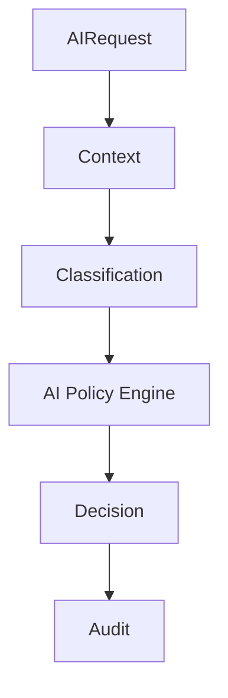

# AI_POLICY_MODEL

## 目的

AI Policy Model は、AI利用、Prompt、Model、Agent、DLP、Federation共有をPolicyで制御する。

## Policy分類

| Policy | 内容 |
|---|---|
| AI_EXECUTION_POLICY | AI実行可否 |
| PROMPT_AUDIT_POLICY | Prompt保存・Mask条件 |
| MODEL_ROUTING_POLICY | Model選択 |
| DLP_AI_POLICY | 機密情報送信制御 |
| AI_AGENT_POLICY | Agent権限制御 |
| FEDERATION_AI_POLICY | Cross Tenant AI制御 |
| HUMAN_APPROVAL_POLICY | 人間承認条件 |

## Policy例

| 条件 | Decision |
|---|---|
| Restricted文書を外部AIへ送信 | deny |
| Confidential文書を要約 | local_llm_required |
| 本番変更のAI提案 | human_approval_required |
| Cross Tenant Knowledge参照 | federation_policy_check |

## 評価Flow

## 原則

- AI PolicyはUIだけでなくGateway/API/Workflowで強制する
- 例外は期限付き、承認付き、監査付きとする
- Policy変更もChange Objectとして承認対象にする

