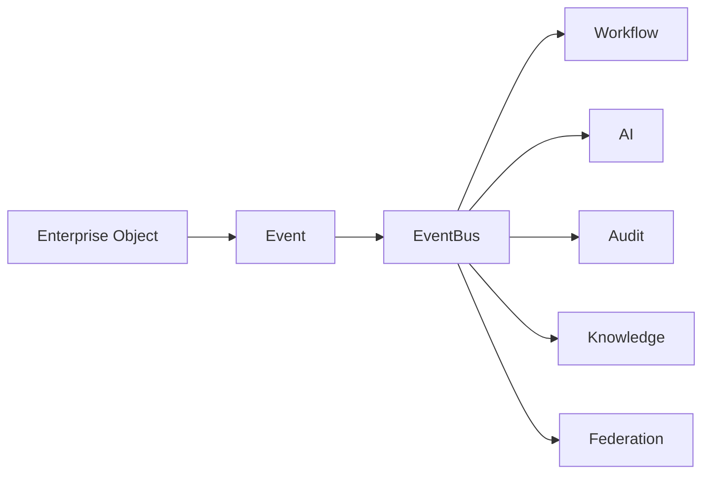

# EVENT_BUS_MODEL

## 目的

Event Bus Model は、企業活動をEventとして統合し、Workflow、AI、Audit、Knowledge、Federationへ伝播させる。

## Event例

| Event | 内容 |
|---|---|
| IssueCreated | 課題起票 |
| ApprovalRequested | 承認要求 |
| ChangeApproved | 変更承認 |
| AIPromptExecuted | AI実行 |
| DLPViolationDetected | DLP違反 |
| DocumentExported | 文書出力 |
| FederationAccessRequested | Cross Tenantアクセス |
| AuditRecorded | 監査保存 |

## Event Flow

## Event属性

- event_id
- event_type
- tenant_id
- actor_id
- object_id
- policy_result
- risk_score
- correlation_id
- audit_event_id

## 原則

- 企業活動はEventとして記録・連携する
- EventはTenant境界とAudit境界を持つ
- AI処理はEventから起動してもAI Gatewayを通過する

