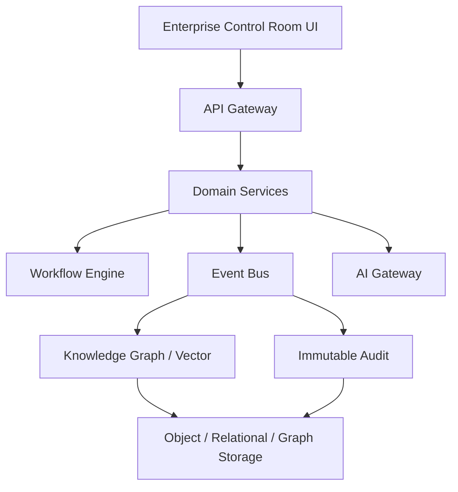

# PLATFORM_ARCHITECTURE

## 目的

Platform Architecture は、Enterprise OSをEvent Driven、Federated、AI Native、Auditableに動作させる基盤構造を定義する。

## レイヤ構造

## 技術候補

| 領域 | 候補 |
|---|---|
| Frontend | Next.js |
| Backend | FastAPI / Go |
| Workflow | Temporal |
| Event Bus | Kafka / NATS |
| Auth | Keycloak / Entra ID連携 |
| GraphDB | Neo4j |
| VectorDB | Qdrant |
| Object Storage | MinIO |
| AI Gateway | LiteLLM等 |

## 原則

- Monolithic Platformにしない
- Enterprise ObjectはEventで状態変化を表現する
- Auditは副作用ではなく必須出力とする
- AI GatewayとPolicy Engineを横断基盤にする

