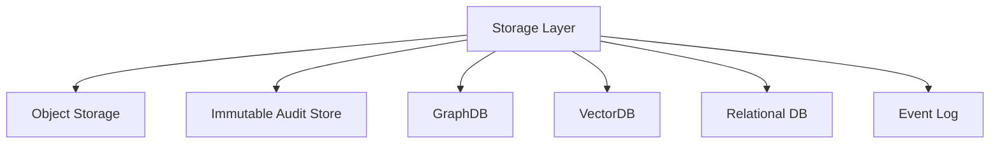

# STORAGE_MODEL

## 目的

Storage Model は、Enterprise OSの文書、監査、AI履歴、Graph、Workflow、Federationデータを用途別に保存する戦略である。

## Storage分類

| データ | Storage |
|---|---|
| Document / Export | Object Storage |
| Immutable Audit | WORM / Object Lock |
| Knowledge Graph | GraphDB |
| Semantic Index | VectorDB |
| Workflow State | Relational DB |
| Event Stream | Event Bus / Log |
| Federation Metadata | Tenant分離DB |
| AI Prompt / Output | Policy管理Storage |

## 構造

## 原則

- 監査ログは通常DBだけに置かない
- Tenantごとの分離と共有Metadataを分ける
- AI PromptはDLP、Retention、Auditと紐づける
- KnowledgeはGraphとVectorの両方で扱う

