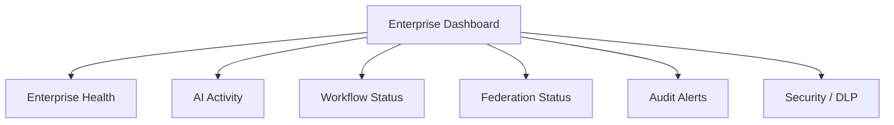

# ENTERPRISE_DASHBOARD_MODEL

## 目的

Enterprise Dashboard Model は、企業全体の状態、AIリスク、Workflow、Federation、Audit、Securityを一望する司令室を定義する。

## Dashboard領域

| 領域 | 指標 |
|---|---|
| Enterprise Health | Incident、Change、Approval SLA |
| AI Activity | Prompt数、AI Risk、Explainability欠落 |
| Workflow Status | 承認待ち、差戻し、滞留 |
| Federation Status | Cross Tenant要求、Trust Level |
| Audit Alerts | 監査異常、証跡欠落 |
| Security / DLP | DLP違反、機密共有 |
| Knowledge Insights | 関連文書、影響範囲 |

## Dashboard構造

## 原則

- 企業状態をIssue、Approval、Audit、AI Action、Federation Eventとして可視化する
- KPIは操作可能なObjectへ接続する
- AIリスクは数値だけでなくExplainabilityへ遷移できるようにする

