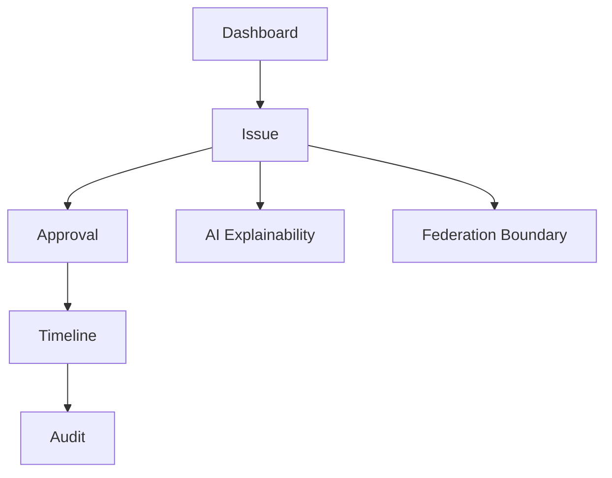

# UX_CONSTITUTION

## 目的

UX Constitution は、Enterprise OSを「操作画面」ではなく、企業状態を理解し統制する **Enterprise Control Room** として設計するための原則である。

## UI思想

```text
GitHub風
+
Enterprise Control Room
```

## UX原則

| 原則 | 内容 |
|---|---|
| Visibility First | 状態を隠さない |
| Auditability | すべての重要操作に監査導線を持つ |
| Explainability | AI判断の根拠を見える化する |
| Workflow Native | Issue、Approval、Workflowを中心に置く |
| Federation Aware | A社/B社/C社の境界を常に表示する |
| AI Native | AI操作を通常業務UIに統合する |

## 画面思想



## 原則

- GitHubをコピーしない。状態管理UIの良さだけをEnterprise向けに再解釈する
- AIの実行状態、Risk、Confidence、Audit Linkを隠さない
- Federation境界を視覚的に明示する

