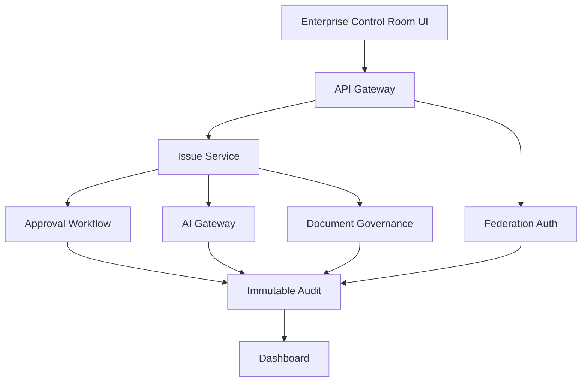

# MVP_ARCHITECTURE

## 目的

MVP Architecture は、最小構成でEnterprise OSの核であるIssue、Approval、AI Audit、Document Governance、Federation Authを成立させる構造である。

## MVP構成

## 最小Enterprise Object

| Object | MVPでの扱い |
|---|---|
| Issue | すべての起点 |
| Approval | 承認・稟議 |
| Document | DLP対象 |
| AI Action | Promptと出力 |
| Audit | 証跡 |
| Federation Event | A社/B社/C社境界 |

## MVPで守ること

- 実装詳細よりContractと責務境界を優先する
- AI直接接続を作らない
- Auditを後付けにしない
- Tenant境界を後回しにしない
- Dashboardは状態可視化の入口として扱う

