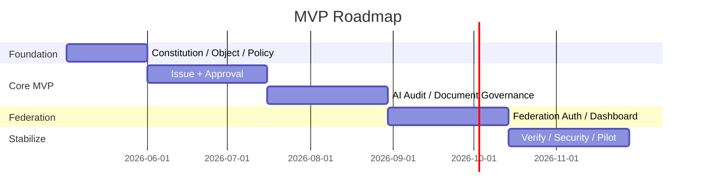

# MVP_ROADMAP

## 目的

MVP Roadmap は、AI Native Enterprise OSを段階的に実証するための優先順位を定義する。

## Roadmap

| Step | 対象 | 成果 |
|---:|---|---|
| 1 | Constitution Baseline | 原則、Policy、Auditの最小定義 |
| 2 | Issue + Approval | 企業活動の起点をObject化 |
| 3 | AI Gateway Audit | Prompt、Model、DLP、Explainability記録 |
| 4 | Document Governance | Classification、DLP、Retention |
| 5 | Federation Auth | A社/B社/C社のID連携 |
| 6 | Teams / Mail Issue化 | 実務コミュニケーションをObject化 |
| 7 | Dashboard | Enterprise状態可視化 |

## 6ヶ月イメージ

## 原則

- 先に統制、次に機能
- MVPでもAI GatewayとAuditは省略しない
- Federationは最初からTenant概念を持つ

