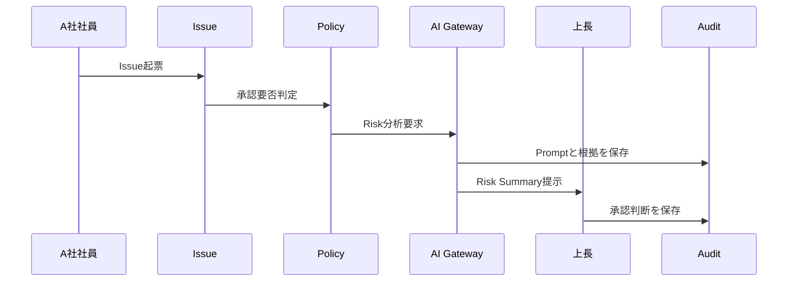

# SCENARIO_01_ISSUE_APPROVAL_AI_RISK

## シナリオ

A社社員が業務改善Issueを起票し、AIがRisk分析を行い、上長承認後にWorkflowが進行する。

## 目的

Issue + Approval をEnterprise OSの核として検証する。

## 登場Object

| Object | 役割 |
|---|---|
| Issue | 起票内容 |
| AI Action | Risk分析 |
| Approval | 上長承認 |
| Workflow | 状態遷移 |
| Audit | 証跡 |

## Flow

## 成功条件

- Issueが企業活動の起点として成立する
- AI判断は承認の補助であり、最終判断者ではない
- Risk、Confidence、参照Knowledgeが説明可能である
- 承認判断がAuditに残る

