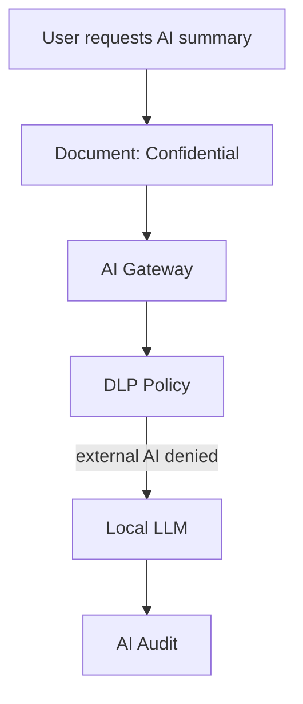

# SCENARIO_02_DLP_LOCAL_LLM_ROUTING

## シナリオ

Confidential文書をAI要約しようとした際、DLPが外部AI送信を制限し、Local LLMへRoutingする。

## 目的

AI Gateway Mandatory、DLP Integration、Model Routingを検証する。

## 登場Object

| Object | 役割 |
|---|---|
| Document | 要約対象 |
| AI Action | 要約要求 |
| Policy | DLP / AI Routing |
| Audit | Prompt、Model、判定記録 |
| Knowledge | 要約結果の登録先 |

## Flow

## 成功条件

- Confidential文書が外部AIへ直接送信されない
- AI GatewayがModel Routingを実施する
- Prompt、分類、DLP判定、Model選択理由がAuditされる
- 要約結果のLineageが残る

