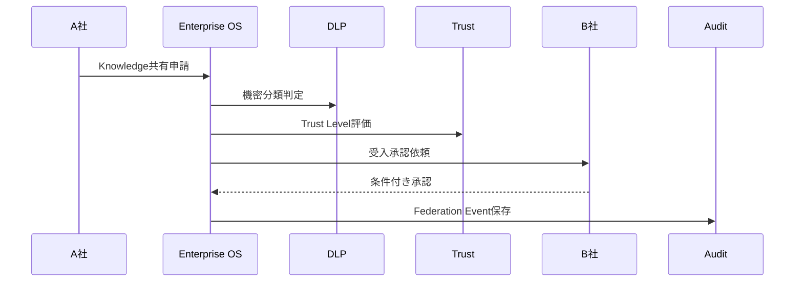

# SCENARIO_03_CROSS_ORG_KNOWLEDGE_SHARING

## シナリオ

A社がB社にKnowledge共有を申請し、Trust Level、DLP、Federation Policy、双方承認を経て共有する。

## 目的

Federation NativeなKnowledge共有を検証する。

## 登場Object

| Object | 役割 |
|---|---|
| Knowledge | 共有対象 |
| Federation Event | Cross Tenant共有 |
| Policy | Federation / DLP |
| Approval | A社/B社双方承認 |
| Audit | 双方監査 |

## Flow

## 成功条件

- Tenant Isolationを壊さず共有できる
- A社/B社双方のPolicyとApprovalが反映される
- DLP結果に応じてMaskまたは共有禁止が可能
- Federation Eventが双方Auditに残る

