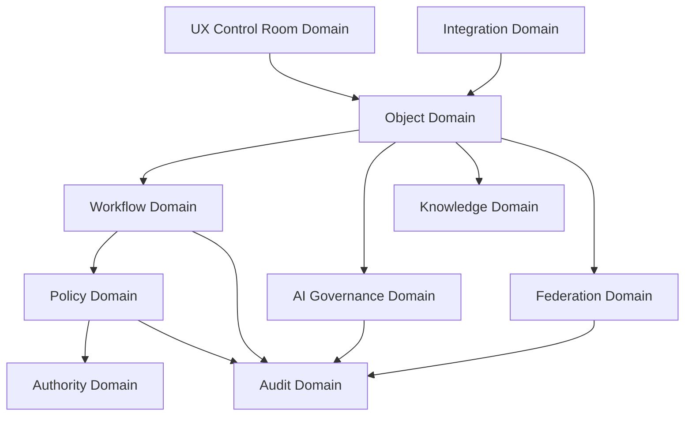

# DOMAIN_BOUNDARY_MODEL

## 目的

Domain Boundary Model は、AI Native Enterprise OS を実装前に責務分割するための設計文書である。ここではコード構造ではなく、Enterprise Object、Policy、Workflow、AI、Federation、AuditがどのDomainに属し、どの境界で接続されるかを定義する。

## Domain分割原則

| 原則 | 内容 |
|---|---|
| Governance First | すべてのDomainはPolicyとAuditを通過する |
| Object Centered | DomainはEnterprise Objectを中心に責務を持つ |
| Federation Aware | Tenant境界をDomain内部に隠さない |
| AI Gateway Mandatory | AI Domain以外からLLMへ直接接続しない |
| Audit by Design | Domain EventはAudit可能な粒度で発火する |

## Core Domains

| Domain | 主責務 | 主要Object |
|---|---|---|
| Object Domain | Issue、Approval、Document等の共通Object管理 | Issue、Approval、Document、Knowledge |
| Workflow Domain | 状態遷移、承認、SLA、差戻し | Workflow、Approval |
| Policy Domain | Policy評価、Decision、例外承認 | Policy |
| Authority Domain | Human、AI Agent、組織、外部Partnerの権限制御 | Identity、Authority |
| Audit Domain | 改ざん防止証跡、検索、eDiscovery | Audit |
| AI Governance Domain | AI Gateway、Prompt Audit、Model Routing | AI Action |
| Knowledge Domain | Enterprise Memory、Graph、Lineage、Retention | Knowledge、Document |
| Federation Domain | Tenant境界、Trust、Cross Org Workflow | Federation Event |
| UX Control Room Domain | 状態可視化、AI説明、監査導線 | Dashboard View |
| Integration Domain | Teams、Mail、外部IdP、通知 | Integration Event |

## Domain依存関係

## Boundary Rules

| 境界 | ルール |
|---|---|
| Object -> Workflow | Object状態変更はWorkflow Eventとして扱う |
| Workflow -> Policy | 承認や実行前にPolicy Decisionを要求する |
| AI -> Knowledge | AIはKnowledgeを参照できるが、DLPとPolicyを通過する |
| Federation -> Knowledge | Cross Tenant Knowledge共有はFederation Eventを生成する |
| Authority -> AI | AI AgentもIdentityとして扱い、権限を持つ |
| Audit -> All Domains | 重要操作はAudit DomainへEventを送る |

## Anti Boundaries

以下の境界破りは禁止する。

- UXからAI Providerへ直接接続する
- Integration DomainがPolicyを迂回してObjectを更新する
- Federation DomainがTenant内部データを無承認で読み出す
- AI Governance DomainがAudit保存なしにPromptを実行する
- Workflow DomainがAuthority確認なしに承認完了へ進める

## MVP時点のDomain優先度

| 優先 | Domain | 理由 |
|---:|---|---|
| 1 | Object Domain | Issue + Approvalの核 |
| 2 | Policy Domain | Governance Firstの実体 |
| 3 | Audit Domain | AI Auditと承認監査の必須基盤 |
| 4 | AI Governance Domain | AI Gateway Mandatoryの実証 |
| 5 | Federation Domain | A社/B社/C社境界の実証 |
| 6 | UX Control Room Domain | 状態可視化の実証 |

