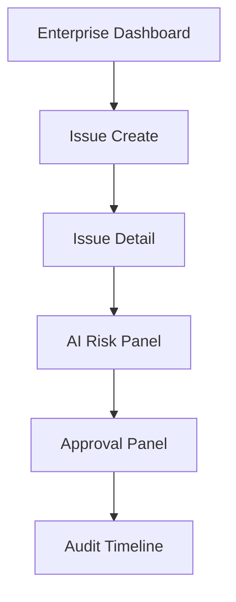
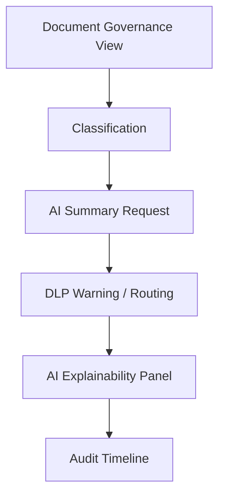
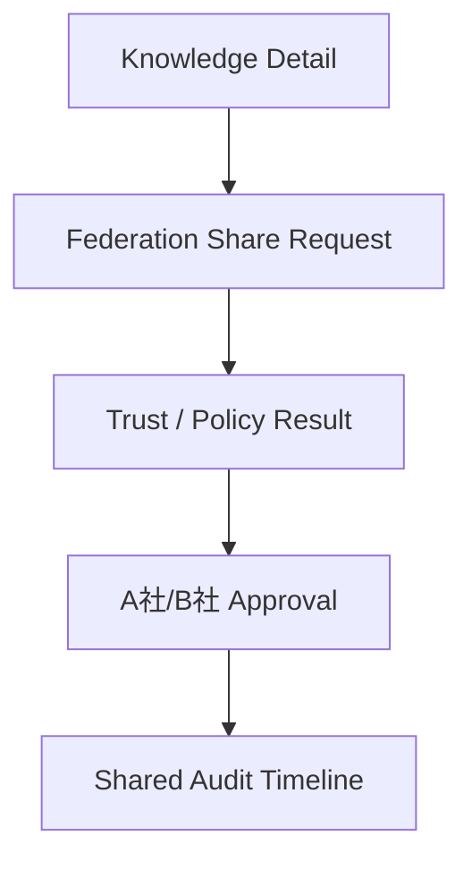

# MVP_SCREEN_FLOW_MODEL

## 目的

MVP Screen Flow Model は、UI実装前に、MVPで必要な画面遷移と状態表示を定義する。これは画面デザインではなく、Enterprise Control Roomとして何を見せ、どこで判断させるかの設計である。

## MVP画面一覧

| 画面 | 目的 |
|---|---|
| Enterprise Dashboard | 全体状態、AI Risk、承認待ち、DLP警告 |
| Issue Detail | Issue内容、Workflow、Timeline |
| Approval Panel | 承認判断、AI提案、Policy結果 |
| AI Explainability Panel | AI根拠、Confidence、参照Knowledge |
| Document Governance View | Classification、DLP、Retention |
| Federation Request View | 共有先、Trust、DLP、双方承認 |
| Audit Timeline | 操作、AI、承認、Federation証跡 |

## Screen Flow 1: Issue + Approval

## Screen Flow 2: Document + AI DLP

## Screen Flow 3: Federation Knowledge Sharing

## 必須表示要素

| 表示 | 理由 |
|---|---|
| Tenant Badge | A社/B社/C社境界を明示 |
| Policy Result | なぜ許可/禁止されたか |
| AI Risk Score | AI判断の危険度 |
| Confidence | AI出力の信頼度 |
| Explainability Link | AI説明責任 |
| Audit Link | 証跡追跡 |
| DLP State | 文書漏洩防止 |
| Approval State | 承認進行 |

## UI原則

- AIの提案と人間の判断を同じものとして見せない
- Federation境界は常に見える場所に出す
- 承認ボタンの近くにPolicy結果とAudit保存予定を表示する
- Dashboardから必ず対象Objectへ遷移できるようにする

