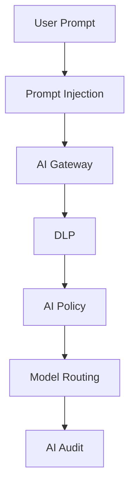
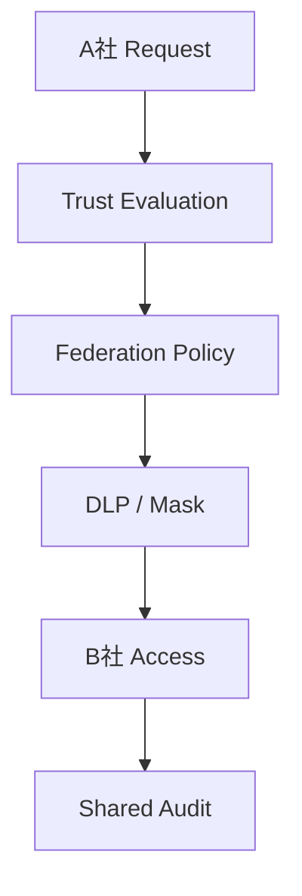

# SECURITY_THREAT_MODEL

## 目的

Security Threat Model は、AI Native Enterprise OS に固有の脅威を設計段階で明確化し、MVP前に統制ポイントを定義する。

## 脅威分類

| 分類 | 主な脅威 |
|---|---|
| AI Threat | Prompt Injection、Data Exfiltration、Model Misrouting |
| Federation Threat | Tenant越境、Trust偽装、Cross Org権限誤用 |
| Authority Threat | 権限昇格、AI Agentなりすまし、例外承認乱用 |
| Audit Threat | ログ改ざん、証跡欠落、説明不能AI判断 |
| Knowledge Threat | DLP漏れ、Lineage欠落、機密文書の誤共有 |
| Workflow Threat | 承認迂回、SLA悪用、自動承認暴走 |

## Threat Matrix

| Threat | 影響 | 対策 |
|---|---|---|
| Prompt Injection | AIが不正命令に従う | Prompt監査、Context分離、Policy Check |
| Confidential Data Exfiltration | 機密情報が外部AIへ送信 | DLP、Model Routing、Mask |
| Tenant Boundary Bypass | A社データをB社が参照 | Federation Policy、Trust評価、Audit |
| AI Agent Privilege Escalation | AI Agentが過剰権限を取得 | AI Agent Identity、Authority Policy |
| Audit Tampering | 証跡が信頼不能 | WORM、Hash、Signed Logs |
| Approval Bypass | 承認なしでWorkflow完了 | Workflow Guard、Approval Policy |
| Shadow AI | Gateway外AI利用 | Network Policy、Audit、User Training |
| Misrouted Model | 高機密がCloud LLMへ送信 | Classification、Routing Policy |
| Stale Knowledge | 古い知識でAIが判断 | Retention、Lineage、Knowledge Trust |

## AI Threat Flow

## Federation Threat Flow

## MVP必須Security Control

| Control | MVP必須 | 理由 |
|---|---|---|
| AI Gateway | Yes | Direct AI Access禁止 |
| Prompt Audit | Yes | AI操作追跡 |
| DLP Classification | Yes | 文書統制の核 |
| Tenant Boundary | Yes | Federation前提 |
| Approval Policy | Yes | 日本企業文化と統制 |
| Immutable Audit | Yes | 監査基盤 |
| AI Agent Identity | Yes | AI主体の責任明確化 |

## 未解決リスク

- 外部SaaS側のログ保持差異
- Local LLMの運用責任範囲
- Prompt内の機密検出精度
- Tenant間の法令差異
- 管理者権限の濫用対策

