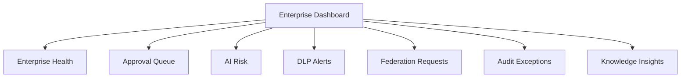

# INFORMATION_ARCHITECTURE

## 目的

Information Architecture は、Enterprise Control Roomとして、利用者が企業状態、Workflow、AI判断、監査、Federation境界を迷わず理解するための情報構造を定義する。

## IA原則

| 原則 | 内容 |
|---|---|
| Object First | 画面の中心はEnterprise Object |
| Status Visible | 状態、承認、Risk、DLP、Tenantを常時表示 |
| Timeline Native | 判断と操作はTimelineで追跡する |
| Explainability Nearby | AI出力の近くに説明根拠を置く |
| Federation Aware | 組織境界をナビゲーションとObjectに明示する |
| Audit One Click | 重要操作から監査証跡へ1クリックで到達 |

## Global Navigation

| Navigation | 内容 |
|---|---|
| Dashboard | 企業状態、承認待ち、AI Risk、DLP警告 |
| Issues | 企業活動の起点 |
| Approvals | 承認、稟議、CAB |
| Knowledge | 文書、Runbook、Enterprise Memory |
| AI Governance | AI Action、Prompt Audit、Explainability |
| Federation | A社/B社/C社、Trust、共有要求 |
| Audit | Timeline、証跡、eDiscovery |
| Settings | Policy、Authority、Tenant設定 |

## Object Detail構造

```text
Object Header
  - Title / Type / Tenant / Status / Classification
Main Content
  - Description / Document / Knowledge / Context
Right Governance Panel
  - Policy Result / Risk / DLP / Approval / Federation Scope
Timeline
  - Comment / Event / AI Action / Approval / Audit
Explainability Drawer
  - AI Summary / Sources / Confidence / Reasoning Summary
```

## Dashboard情報階層



## MVP画面ごとの主要情報

| 画面 | 必須情報 |
|---|---|
| Dashboard | 承認待ち、AI Risk、DLP警告、Federation要求 |
| Issue Detail | Issue属性、Workflow、AI提案、Timeline |
| Approval Detail | 申請内容、Policy結果、AI Risk、承認理由 |
| Document View | Classification、DLP、Retention、Lineage |
| AI Action View | Prompt監査、Model、Context、Explainability |
| Federation View | Source/Target Tenant、Trust、DLP、双方承認 |
| Audit Timeline | Actor、Action、Policy Result、Hash、Correlation |

## 情報設計上の禁止事項

- AI出力だけを表示し、根拠を別画面の奥に隠す
- Tenant境界を小さな補助情報として扱う
- 承認判断からPolicy結果を切り離す
- Audit Timelineを管理者専用の後処理にする
- Dashboardを単なるKPI表示にする

