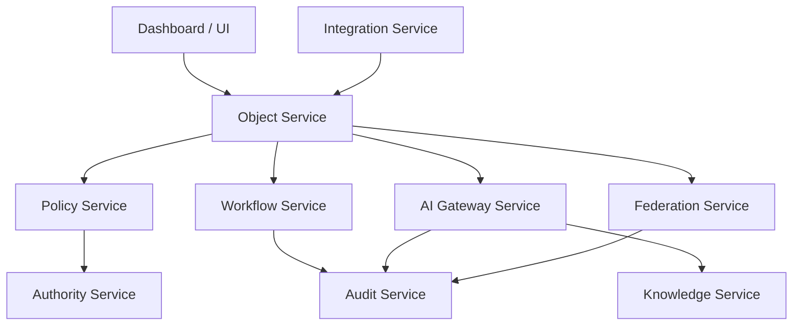

# SERVICE_RESPONSIBILITY_MODEL

## 目的

Service Responsibility Model は、DomainごとのService責務と禁止責務を定義し、巨大モノリス化と責務混在を防ぐ。

## Service分割原則

| 原則 | 内容 |
|---|---|
| Own One Domain | Serviceは主責務を1つのDomainに置く |
| No Hidden Authority | 権限判断を各Serviceに隠さない |
| Audit as Contract | 重要操作はAudit Eventを契約に含める |
| AI via Gateway | AI利用はAI Gateway Serviceへ委譲する |
| Federation via Broker | Cross Tenant操作はFederation Serviceへ委譲する |

## Service一覧

| Service | 持つ責務 | 持たない責務 |
|---|---|---|
| Object Service | Issue、Document、Knowledge等のObject基本操作 | Policy最終判断、AI実行 |
| Workflow Service | 状態遷移、承認フロー、SLA | 権限最終判断、外部AI接続 |
| Policy Service | Policy評価、Decision生成、例外条件評価 | Object永続化、UI表示 |
| Authority Service | Actor、Role、Tenant、AI Agent権限制御 | Workflow実行 |
| Audit Service | Audit Event保存、Timeline、証跡検索 | 業務判断 |
| AI Gateway Service | Prompt Audit、DLP連携、Model Routing、Explainability | Objectの所有管理 |
| Knowledge Service | Knowledge Graph、Lineage、Retention参照 | DLP最終判定 |
| Federation Service | Trust評価、Cross Tenant共有、Shared Audit連携 | Tenant内部Workflowの所有 |
| Integration Service | Teams/Mail取り込み、通知 | ObjectのPolicy迂回更新 |
| Dashboard Service | 集計、状態可視化 | 業務状態の直接変更 |

## Service Interaction

## Service別必須Event

| Service | 代表Event |
|---|---|
| Object Service | IssueCreated, DocumentRegistered |
| Workflow Service | ApprovalRequested, WorkflowAdvanced |
| Policy Service | PolicyEvaluated |
| Authority Service | AuthorityChecked |
| Audit Service | AuditRecorded |
| AI Gateway Service | AIPromptExecuted, AIRiskAnalyzed |
| Knowledge Service | KnowledgeLinked, LineageUpdated |
| Federation Service | FederationAccessRequested, FederationShared |
| Integration Service | ExternalMessageCaptured |

## 境界違反例

| 違反 | 問題 |
|---|---|
| Object ServiceがAI Providerへ直接接続 | AI Gateway Mandatory違反 |
| Workflow Serviceが承認者権限を独自判定 | Authority分散 |
| Integration Serviceが直接承認完了にする | Workflow/Audit迂回 |
| Dashboard ServiceがObject状態を更新 | 可視化と業務処理の混在 |
| Federation ServiceがDLPなしで共有 | 情報漏洩 |

## MVP時点の最小Service構成

| 優先 | Service | 理由 |
|---:|---|---|
| 1 | Object Service | Issue + Documentの起点 |
| 2 | Workflow Service | Approvalを成立させる |
| 3 | Policy Service | Governance Firstの実体 |
| 4 | Audit Service | AI Auditと承認証跡 |
| 5 | AI Gateway Service | Direct AI Access禁止 |
| 6 | Federation Service | A社/B社/C社境界 |

