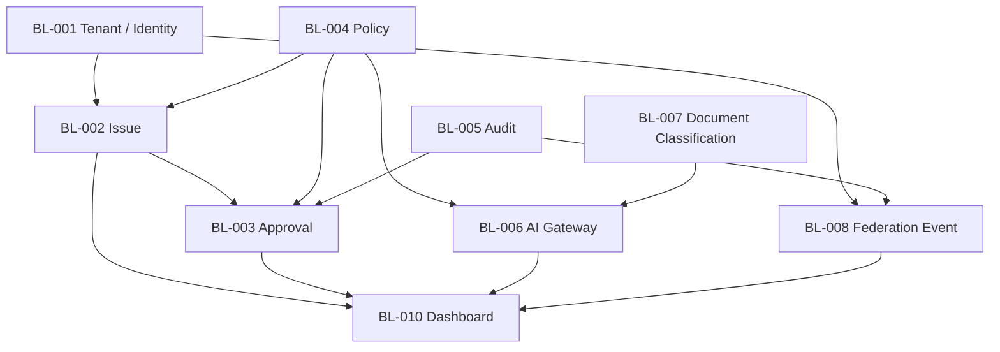

# IMPLEMENTATION_BACKLOG

## 目的

Implementation Backlog は、まだ実装せず、MVP実装に必要なIssue候補を設計成果物として整理する。各Backlogは、Constitution、Object、Policy、Audit、Acceptance Criteriaに接続できる粒度にする。

## Backlog優先度

| 優先度 | 意味 |
|---|---|
| P1 | MVP成立に必須 |
| P2 | MVP品質・安全性に重要 |
| P3 | Pilot改善 |
| P4 | 将来拡張 |

## P1 Backlog

| ID | Title | 目的 | Acceptance |
|---|---|---|---|
| BL-001 | Tenant / Identity基盤の最小設計 | A社/B社/C社境界を表現 | Tenant BadgeとAuthority判定が可能 |
| BL-002 | Issue Object MVP | 企業活動の起点 | Issue作成、状態、Audit参照が可能 |
| BL-003 | Approval Workflow MVP | 承認文化の核 | 承認/却下/理由/Auditが可能 |
| BL-004 | Policy Decision MVP | Governance First実体 | allow/deny/approval_requiredを返せる |
| BL-005 | Audit Timeline MVP | 監査性の核 | 重要EventがTimeline表示される |
| BL-006 | AI Gateway MVP | Direct AI Access禁止 | Prompt Audit、DLP、Model Routingが通る |
| BL-007 | Document Classification MVP | DLP入口 | DocumentにClassificationが付く |
| BL-008 | Federation Event MVP | Cross Tenant操作 | Trust、DLP、Approval、Auditを持つ |

## P2 Backlog

| ID | Title | 目的 | Acceptance |
|---|---|---|---|
| BL-009 | AI Explainability View | AI Black Box防止 | Reasoning SummaryとSourceが見える |
| BL-010 | Dashboard MVP | 状態可視化 | Approval、AI Risk、DLP、Federationが見える |
| BL-011 | Knowledge Lineage MVP | Knowledge信頼性 | SourceとAI生成履歴を追跡 |
| BL-012 | Non Goals Guard Review | Scope逸脱防止 | ERP/GitHub clone/Direct AIなしを確認 |
| BL-013 | Policy Test Matrix実行準備 | 統制検証 | 主要Policy条件が検証可能 |

## P3 Backlog

| ID | Title | 目的 | Acceptance |
|---|---|---|---|
| BL-014 | Teams/Mail Issue化Pilot | 実務導線 | MessageからIssue候補生成 |
| BL-015 | Federation Dashboard改善 | 組織境界可視化 | Trust状態と共有要求を一覧化 |
| BL-016 | Audit Search改善 | 監査探索 | Correlation IDで追跡 |

## Backlog依存関係

## 実装開始前のBacklog条件

- P1がMVP ScopeとAcceptance Criteriaに接続している
- 各BacklogがService Responsibilityに対応している
- AuditとPolicyを省略したBacklogがない
- Non Goalsに反するBacklogがない
- Pilot Scenarioに接続できる

